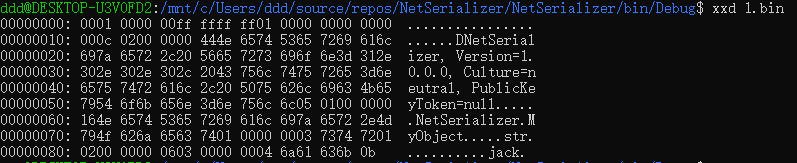
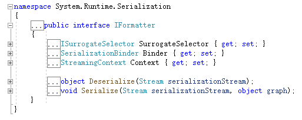
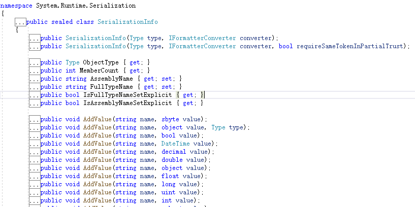
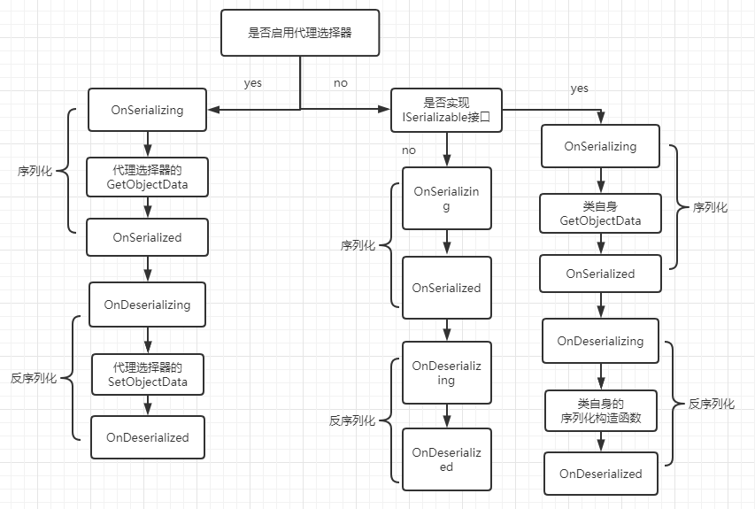

# dotnet-serialize-101

> java太卷了，找点新的学习方向，从0到1学习dotnet的一些反序列化漏洞。

# 简述dotnet序列化和反序列化

同java类比，dotnet也需要对某个对象进行持久化处理，从而在任何时间都能够恢复这个对象。为什么要使用序列化？因为我们需要将重要的对象存入到媒体，这个媒体可能是数据库或者是文件，或者我们需要将对象进行网络传输传递到另一个服务上，而这个对象转媒体(数据库、文件、网络传输流)的过程就是序列化的过程，反序列化则正好相反。

# 一个简单序列化的例子

微软官方文档给出了内置库中可以序列化的类型列表，[见这里](https://docs.microsoft.com/zh-cn/dotnet/standard/serialization/binary-serialization)。先来声明一个实体类。在java中，序列化和反序列化需要实现Serializable接口，在dotnet中则是使用`特性`的方式进行标记Serializable。

```csharp
[Serializable]  
public class MyObject
{  
  public int n1;  
  [NonSerialized] public int n2;  
  public String str;  
}
```

你也可以指定`[NonSerialized]`表示不能被序列化的字段。接下来我们构建一个MyObject对象并对其序列化和反序列化。

```csharp
using System;
using System.IO;
using System.Runtime.Serialization;
using System.Runtime.Serialization.Formatters.Binary;

namespace NetSerializer
{
    [Serializable]
    public class MyObject
    {
        public int n1;
        [NonSerialized] public int n2;
        public String str;
    }

    class Program
    {
        public static void BinaryFormatterSerialize(string file, object o)
        {
            BinaryFormatter binaryFormatter = new BinaryFormatter();
            FileStream fileStream = new FileStream(file, FileMode.Create, FileAccess.Write, FileShare.None);
            binaryFormatter.Serialize(fileStream, o);
            fileStream.Close();
            Console.WriteLine($"serialize object {o} to file {file}.");
        }

        public static object BinaryFormatterDeserialFromFile(string file)
        {
            IFormatter formatter = new BinaryFormatter();
            Stream stream = new FileStream(file, FileMode.Open, FileAccess.Read, FileShare.Read);
            object o = formatter.Deserialize(stream);
            stream.Close();
            return o;
        }

        static void Main(string[] args)
        {
            try
            {
                MyObject myObject = new MyObject();
                myObject.n1 = 1;
                myObject.n2 = 2;
                myObject.str = "jack";

                BinaryFormatterSerialize("1.bin", myObject);
                MyObject myObject1 = (MyObject)BinaryFormatterDeserialFromFile("1.bin");

                Console.WriteLine($"n1:{myObject1.n1}");
                Console.WriteLine($"NonSerialized n2:{myObject1.n2}");
                Console.WriteLine($"str:{myObject1.str}");
            }
            catch (Exception e)
            {
                Console.WriteLine(e.Message);
            }
            Console.ReadKey();
        }
    }
}
```

输出结果为：

```txt
serialize object NetSerializer.MyObject to file 1.bin.
n1:1
NonSerialized n2:0
str:jack
```

可以看到对象除了被标记不能被序列化的字段以外全部恢复到了原来的值。查看生成的bin文件，发现序列化之后的数据采用`0001 0000`开头



# Formatter

在序列化的时候我们引入了一个BinaryFormatter类，这个类表示使用二进制的形式进行序列化，而在dotnet中有很多其他的formatter类，每一个formatter都对应了一种序列化的格式，列举几个：

1. BinaryFormatter 用于二进制格式
2. SoapFormatter 用于序列化soap格式
3. LosFormatter 用于序列化 Web 窗体页的视图状态
4. ObjectStateFormatter 用于序列化状态对象图

当然还有一些其他格式的序列化类，比如XmlSerializer、JsonSerializer等用于生成xml、json格式的数据，这个以后再说。

这些formatter类都实现了名为IFormatter、IRemotingFormatter的接口，其中IRemotingFormatter是用来远程调用的RPC接口，它也实现了IFormatter，所以重点看IFormatter接口。



IFormatter定义了序列化和反序列化的两个方法，以及三个字段，其中每个字段含义如下：

| 类 字段名                            | 含义用途                                                |
| ------------------------------------ | ------------------------------------------------------- |
| ISurrogateSelector SurrogateSelector | 序列化代理选择器 接管formatter的序列化或反序列化处理    |
| SerializationBinder Binder           | 用于控制在序列化和反序列化期间使用的实际类型            |
| StreamingContext Context             | 序列化流上下文 其中states字段包含了序列化的来源和目的地 |

通过这三个字段，我们可以控制序列化和反序列化时数据的类型、值以及其他信息。

# BinaryFormatter序列化的生命周期和事件

根据微软的文档，当formatter调用Serialize方法的时候，会有以下的生命周期。

1. 首先确定formatter是否有代理选择器，如果有则检查代理选择器要处理的对象类型是否和给定的对象类型一致，如果一致，代理选择器会调用`ISerializable.GetObjectData()`。
2. 如果没有代理选择器，或者代理选择器不处理该对象类型，则检查对象是否有`[Serializable]`特性。如果不能序列化则抛出异常。
3. 检查该对象是否实现ISerializable接口，如果实现就调用其GetObjectData方法。
4. 如果没实现ISerializable接口就使用默认的序列化策略，序列化所以没标记`[NonSerialized]`的字段。

而在序列化和反序列化的过程中还有四个回调事件

| 特性                                                         | 调用关联的方法时 | 典型用法                              |
| :----------------------------------------------------------- | :--------------- | :------------------------------------ |
| [OnDeserializingAttribute](https://docs.microsoft.com/zh-cn/dotnet/api/system.runtime.serialization.ondeserializingattribute) | 反序列化之前     | 初始化可选字段的默认值。              |
| [OnDeserializedAttribute](https://docs.microsoft.com/zh-cn/dotnet/api/system.runtime.serialization.ondeserializedattribute) | 反序列化之后     | 根据其他字段的内容修改可选字段值。    |
| [OnSerializingAttribute](https://docs.microsoft.com/zh-cn/dotnet/api/system.runtime.serialization.onserializingattribute) | 序列化之前       | 准备序列化。 例如，创建可选数据结构。 |
| [OnSerializedAttribute](https://docs.microsoft.com/zh-cn/dotnet/api/system.runtime.serialization.onserializedattribute) | 序列化之后       | 记录序列化事件。                      |

可以根据几个具体的案例来看序列化和反序列化的生命周期

```csharp
using System;
using System.IO;
using System.Runtime.Serialization;
using System.Runtime.Serialization.Formatters.Binary;
using System.Security.Permissions;

namespace NetSerializer
{
    [Serializable]
    public class MyObject : ISerializable
    {
        public string str { get; set; }
        public MyObject()
        {
        }
        //实现了ISerializable接口的类必须包含有序列化构造函数，否则会出错。
        protected MyObject(SerializationInfo info, StreamingContext context)
        {
            Console.WriteLine("MyObject(SerializationInfo info, StreamingContext context)");
            str = info.GetString("str");
        }

        [SecurityPermission(SecurityAction.LinkDemand, Flags = SecurityPermissionFlag.SerializationFormatter)]
        public virtual void GetObjectData(SerializationInfo info, StreamingContext context)
        {
            Console.WriteLine("GetObjectData of MyObject.class");
            info.AddValue("str", str, typeof(string));
        }

        [OnDeserializing]
        private void TestOnDeserializing(StreamingContext sc)
        {
            Console.WriteLine("TestOnDeserializing");

        }
        [OnDeserialized]
        private void TestOnDeserialized(StreamingContext sc)
        {
            Console.WriteLine("TestOnDeserialized");
        }
        [OnSerializing]
        private void TestOnSerializing(StreamingContext sc)
        {
            Console.WriteLine("TestOnSerializing");
        }
        [OnSerialized]
        private void TestOnSerialized(StreamingContext sc)
        {
            Console.WriteLine("TestOnSerialized");
        }
    }
    class MySerializationSurrogate : ISerializationSurrogate
    {
        public void GetObjectData(object obj, SerializationInfo info, StreamingContext context)
        {
            Console.WriteLine("GetObjectData of ISerializationSurrogate");
            info.AddValue("str", ((MyObject)obj).str);
        }

        public object SetObjectData(object obj, SerializationInfo info, StreamingContext context, ISurrogateSelector selector)
        {
            Console.WriteLine("SetObjectData of ISerializationSurrogate");
            MyObject m = new MyObject();
            m.str = (string)info.GetValue("str", typeof(string));
            return m;
        }
    }
    class Program
    {
        static void Main(string[] args)
        {
            try
            {
                MyObject myObject = new MyObject();
                myObject.str = "hello";

                using (MemoryStream memoryStream = new MemoryStream())
                {
                    // 构建formatter
                    BinaryFormatter binaryFormatter = new BinaryFormatter();

                    // 设置序列化代理选择器
                    SurrogateSelector ss = new SurrogateSelector();
                    ss.AddSurrogate(typeof(MyObject), binaryFormatter.Context, new MySerializationSurrogate());
                    // 赋值给formatter 这里是否设置代理选择器决定了序列化的生命周期
                    binaryFormatter.SurrogateSelector = ss;
                    // 序列化
                    binaryFormatter.Serialize(memoryStream, myObject);
                    // 重置stream
                    memoryStream.Position = 0;
                    myObject = null;
                    // 反序列化
                    myObject = (MyObject)binaryFormatter.Deserialize(memoryStream);
                    Console.WriteLine(myObject.str);    // hello
                }

            }
            catch (Exception e)
            {
                Console.WriteLine(e.StackTrace);
            }
            Console.ReadKey();
        }
    }
}
```

这是一个使用了SurrogateSelector代理选择器的序列化例子，输出如下

```txt
TestOnSerializing
GetObjectData of ISerializationSurrogate
TestOnSerialized
TestOnDeserializing
SetObjectData of ISerializationSurrogate
TestOnDeserialized
hello
```

可以看到四个回调事件是只要进行声明就会执行。其中我们自己的代理选择器MySerializationSurrogate实现ISerializationSurrogate接口的两个方法。当我们设置了代理选择器时，它的生命周期就像打印的顺序一样。


当注释掉设置代理选择器的那行代码

```csharp
//binaryFormatter.SurrogateSelector = ss;
```

其输出是这样的

```txt
TestOnSerializing
GetObjectData of MyObject.class
TestOnSerialized
TestOnDeserializing
MyObject(SerializationInfo info, StreamingContext context)
TestOnDeserialized
hello
```

当对象其不实现ISerializable接口时，他的生命周期仅限于回调函数(使用dotnet默认序列化策略)，输出如下：

```txt
TestOnSerializing
TestOnSerialized
TestOnDeserializing
TestOnDeserialized
hello
```

单独来看一下MyObject类的序列化构造函数

```csharp
//实现了ISerializable接口的类必须包含有序列化构造函数，否则会出错。
protected MyObject(SerializationInfo info, StreamingContext context)
{
    Console.WriteLine("MyObject(SerializationInfo info, StreamingContext context)");
    str = info.GetString("str");
}
```

SerializationInfo info变量中表示序列化流的信息，对象的类型和值都存储在其中，查看类定义



可见其存储了对象类型、成员个数、程序集名称、类型名称等，还有一些AddValue的重载用于添加类实例字段变量键值对。其实这个序列化构造函数在代理选择器中表现的更加明显：

```csharp
class MySerializationSurrogate : ISerializationSurrogate
{
    public void GetObjectData(object obj, SerializationInfo info, StreamingContext context)
    {
        Console.WriteLine("GetObjectData of ISerializationSurrogate");
        info.AddValue("str", ((MyObject)obj).str);
    }

    public object SetObjectData(object obj, SerializationInfo info, StreamingContext context, ISurrogateSelector selector)
    {
        Console.WriteLine("SetObjectData of ISerializationSurrogate");
        MyObject m = new MyObject();
        m.str = (string)info.GetValue("str", typeof(string));
        return m;
    }
}
```

一个get一个set表示对象的序列化形式和反序列化重构时的处理方式。而非代理选择器只实现ISerializable接口的类只有GetObjectData，其类自身的序列化构造函数等同于代理选择器的SetObjectData。

此时用一张图表示序列化及反序列化完整的生命周期：



# ysoserial.net

对于dotnet反序列化漏洞来讲，ysoserial.net是一个绕不过去的工具，而其使用的方法及其设计架构都是值得我们学习的东西。

ysoserial.net主要分为formatter、gadget、plugin三个功能。

```txt
== GADGETS ==
        (*) ActivitySurrogateDisableTypeCheck [Disables 4.8+ type protections for ActivitySurrogateSelector, command is ignored]
                Formatters: BinaryFormatter , LosFormatter , NetDataContractSerializer , SoapFormatter
        (*) ActivitySurrogateSelector [This gadget ignores the command parameter and executes the constructor of ExploitClass class] (supports extra options: use the '--fullhelp' argument to view)
                Formatters: BinaryFormatter (2) , LosFormatter , SoapFormatter
        (*) ActivitySurrogateSelectorFromFile [Another variant of the ActivitySurrogateSelector gadget. This gadget interprets the command parameter as path to the .cs file that should be compiled as exploit class. Use semicolon to separate the file from additionally required assemblies, e. g., '-c ExploitClass.cs;System.Windows.Forms.dll'] (supports extra options: use the '--fullhelp' argument to view)
                Formatters: BinaryFormatter (2) , LosFormatter , SoapFormatter
        (*) AxHostState
                Formatters: BinaryFormatter , LosFormatter , NetDataContractSerializer , SoapFormatter
        (*) ClaimsIdentity
                Formatters: BinaryFormatter , LosFormatter , SoapFormatter
        (*) DataSet
                Formatters: BinaryFormatter , LosFormatter , SoapFormatter
        (*) ObjectDataProvider (supports extra options: use the '--fullhelp' argument to view)
                Formatters: DataContractSerializer (2) , FastJson , FsPickler , JavaScriptSerializer , Json.Net , SharpSerializerBinary , SharpSerializerXml , Xaml (4) , XmlSerializer (2) , YamlDotNet < 5.0.0
        (*) PSObject [Target must run a system not patched for CVE-2017-8565 (Published: 07/11/2017)]
                Formatters: BinaryFormatter , LosFormatter , NetDataContractSerializer , SoapFormatter
        (*) RolePrincipal
                Formatters: BinaryFormatter , DataContractSerializer , Json.Net , LosFormatter , NetDataContractSerializer , SoapFormatter
        (*) SessionSecurityToken
                Formatters: BinaryFormatter , DataContractSerializer , Json.Net , LosFormatter , NetDataContractSerializer , SoapFormatter
        (*) SessionViewStateHistoryItem
                Formatters: BinaryFormatter , DataContractSerializer , Json.Net , LosFormatter , NetDataContractSerializer , SoapFormatter
        (*) TextFormattingRunProperties [This normally generates the shortest payload] (supports extra options: use the '--fullhelp' argument to view)
                Formatters: BinaryFormatter , DataContractSerializer , LosFormatter , NetDataContractSerializer , SoapFormatter
        (*) ToolboxItemContainer
                Formatters: BinaryFormatter , LosFormatter , SoapFormatter
        (*) TypeConfuseDelegate
                Formatters: BinaryFormatter , LosFormatter , NetDataContractSerializer
        (*) TypeConfuseDelegateMono [Tweaked TypeConfuseDelegate gadget to work with Mono]
                Formatters: BinaryFormatter , LosFormatter , NetDataContractSerializer
        (*) WindowsClaimsIdentity [Requires Microsoft.IdentityModel.Claims namespace (not default GAC)] (supports extra options: use the '--fullhelp' argument to view)
                Formatters: BinaryFormatter (3) , DataContractSerializer (2) , Json.Net (2) , LosFormatter (3) , NetDataContractSerializer (3) , SoapFormatter (2)
        (*) WindowsIdentity
                Formatters: BinaryFormatter , DataContractSerializer , Json.Net , LosFormatter , NetDataContractSerializer , SoapFormatter
        (*) WindowsPrincipal
                Formatters: BinaryFormatter , DataContractJsonSerializer , DataContractSerializer , Json.Net , LosFormatter , NetDataContractSerializer , SoapFormatter

== PLUGINS ==
        (*) ActivatorUrl (Sends a generated payload to an activated, presumably remote, object)
        (*) Altserialization (Generates payload for HttpStaticObjectsCollection or SessionStateItemCollection)
        (*) ApplicationTrust (Generates XML payload for the ApplicationTrust class)
        (*) Clipboard (Generates payload for DataObject and copy it into the clipboard - ready to be pasted in affected apps)
        (*) DotNetNuke (Generates payload for DotNetNuke CVE-2017-9822)
        (*) Resx (Generates RESX and .RESOURCES files)
        (*) SessionSecurityTokenHandler (Generates XML payload for the SessionSecurityTokenHandler class)
        (*) SharePoint (Generates poayloads for the following SharePoint CVEs: CVE-2020-1147, CVE-2019-0604, CVE-2018-8421)
        (*) TransactionManagerReenlist (Generates payload for the TransactionManager.Reenlist method)
        (*) ViewState (Generates a ViewState using known MachineKey parameters)
```

查看其使用说明，可见众多gadget即gadget所支持的formatter。抽象一点说，formatter标志为反序列化入口，gadget是链条，而plugin是针对其他应用如SharePoint对于反序列化数据的加密解密做一个实现。

# 后文

本系列其他文章将会分别讲解各个formatter，并在其中穿插gadget的具体原理，未涉及的gadget则会单独拿出来进行讲解。